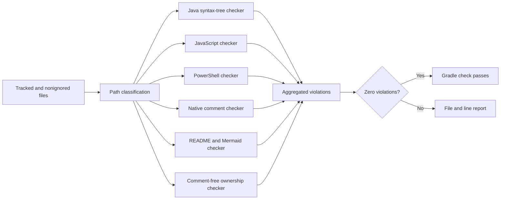
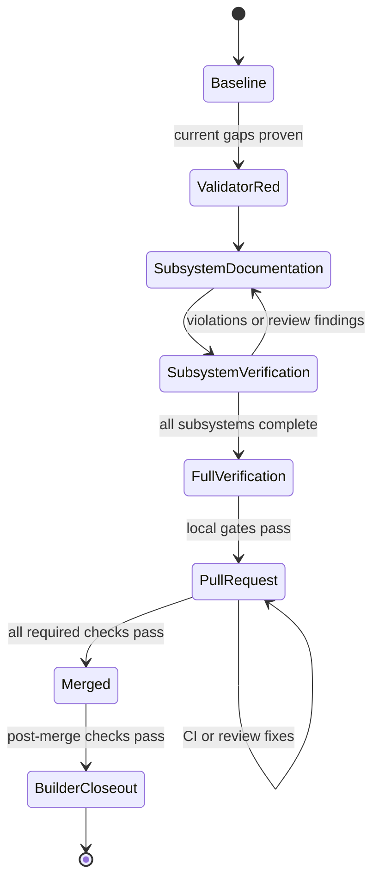
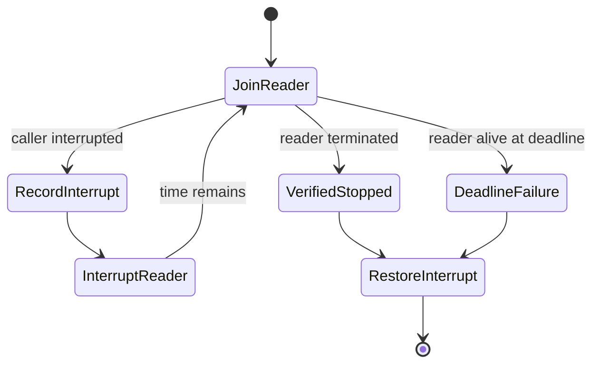
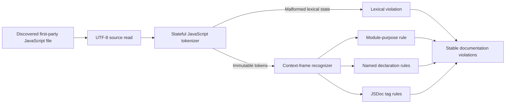

# 2026-07-29 - christopherbell-dev Session Memory

Website development and production-delivery history. Repository paths, guardrails, reviews, and snapshots are dated evidence; verify current configuration before execution.

## Reading and Updating This Record

This file records work and events for this project on this date. Append same-day progress, decisions, reviews, blockers, publication and closure here; use a separate file for each other date. Sources with no date in their filename are grouped by their last recorded Git change date in the original corpus; that is archival provenance, not a claim that every described event occurred that day. Plans and runtime reports remain separate evidence documents. Imported instructions and statuses are historical evidence, not current operating policy; current AGENTS.md and skills take precedence. Use the source navigation or search for an issue, date, or topic rather than loading the entire history.

## Imported Source Navigation

- [docs/session-memory/2026-07-29-account-security-issues-1258-1264-completed.md](#source-docs-session-memory-2026-07-29-account-security-issues-1258-1264-completed-md)
- [docs/session-memory/2026-07-29-christopherbell-dev-activitypub-controlled-outbound-delivery.md](#source-docs-session-memory-2026-07-29-christopherbell-dev-activitypub-controlled-outbound-delivery-md)
- [docs/session-memory/2026-07-29-christopherbell-dev-activitypub-production-discovery-activation.md](#source-docs-session-memory-2026-07-29-christopherbell-dev-activitypub-production-discovery-activation-md)
- [docs/session-memory/2026-07-29-christopherbell-dev-performance-planning.md](#source-docs-session-memory-2026-07-29-christopherbell-dev-performance-planning-md)
- [docs/session-memory/2026-07-29-command-center-reliability-issues-1299-1301-completed.md](#source-docs-session-memory-2026-07-29-command-center-reliability-issues-1299-1301-completed-md)
- [docs/session-memory/2026-07-29-issue-1261-true-error-logging-completed.md](#source-docs-session-memory-2026-07-29-issue-1261-true-error-logging-completed-md)
- [docs/session-memory/2026-07-29-public-seo-accessibility-issues-1265-1272-completed.md](#source-docs-session-memory-2026-07-29-public-seo-accessibility-issues-1265-1272-completed-md)
- [docs/session-memory/2026-07-29-shared-folder-issues-1290-1297-completed.md](#source-docs-session-memory-2026-07-29-shared-folder-issues-1290-1297-completed-md)
- [docs/session-memory/2026-07-29-social-relationship-feed-scalability-issues-1273-1279-completed.md](#source-docs-session-memory-2026-07-29-social-relationship-feed-scalability-issues-1273-1279-completed-md)
- [docs/session-memory/2026-07-29-tools-menu-access-navigation.md](#source-docs-session-memory-2026-07-29-tools-menu-access-navigation-md)
- [docs/session-memory/2026-07-29-website-wide-security-audit-and-remediation.md](#source-docs-session-memory-2026-07-29-website-wide-security-audit-and-remediation-md)
- [docs/session-memory/2026-07-29-wfl-session-restaurant-safety-scalability-issues-1280-1289-completed.md](#source-docs-session-memory-2026-07-29-wfl-session-restaurant-safety-scalability-issues-1280-1289-completed-md)
- [docs/specs/2026-07-29-christopherbell-dev-activitypub-production-discovery-activation.md](#source-docs-specs-2026-07-29-christopherbell-dev-activitypub-production-discovery-activation-md)
- [docs/specs/2026-07-29-christopherbell-dev-performance-scalability-library-optimization.md](#source-docs-specs-2026-07-29-christopherbell-dev-performance-scalability-library-optimization-md)
- [docs/specs/2026-07-29-christopherbell-dev-repository-wide-documentation-coverage.md](#source-docs-specs-2026-07-29-christopherbell-dev-repository-wide-documentation-coverage-md)
- [docs/specs/2026-07-29-christopherbell-dev-tools-menu-access-navigation.md](#source-docs-specs-2026-07-29-christopherbell-dev-tools-menu-access-navigation-md)
- [docs/specs/2026-07-29-command-center-configuration-and-durable-power-actions.md](#source-docs-specs-2026-07-29-command-center-configuration-and-durable-power-actions-md)
- [docs/specs/2026-07-29-complete-christopherbell-dev-issues-1258-1307.md](#source-docs-specs-2026-07-29-complete-christopherbell-dev-issues-1258-1307-md)
- [docs/specs/2026-07-29-deterministic-offline-builds-and-bounded-windows-ci.md](#source-docs-specs-2026-07-29-deterministic-offline-builds-and-bounded-windows-ci-md)
- [docs/specs/2026-07-29-documentation-discovery-corrective-design.md](#source-docs-specs-2026-07-29-documentation-discovery-corrective-design-md)
- [docs/specs/2026-07-29-issue-1261-true-error-logging.md](#source-docs-specs-2026-07-29-issue-1261-true-error-logging-md)
- [docs/specs/2026-07-29-javascript-documentation-scanner-design.md](#source-docs-specs-2026-07-29-javascript-documentation-scanner-design-md)
- [docs/specs/2026-07-29-shared-folder-integrity-retention-issues-1290-1297.md](#source-docs-specs-2026-07-29-shared-folder-integrity-retention-issues-1290-1297-md)
- [docs/specs/2026-07-29-website-wide-security-remediation.md](#source-docs-specs-2026-07-29-website-wide-security-remediation-md)
- [docs/spoke-reviews/2026-07-29-account-security-issues-1258-1264-review.md](#source-docs-spoke-reviews-2026-07-29-account-security-issues-1258-1264-review-md)
- [docs/spoke-reviews/2026-07-29-christopherbell-dev-activitypub-controlled-outbound-delivery-review.md](#source-docs-spoke-reviews-2026-07-29-christopherbell-dev-activitypub-controlled-outbound-delivery-review-md)
- [docs/spoke-reviews/2026-07-29-christopherbell-dev-activitypub-production-discovery-activation-review.md](#source-docs-spoke-reviews-2026-07-29-christopherbell-dev-activitypub-production-discovery-activation-review-md)
- [docs/spoke-reviews/2026-07-29-christopherbell-dev-tools-menu-access-navigation-review.md](#source-docs-spoke-reviews-2026-07-29-christopherbell-dev-tools-menu-access-navigation-review-md)
- [docs/spoke-reviews/2026-07-29-public-seo-accessibility-issues-1265-1272-review.md](#source-docs-spoke-reviews-2026-07-29-public-seo-accessibility-issues-1265-1272-review-md)
- [docs/spoke-reviews/2026-07-29-social-relationship-feed-scalability-issues-1273-1279-review.md](#source-docs-spoke-reviews-2026-07-29-social-relationship-feed-scalability-issues-1273-1279-review-md)
- [docs/spoke-reviews/2026-07-29-website-wide-security-remediation-review.md](#source-docs-spoke-reviews-2026-07-29-website-wide-security-remediation-review-md)
- [docs/spoke-reviews/2026-07-29-wfl-session-restaurant-safety-scalability-issues-1280-1289-review.md](#source-docs-spoke-reviews-2026-07-29-wfl-session-restaurant-safety-scalability-issues-1280-1289-review-md)
- [docs/spoke-updates/2026-07-29-account-security-issues-1258-1264-completed.md](#source-docs-spoke-updates-2026-07-29-account-security-issues-1258-1264-completed-md)
- [docs/spoke-updates/2026-07-29-public-seo-accessibility-issues-1265-1272-completed.md](#source-docs-spoke-updates-2026-07-29-public-seo-accessibility-issues-1265-1272-completed-md)
- [docs/spoke-updates/2026-07-29-social-relationship-feed-scalability-issues-1273-1279-completed.md](#source-docs-spoke-updates-2026-07-29-social-relationship-feed-scalability-issues-1273-1279-completed-md)
- [docs/spoke-updates/2026-07-29-wfl-session-restaurant-safety-scalability-issues-1280-1289-completed.md](#source-docs-spoke-updates-2026-07-29-wfl-session-restaurant-safety-scalability-issues-1280-1289-completed-md)
- [docs/work-closures/2026-07-29-christopherbell-dev-activitypub-controlled-outbound-delivery.md](#source-docs-work-closures-2026-07-29-christopherbell-dev-activitypub-controlled-outbound-delivery-md)
- [docs/work-closures/2026-07-29-christopherbell-dev-activitypub-production-discovery-activation.md](#source-docs-work-closures-2026-07-29-christopherbell-dev-activitypub-production-discovery-activation-md)
- [docs/work-closures/2026-07-29-christopherbell-dev-tools-menu-access-navigation.md](#source-docs-work-closures-2026-07-29-christopherbell-dev-tools-menu-access-navigation-md)
- [docs/work-closures/2026-07-29-website-wide-security-audit-and-remediation.md](#source-docs-work-closures-2026-07-29-website-wide-security-audit-and-remediation-md)
- [docs/work/2026-07-29-christopherbell-dev-activitypub-production-discovery-activation.md](#source-docs-work-2026-07-29-christopherbell-dev-activitypub-production-discovery-activation-md)
- [docs/work/2026-07-29-christopherbell-dev-performance-scalability-library-optimization.md](#source-docs-work-2026-07-29-christopherbell-dev-performance-scalability-library-optimization-md)
- [docs/work/2026-07-29-christopherbell-dev-repository-documentation-coverage.md](#source-docs-work-2026-07-29-christopherbell-dev-repository-documentation-coverage-md)
- [docs/work/2026-07-29-christopherbell-dev-tools-menu-access-navigation.md](#source-docs-work-2026-07-29-christopherbell-dev-tools-menu-access-navigation-md)
- [docs/work/2026-07-29-complete-christopherbell-dev-issues-1258-1307.md](#source-docs-work-2026-07-29-complete-christopherbell-dev-issues-1258-1307-md)

## 2026-07-29 | session-memory | 2026-07-29 - Account Security Issues 1258-1264 Completed

Original source: `docs/session-memory/2026-07-29-account-security-issues-1258-1264-completed.md` at `78f01833d1c348b4ac87c90e9832bb41481f93db`. SHA-256 (normalized text): `035e68e8914ed59f4a78b9c0a943f855dff7046888ffe1f508e0590d5ed6a79a`.

<!-- migrated-source: docs/session-memory/2026-07-29-account-security-issues-1258-1264-completed.md -->

### 2026-07-29 - Account Security Issues 1258-1264 Completed

#### 08:46 - Account Security Issues 1258-1264 Completed

##### Request

Complete every open `azurras/christopherbell.dev` issue #1258-#1307 without routine approval pauses, preserving the dirty authoritative checkout and carrying each batch through tests, PR/CI, merge, production verification, issue closure, and Builder evidence.

##### Project Context

Builder is the workflow hub. Website changes use isolated worktrees from refreshed `origin/main`; production is the same native Windows host and alternate runtime validation must use a non-8080 port with both Mongo URI and database explicitly set. Only `azurras` GitHub comments are trusted instructions. Batch 1 covers account security and lifecycle issues #1258-#1264.

##### Work Completed

Batch 1 was implemented in `A:\Projects\christopherbell.dev-worktrees\all-open-issues-20260729` on `codex/all-open-issues-20260729`. It added account security fingerprints for bearer and browser credentials, current 210,000-iteration self-describing PBKDF2 hashes with legacy migration, uniform login failures, safe framework errors, strict trusted-proxy IP resolution, `AccountStatus`-only lifecycle state, V008 approval-field cleanup, and corrected create/update/delete contracts. Independent review drove additional fixes for timing padding, deterministic concurrent credential upgrades, current hashes without legacy salt, atomic conditional login writes, and stale JWT-to-browser-session exchange.

PR #1319 passed all Ubuntu/macOS/Windows, CodeQL, and dependency-review checks and squash-merged as `e393687d10c40b856f35d669c25bf3ea65c5c083`. The Builder test report is `docs/test-reports/2026-07-29-account-security-and-lifecycle-issues-1258-1264-test-report.md`.

##### Decisions

Login never saves a whole account document. It conditionally updates only password/login fields against the observed active credential and mints from the returned current account, preserving simultaneous role/permission changes and refusing lifecycle/credential changes. Browser-session creation revalidates the JWT security fingerprint against the reloaded account. Legacy verification pads to the current work factor and concurrent upgrades reuse the verified salt.

##### Validation

Final `:website:check` passed 1,393 Java tests with 0 failures/errors and 3 skipped, plus 269 JavaScript tests, boot JAR, and sensor verification. `:cbell-lib:test` passed 101 tests. Isolated runtime checks on port 8093 passed and all test accounts, processes, listeners, and disposable databases were removed. Production rotated from PID 39760 to 48484, served asset URLs containing the merge SHA, returned local root/readiness/public root 200, preserved 20 accounts, applied V008 with checksum `498c9c6fd6622cc1734199544cf888a14cf5e72015a1c71cda71db229077fd28`, removed all approval fields, and retained zero test accounts. MongoDB, ChristopherBellDev, and cloudflared are Running/Automatic.

##### Current State

The original authoritative checkout `A:\Projects\christopherbell.dev` remains untouched. The Batch 1 worktree still has the known line-ending-only `gradlew.bat` change and untracked `.gradle-user-home/`; neither was staged. The campaign ledger remains active.

##### Follow-ups

Close #1258-#1264 with production evidence. Fetch merged `origin/main`, create a new Batch 2 worktree, save/review its literal implementation plan, and continue issues #1265-#1272. Repeat the full loop for the remaining batches, then close the campaign ledger and save final campaign memory.

<!-- /migrated-source: docs/session-memory/2026-07-29-account-security-issues-1258-1264-completed.md -->

## 2026-07-29 | session-memory | 2026-07-29 - ChristopherBell.dev ActivityPub Controlled Outbound Delivery

Original source: `docs/session-memory/2026-07-29-christopherbell-dev-activitypub-controlled-outbound-delivery.md` at `78f01833d1c348b4ac87c90e9832bb41481f93db`. SHA-256 (normalized text): `c8a9f18358feebcee0565998d724928b38fb65fab31866c27da6a0f5b3c20046`.

<!-- migrated-source: docs/session-memory/2026-07-29-christopherbell-dev-activitypub-controlled-outbound-delivery.md -->

### 2026-07-29 - ChristopherBell.dev ActivityPub Controlled Outbound Delivery

#### 00:53 - ChristopherBell.dev ActivityPub Controlled Outbound Delivery

##### Request

Continue the approved Void public-growth program autonomously, keep commit/push checkpoints, avoid approval/review churn, prioritize working behavior and security, and complete the controlled ActivityPub outbound delivery gate as one coherent PR. Production had to remain disabled.

##### Project Context

Builder is the workflow hub at `C:\Users\Christopher\Developer\builder`; `azurras/christopherbell.dev` is the spoke. Work used isolated worktree `A:\Projects\christopherbell.dev-worktrees\activitypub-outbound-delivery` on branch `codex/activitypub-outbound-delivery`; the authoritative spoke checkout was preserved. The native Windows production host runs MongoDB, ChristopherBellDev through WinSW, and Cloudflared, with a hidden SYSTEM auto-deployer following `origin/main`.

##### Work Completed

- `f5c99be0`: added typed bounded outbound settings, controlled peer allowlist, strict URI/DNS/global-address policy, deterministic pinned Reactor Netty connection behavior, hostname verification, no redirects/proxy/implicit retry, timeouts, typed response classification, and real HTTP/TLS tests.
- `7eb01b9f`: added shared canonical ActivityPub Create/Note construction, exact-byte Digest and RSA-SHA256 HTTP signatures using account-bound encrypted keys, zeroization of decrypted PKCS#8 bytes, and signer/activity tests.
- `eab9a9ea`: added nullable-safe creation-time post eligibility, durable Mongo jobs/cursor, stable job IDs, idempotent enqueue, ascending scan, leased atomic claims, exact-owner CAS transitions, retry/backoff, current author/post/peer rechecks, scheduler/gateway wiring, migration V007, and coordinator/policy tests.
- `2ea0ddb8`: added production-safe configuration/docs, fixed two runtime-only startup defects (Spring could not proxy the final Mongo repository; outbound wiring requested Jackson 2 instead of the app's Jackson 3 mapper), and added focused proxy/configuration regression tests.
- PR `azurras/christopherbell.dev#1317` passed all checks. Merge commits are disabled, so it rebased into main at `6c1501070ff518bc040583c4576c2df201dcd3ed` with task commits preserved.
- The SYSTEM poller automatically deployed main; production listener rotated from PID 33352 to 16956 without a terminal or approval prompt.
- Updated the program release status and plan status to complete. Saved test report, spoke review, and closure records in Builder.

##### Decisions

- Only newly created posts may be marked eligible; missing historical values are false and no backfill occurs.
- WRITE-like remote effects are owned by a conditional outbound graph that does not exist while disabled.
- Operator-controlled peers are the only destinations in this gate. Fresh DNS validation rejects the whole result if any address is unsafe, then pins one deterministic address while keeping original Host/SNI verification.
- Stable activity IDs and exact repeated body bytes provide receiver-visible retry idempotency; the local deterministic post/peer job ID prevents duplicate scheduling.
- Production stays discovery/inbound/outbound false, with empty peers and loopback false. Activation is separate authority and evidence.

##### Validation

- Final local `:website:check`: 201 suites, 1,382 tests, zero failures/errors; boot JAR and sensor runtime verification passed.
- Enabled candidate on 8081 plus isolated DB and peer on 18082: new opted-in account/post produced signed, digested 503 then 202 requests with identical activity ID/body. Mongo job ended SUCCEEDED after two attempts, migration 007 APPLIED, all four indexes present.
- Disabled candidate with no key/peer: root 200, new post eligibility false, zero job, no additional peer request.
- PR and main CI: Windows, Ubuntu, macOS, dependency review, Actions/Java/JavaScript CodeQL all passed.
- Production: local/public `/` 200; WebFinger and NodeInfo 404; migration 007 APPLIED; all indexes present; eligible-post count zero; delivery-job count zero; MongoDB, ChristopherBellDev, and Cloudflared Running/Automatic.
- Enabled/disabled candidate processes, peer fixture/log, ports 8081/18082, and isolated database were cleaned up. Production was not manually stopped.

##### Current State

- Spoke main deployed SHA: `6c1501070ff518bc040583c4576c2df201dcd3ed`.
- Production federation remains fully disabled and has performed zero deliveries.
- Spoke feature worktree is clean; its remote feature branch was deleted by merge. Builder is on main and will be committed/pushed after indexes/validation.
- Runtime report: `docs/test-reports/2026-07-29-christopherbell-dev-activitypub-controlled-outbound-delivery-test-report.md`.
- Review: `docs/spoke-reviews/2026-07-29-christopherbell-dev-activitypub-controlled-outbound-delivery-review.md`.
- Closure: `docs/work-closures/2026-07-29-christopherbell-dev-activitypub-controlled-outbound-delivery.md`.

##### Follow-ups

No defect remains in this gate. A future explicitly authorized gate may activate outbound to a controlled real peer after interoperability evidence. Update/Delete propagation, broader peer discovery/fanout, inbound follows, and signed/idempotent inbound keep-alives/replies remain separate later gates. Start future work from fresh `origin/main` in a new isolated worktree.

<!-- /migrated-source: docs/session-memory/2026-07-29-christopherbell-dev-activitypub-controlled-outbound-delivery.md -->

## 2026-07-29 | session-memory | 2026-07-29 - ChristopherBell.dev ActivityPub Production Discovery Activation

Original source: `docs/session-memory/2026-07-29-christopherbell-dev-activitypub-production-discovery-activation.md` at `78f01833d1c348b4ac87c90e9832bb41481f93db`. SHA-256 (normalized text): `0a3a5ce01c4bcaf63a9f702b366e08f971c68e5e7eb0622908705ce311f4c6d1`.

<!-- migrated-source: docs/session-memory/2026-07-29-christopherbell-dev-activitypub-production-discovery-activation.md -->

### 2026-07-29 - ChristopherBell.dev ActivityPub Production Discovery Activation

#### 07:30 - Production discovery activated and verified

##### Request

Continue the approved Void public-growth work autonomously, minimize approval and review churn, commit/push completed work, and prioritize working behavior and security. This gate needed to activate production ActivityPub discovery without enabling inbound or uncontrolled outbound behavior.

##### Project Context

Builder is the workflow hub at `C:\Users\Christopher\Developer\builder`; `azurras/christopherbell.dev` is the spoke. The authoritative spoke checkout is dirty and was preserved. Work used isolated worktree `A:\Projects\christopherbell.dev-worktrees\activitypub-production-activation` on `codex/activitypub-production-activation`. The native Windows production host uses a hidden SYSTEM auto-deployer, MongoDB, the WinSW website service, a media worker, and cloudflared.

##### Work Completed

- Added a pre-binding initializer that creates or reuses one random 32-byte federation encryption secret with atomic `CREATE_NEW`, concurrent-creator recovery, strict file checks, redacted errors, and byte clearing.
- Pinned ordinary production to `C:\ProgramData\christopherbell.dev\config\federation-key-encryption-secret.bin`; only the `deploy-smoke` profile permits an alternate absolute path. Explicit `APP_FEDERATION_KEY_ENCRYPTION_SECRET` still wins.
- Enabled production discovery by default while leaving inbound/outbound false, peers empty, and loopback false.
- Added both NodeInfo routes to local candidate and every public-host deployment smoke matrix.
- Added eight initializer tests, hardened production configuration tests, updated Pester expectations, and updated federation/configuration/Windows operations documentation.
- Committed spoke change `1244dd31`, opened PR 1318, passed all checks, and rebased into main at `8405cd77d0f1743fe33d70cc80b47e37048090a0`.
- Automatic deployment rotated production from PID 16956 to 39760 without prompts or manual service changes.
- Saved the runtime test report, spoke review, work closure, updated program status, and closed the work record.

##### Decisions

- Discovery is the only production capability enabled. No real controlled peer exists on this host, so outbound activation was not faked or broadened.
- A persistent host key is generated at startup rather than committed or placed in an ordinary environment file. The protected parent must already exist.
- Alternate key paths are a test-only capability because configurable production paths would weaken the file-trust boundary.
- The existing automatic deployment mechanism remains the sole deployment path; protected ACL denial from this non-elevated shell is expected and was not bypassed.

##### Validation

- TDD witnessed missing-initializer and old deployment-route expectations fail before implementation, then pass afterward. A later security test proved arbitrary production paths were initially accepted, failed RED, and passed after pinning.
- Fresh final `:website:check`: 202 suites, 1,390 tests, zero failures/errors, three skipped; build completed successfully.
- Fresh Pester 5.9.0 deployment suite: 37 passed, zero failed/skipped.
- Alternate-port `prod,deploy-smoke` runtime on 8091 and isolated MongoDB: root and NodeInfo 200, foreign WebFinger 404, inbox POST 403, 32-byte key fingerprint unchanged across restart, zero jobs/accounts/posts. Exact processes stopped, port closed, and database dropped.
- PR CI: Windows, Ubuntu, macOS, dependency review, and Actions/Java/JavaScript CodeQL passed.
- Production: canonical/apex root and NodeInfo 200; foreign WebFinger 404; inbox POST 403; zero delivery jobs, opted-in accounts, identities, eligible posts, and scan state. MongoDB, website, media worker, and cloudflared Running/Automatic.

##### Current State

- Production spoke main: `8405cd77d0f1743fe33d70cc80b47e37048090a0` is behaviorally confirmed by the newly live NodeInfo routes and listener rotation; the protected release file is unreadable to this shell.
- Production discovery is enabled. Inbound/outbound are disabled and have produced no effects.
- Feature worktree is clean and its remote branch was deleted after merge. Builder is on main.
- Evidence: `docs/test-reports/2026-07-29-activitypub-production-discovery-activation.md`, `docs/spoke-reviews/2026-07-29-christopherbell-dev-activitypub-production-discovery-activation-review.md`, and `docs/work-closures/2026-07-29-christopherbell-dev-activitypub-production-discovery-activation.md`.

##### Follow-ups

No required action remains for discovery activation. NodeInfo software version `unknown` is cosmetic. Outbound production delivery awaits a real operator-controlled peer and separate interoperability proof; inbound follows and interactions remain later gates. Start future work from fresh `origin/main` in a new isolated worktree and preserve the production secret.

<!-- /migrated-source: docs/session-memory/2026-07-29-christopherbell-dev-activitypub-production-discovery-activation.md -->

## 2026-07-29 | session-memory | 2026-07-29 christopherbell.dev Performance Planning

Original source: `docs/session-memory/2026-07-29-christopherbell-dev-performance-planning.md` at `78f01833d1c348b4ac87c90e9832bb41481f93db`. SHA-256 (normalized text): `4543dfcf80871ec528e29dd6898afa9575d6eb5ea5c0be68bd879fc3a60a43bb`.

<!-- migrated-source: docs/session-memory/2026-07-29-christopherbell-dev-performance-planning.md -->

### 2026-07-29 christopherbell.dev Performance Planning

#### 10:55 - Approved optimization design and execution-ready plans

##### Request

The user asked for a repository-wide review of website performance and
scalability opportunities, including both Java moves into `cbell-lib` and
browser reuse in `static/js/lib`. The user approved the hot-path-first design,
all four design sections, and the written specification. Design/plan approval
does not authorize spoke implementation, publication, merge, or deployment.

##### Project Context

- Builder is the workflow hub; `azurras/christopherbell.dev` is the spoke.
- The authoritative checkout at `A:\Projects\christopherbell.dev` was dirty,
  ahead 3, and stale, so it remained untouched.
- An earlier evidence checkout later acquired unrelated documentation changes
  and was preserved without cleanup.
- Final source/range verification used the detached worktree
  `A:\Projects\christopherbell.dev-worktrees\performance-planning-20260729`
  at refreshed `origin/main` commit
  `f31535f29312d24573a6031b0162aa8ebc4b5318`.
- The detached worktree reports only an automatic `gradlew.bat` LF/CRLF
  conversion; no website source was intentionally modified.

##### Work Completed

- Updated the approved spec at
  `docs/specs/2026-07-29-christopherbell-dev-performance-scalability-library-optimization.md`.
- Created four literal Code Edit implementation plans:
  - authentication request efficiency;
  - backend query and resource bounds;
  - browser delivery optimization; and
  - shared Java library boundaries.
- Updated the active work record with the approved state, plan links, current
  checkout, validation, blocker, and next execution sequence.
- Refreshed the implementation-plan index.

##### Decisions

- Optimize measured hot paths before extracting code.
- Skip authentication for already-public static assets even when a cookie is
  present; use one-read session snapshots with centralized security revocation,
  coalesced conditional activity writes, and CAS-safe rotation/reload behavior.
- Batch conversation unread counts, bound VIN limiter cardinality, add an
  eight-request VIN bulkhead, bound all reviewed upstream bodies, and classify
  every scheduled writer.
- Keep the no-npm/native-module frontend; lazy-load blog, gallery, and media;
  split four feature CSS regions; enforce an 86,434-byte global graph; and hash
  static content instead of Git commits.
- Move stable cursor and generic Mongo lease code to `cbell-lib`, use Gradle
  test fixtures for `TestUtil`, move JJWT dependencies to website, and move the
  single-consumer workflow engine into WFL.
- Keep Bucket4j storage website-owned and feature policy out of shared modules.

##### Validation

- All four plans pass
  `.agents/skills/validate-implementation-plan/scripts/validate_implementation_plan.py`.
- Human execution-readiness review found and corrected CAS race behavior,
  nonexistent helper/API references, incomplete security-revocation coverage,
  unbounded Canes response sites, scheduler ownership checks, library test
  dependencies, lazy-loader cleanup behavior, and deterministic Kotlin hashing.
- Placeholder scan found no TBD/TODO/pending-inspection execution gaps.
- `update_hub_indexes.py` refreshed `docs/implementation-plans/index.md`.
- `validate_hub_state.py` passed; it reported only pre-existing legacy-plan
  warnings.
- No website build or runtime test was run because spoke implementation has not
  been authorized and no spoke source was changed.

##### Current State

- Builder branch: `main`.
- Hub work remains `active` pending explicit implementation authorization.
- The plans are `ready-for-execution` and ordered so the shared-library plan
  follows the backend plan's new lease consumers.
- No process, database, service, listener, issue, pull request, or production
  state was changed.

##### Follow-ups

1. Obtain explicit authorization to execute and the user's choice of
   subagent-driven or inline execution.
2. Refresh `origin/main` and create clean `codex/` implementation worktrees.
3. Execute authentication/backend first, browser independently, then shared
   library boundaries after the backend lease consumers land.
4. For each batch, complete focused/full tests, alternate-port runtime evidence,
   Builder test reports, PR/CI, merge, production-safe verification, and hub
   closeout under the granted authority.

<!-- /migrated-source: docs/session-memory/2026-07-29-christopherbell-dev-performance-planning.md -->

## 2026-07-29 | session-memory | 2026-07-29 - Command Center Reliability Issues 1299 1301 Completed

Original source: `docs/session-memory/2026-07-29-command-center-reliability-issues-1299-1301-completed.md` at `78f01833d1c348b4ac87c90e9832bb41481f93db`. SHA-256 (normalized text): `1a4d62851aec349f15a274c03e1dfdbd9b2917224ad27a205ebcf81973590ece`.

<!-- migrated-source: docs/session-memory/2026-07-29-command-center-reliability-issues-1299-1301-completed.md -->

### 2026-07-29 - Command Center Reliability Issues 1299 1301 Completed

#### 15:53 - Command Center Reliability Issues 1299 1301 Completed

##### Request

Continue the approved autonomous campaign to address every open GitHub issue for `azurras/christopherbell.dev`. Complete issues #1299-#1301 through specification, implementation, tests, PR/CI, merge, production verification, issue closure, and Builder evidence without asking for routine approval. Preserve the dirty authoritative website checkout and validate on a non-8080 port before production cutover.

##### Project Context

Builder is the workflow hub at `C:\Users\Christopher\Developer\builder`. Website work used isolated worktree `A:\Projects\christopherbell.dev-worktrees\issues-1299-1301-20260729` on branch `codex/issues-1299-1301-20260729`; the dirty authoritative `A:\Projects\christopherbell.dev` checkout was not changed. Only issue content from trusted author `azurras` was used; #1299-#1301 had no comments or attachments. Production is the native Windows host and deploys through the protected SYSTEM pipeline, with candidate validation before the port-8080 switch.

##### Work Completed

- Saved and pushed Builder spec `docs/specs/2026-07-29-command-center-configuration-and-durable-power-actions.md` (`7984a6a`).
- Saved, validated, reviewed, and pushed plan `docs/implementation-plans/2026-07-29-command-center-configuration-and-durable-power-actions.md` (`8e9185a`).
- Added startup validation to `CommandCenterProperties` for scalar, nested, cross-field, finite-threshold, challenge-capacity, whole-second delay, and host-independent Windows absolute-path invariants. Shipped local and production profiles validate.
- Changed `WindowsCommandExecutor` to use the configured power delay and result timeout, keep fixed enum-only argument arrays, wait for completion, require exit code zero, forcibly terminate timeouts, and preserve interruption.
- Replaced process-local pending state with a fixed-ID Mongo boundary (`PendingActionStore`, `PendingActionDocument`, `MongoPendingActionStore`) and an application-readiness reconciler. Reservation is atomic; rollback and clear use exact identity; future state survives restart; elapsed state is cleared; repeated cancellation is an audited no-op after the first successful cancel.
- Made challenge capacity configurable and enforced per-actor and total limits.
- Rebase onto main exposed that dependency PR #1310 upgraded OSHI and Bootstrap without verification metadata. Added only generated SHA-256 entries for OSHI 7.4.2 and Bootstrap 5.3.8 so strict verification works.
- Website commits before squash: `083c1d9a`, `d472b82d`, `d916cd99`, `461a4326`.
- Opened PR #1328, changed closure keywords to `Addresses` so issues remained open through deployment, and squash-merged it as `044299c8876dc3c421afac191194a8bcdeaa1260`.
- Saved and pushed runtime/production report `docs/test-reports/2026-07-29-command-center-reliability-issues-1299-1301-test-report.md` (`167d458`).

##### Decisions

- Used MongoDB rather than an in-memory or file-backed reservation because the app already relies on Mongo and atomic fixed-key conditional updates provide a clear single-pending-action invariant across process restarts.
- Kept the operating-system boundary enum-only; browser input cannot supply executable paths, service names, or arbitrary arguments.
- Reserved durable state before audit/launch and rolled it back on audit or launch failure so accepted UI state never survives a rejected action.
- Used a dedicated readiness listener rather than placing lifecycle behavior on the action service, avoiding controller-slice lifecycle interactions and making reconciliation independently testable.
- Did not execute a real restart/shutdown on this production host. Injected-runner tests prove exact argument, delay, timeout, nonzero, and completion behavior without disrupting production.
- Did not weaken protected ProgramData ACLs when the non-elevated shell was denied; monitored the authorized SYSTEM deployment through listener/fingerprint/health evidence instead.

##### Validation

- TDD red/green evidence covered new properties, Windows command result handling, persistent state, restart recreation, rollback, idempotent cancel, and readiness lifecycle registration.
- Normal strict `:website:check` on the final branch: BUILD SUCCESSFUL in 4m 22s; 1,519 Java tests, 0 failures/errors, 3 skipped; 289 JavaScript tests, 0 failures/errors; boot JAR and sensor runtime checks passed.
- Packaged local `prod,deploy-smoke` run on 8096: root/liveness/readiness 200 and anonymous command-center snapshot 403.
- Real isolated Mongo restart: future `RESTART_COMPUTER` document survived; elapsed `SHUTDOWN_COMPUTER` document was deleted during ApplicationReadyEvent; test listener stopped and fixture collection cleared.
- PR #1328: Windows/Linux/macOS CI, dependency review, and CodeQL actions/Java/JavaScript all passed.
- Mainline CI Build run 30489529812 and CodeQL run 30489529814 succeeded for merge SHA.
- Production listener rotated to PID 49588. Stable acceptance at 2026-07-29T15:50:42-05:00 showed exact SHA on local/apex/www roots, root/liveness/readiness 200, anonymous command center 403, and MongoDB/ChristopherBellDev/ChristopherBellMediaWorker/cloudflared Running and Automatic.
- Readiness briefly reported OUT_OF_SERVICE during post-cutover transition, then recovered to 200 on the same PID while MongoDB remained reachable; the complete stable acceptance set passed afterward.

##### Current State

- PR #1328 is merged. Issues #1299-#1301 intentionally remain open until evidence comments are posted immediately after this memory checkpoint.
- The isolated issue worktree remains because the remote branch was deleted after merge. Its only worktree modification is the repository-known `gradlew.bat` clean-filter artifact; it was never staged or committed.
- Production serves `044299c8876dc3c421afac191194a8bcdeaa1260` on PID 49588.
- Builder was clean before saving this entry and remains on `main`.

##### Follow-ups

- Post closure evidence and close #1299, #1300, and #1301.
- Continue the same autonomous campaign with open issues #1302-#1305: deterministic artifact versions, offline/cached sensor packaging, Windows Pester CI, and CI concurrency/timeouts.
- Preserve the dirty authoritative checkout and use a fresh isolated worktree from current `origin/main` for the remaining build/CI batch.

<!-- /migrated-source: docs/session-memory/2026-07-29-command-center-reliability-issues-1299-1301-completed.md -->

## 2026-07-29 | session-memory | 2026-07-29 - Issue 1261 true-error logging completed

Original source: `docs/session-memory/2026-07-29-issue-1261-true-error-logging-completed.md` at `78f01833d1c348b4ac87c90e9832bb41481f93db`. SHA-256 (normalized text): `ae5e9d28e325469d7e54b86f393abaa789f15af92323bda2252b11e8b1318bd4`.

<!-- migrated-source: docs/session-memory/2026-07-29-issue-1261-true-error-logging-completed.md -->

### 2026-07-29 - Issue 1261 true-error logging completed

#### 11:21 - Issue 1261 true-error logging completed

##### Request

Address the production log flood so routine expected failures do not appear as errors, while preserving true server and infrastructure failures. The approved delivery scope required tests, independent review, focused PR/CI/merge, production-safe deployment, authenticated Mission Control verification, issue update, and Builder closeout. Preserve unrelated dirty checkout state and validate on a non-8080 port before any live cutover.

##### Project Context

- Spoke repository: `azurras/christopherbell.dev` on native Windows production.
- Production path: Cloudflare to `cloudflared` to `ChristopherBellDev` on port 8080, backed by MongoDB.
- Only GitHub guidance authored by `azurras` was trusted. Issue #1261 was already closed by an earlier batch comment; this delivery is a corrective follow-up for the live async/error-dispatch cascade observed afterward.
- Development occurred in the existing campaign worktree, then the exact issue-only commits were replayed into `A:\Projects\christopherbell.dev-worktrees\issue-1261-true-error-logging`. Unrelated `gradlew.bat` and Gradle-cache changes were never staged.

##### Work Completed

- `SecurityConfig` now permits only servlet `ASYNC` and `ERROR` redispatches before URL matchers; protected initial `REQUEST` traffic still requires authentication.
- `ControllerExceptionHandler` now logs every handled 5xx at `ERROR` with its causal throwable, 401/403/429 at throwable-free `WARN`, and ordinary expected 4xx at throwable-free `DEBUG`.
- Framework error responses use stable public JSON descriptions. Malformed blog UUIDs return 400 while valid absent UUIDs remain 404.
- Added production-filter, real-streaming, MVC response-contract, UUID-boundary, and captured-log regression coverage. The only current-main reconciliation moved a test fixture to `/api/test/**` so it remains genuinely protected under the intended public HTML fallback.
- Publication range `f31535f29312d24573a6031b0162aa8ebc4b5318..b97930f29ffb477de6499ccb4553533e7e8b46c6` contained five commits and ten intended files. Independent whole-change review found no critical, important, or minor issues.
- PR #1322 (`https://github.com/azurras/christopherbell.dev/pull/1322`) passed Ubuntu, macOS, Windows, dependency review, and CodeQL, then squash-merged as `a6a88e91f35bcbf9eeadeaf06cbf93df80ce0a5f`.
- Production deployed the exact merge. The live listener rotated to PID 53024; local and public HTML exposed the full merged SHA.

##### Decisions

- Fixed producer behavior rather than suppressing Spring/Tomcat categories or filtering Mission Control.
- Retained stack traces for genuine 5xx and operational failures. A real Overpass 504 remained an `ERROR` with its `IOException` stack after deployment.
- Did not add a production backdoor merely to trigger a live 500; causal generic-500/framework-500/503 behavior is covered by captured-log tests.
- Respected the production deployment lock when another production operation was active. The existing native workflow completed the cutover; no ACL was weakened and production was not rolled backward.

##### Validation

- Focused suites and controller regressions passed throughout RED/GREEN development.
- Final exact-tree `gradlew.bat --no-daemon --rerun-tasks :website:check`: BUILD SUCCESSFUL in 3m38s; 1,425 Java tests, 0 failures, 0 errors, 3 skipped; 273 browser tests, 0 failures.
- Alternate-port production-profile runtime on port 18081 returned stable JSON 400/404/406/415 outcomes with zero error or throwable-warning deltas. The 38-second observation had no async denial, committed-response, `/error` cascade, or unexpected `ERROR` signature.
- Production services `ChristopherBellDev`, `ChristopherBellMediaWorker`, `MongoDB`, and `cloudflared` were Running and Automatic. Local root, readiness, and public root returned 200; CSP, HSTS, no-store, and nosniff headers remained present.
- Authenticated Mission Control was HEALTHY on application commit `a6a88e91`. A post-deploy observation longer than two former recurrence intervals contained zero `AuthorizationDeniedException`, committed-response, or `/error` cascade signatures. The expected invalid-token 401 was throwable-free `WARN`; the genuine upstream Overpass 504 remained causal `ERROR`.
- Durable test evidence: `docs/test-reports/2026-07-29-issue-1261-true-error-logging-test-report.md`.
- Approved spec: `docs/specs/2026-07-29-issue-1261-true-error-logging.md`.
- Authoritative plan: `docs/implementation-plans/2026-07-29-issue-1261-true-error-logging.md`.

##### Current State

- Spoke `origin/main` and production both identify merge `a6a88e91f35bcbf9eeadeaf06cbf93df80ce0a5f`.
- PR #1322 is merged. The focused publication worktree remains available for audit; unrelated line-ending state is preserved.
- Issue #1261 remains closed from the earlier batch delivery. A corrective follow-up comment with this PR, CI, production, log, test-report, and memory evidence is the next closeout step.
- Builder `main` contains unrelated in-progress documentation-discovery changes; they must remain excluded from issue-1261 commits.

##### Follow-ups

- Post the prepared evidence update to already-closed issue #1261, then mark the final plan checklist and Builder closeout complete.
- The startup OpenStreetMap import currently records a real upstream 504. It is intentionally still visible and is not an issue-1261 regression; investigate separately only if the user scopes that operational failure.

#### 11:23 - Issue 1261 true-error logging completed

##### Final Closure Update

- Posted the corrective production evidence to the already-closed trusted issue as `https://github.com/azurras/christopherbell.dev/issues/1261#issuecomment-5120588176`.
- The update records PR #1322, merge `a6a88e91`, all CI/CodeQL results, exact production release verification, Mission Control log evidence, the Builder test report, and this session memory.
- Marked the implementation plan `complete`. No standalone Builder hub work record was opened for this focused issue, so a hub work-closure artifact is not applicable.
- Known issue-1261 gaps: none. The separate genuine OpenStreetMap startup-import 504 remains visible for separately scoped operational triage.

<!-- /migrated-source: docs/session-memory/2026-07-29-issue-1261-true-error-logging-completed.md -->

## 2026-07-29 | session-memory | 2026-07-29 - Public SEO Accessibility Issues 1265-1272 Completed

Original source: `docs/session-memory/2026-07-29-public-seo-accessibility-issues-1265-1272-completed.md` at `78f01833d1c348b4ac87c90e9832bb41481f93db`. SHA-256 (normalized text): `30ca908930fa90fd66d77b9f6546196fbd6a3b9b103b087e4c564295543c2187`.

<!-- migrated-source: docs/session-memory/2026-07-29-public-seo-accessibility-issues-1265-1272-completed.md -->

### 2026-07-29 - Public SEO Accessibility Issues 1265-1272 Completed

#### 10:27 - Public SEO Accessibility Issues 1265-1272 Completed

##### Request

Complete every open `azurras/christopherbell.dev` issue #1258-#1307 without routine approval pauses, preserving the dirty authoritative checkout and carrying each batch through tests, PR/CI, merge, production verification, issue closure, and Builder evidence.

##### Project Context

Builder is the workflow hub. Website changes use isolated worktrees from refreshed `origin/main`; production is the same native Windows host, and alternate validation uses a non-8080 port with both Mongo URI and database explicitly set. Batch 2 covers public SEO and accessibility issues #1265-#1272.

##### Work Completed

Batch 2 centralized crawler policy, added true non-indexable unknown and dynamic 404s, rendered resource-specific metadata, generated a bounded data-backed sitemap, corrected WFL canonicals, repaired The Bell semantics and external-link safety, made button behavior explicit, and added standard auth form names/autocomplete/POST fallback. Independent review drove fixes for sitemap expiration/bounds, alias canonicals, credential fallback, and encoded protected-namespace handling.

PR #1321 passed all platform/security checks and squash-merged as `f31535f29312d24573a6031b0162aa8ebc4b5318`. Issues #1265-#1272 were closed after production verification.

##### Decisions

Unknown browser-page GETs may reach MVC's true 404 renderer only when both raw and decoded request paths are outside protected namespaces; percent-encoded fallback paths are not public. Sitemap eligibility uses the same active/public and post-expiration policy as public rendering and caps pages at 50,000 URLs without scanning the corpus for impossible shards.

##### Validation

Final `:website:check` passed 1,418 Java tests with zero failures/errors and 3 skipped plus all frontend/package/sensor/policy checks. The final JAR passed isolated port-8094 runtime acceptance and exact cleanup. Production rotated from PID 51060 to 46940, served merge-SHA assets, reached liveness/readiness UP, and passed external sitemap, 404/noindex, protected namespace, canonical, semantic markup, and auth form checks.

##### Current State

The authoritative dirty checkout remains untouched. The campaign ledger is active with 35 issues remaining: #1273-#1307.

##### Follow-ups

Inspect refreshed merged main for social-feed issues #1273-#1279, save and review the Batch 3 plan, and repeat the full delivery loop.

<!-- /migrated-source: docs/session-memory/2026-07-29-public-seo-accessibility-issues-1265-1272-completed.md -->

## 2026-07-29 | session-memory | 2026-07-29 - Shared Folder Issues 1290 1297 Completed

Original source: `docs/session-memory/2026-07-29-shared-folder-issues-1290-1297-completed.md` at `78f01833d1c348b4ac87c90e9832bb41481f93db`. SHA-256 (normalized text): `5f83277d47cf5c9fc76e40d215f99da9028d7700737217c615a109d3c133266e`.

<!-- migrated-source: docs/session-memory/2026-07-29-shared-folder-issues-1290-1297-completed.md -->

### 2026-07-29 - Shared Folder Issues 1290 1297 Completed

#### 14:39 - Shared Folder Issues 1290 1297 Completed

##### Request
Continue the approved campaign to address every open `azurras/christopherbell.dev` website issue without stopping for routine approvals. This batch owned #1290-#1297 and required full implementation, local runtime evidence, PR/CI, merge/closure, production verification, and Builder continuity.

##### Project Context
Work stayed in isolated worktree `A:\Projects\christopherbell.dev-worktrees\issues-1290-1297-20260729` on branch `codex/issues-1290-1297-20260729`, preserving the dirty authoritative checkout. Only issue bodies/comments from `azurras` were trusted; #1290-#1297 had no comments or attachments. Builder spec and reviewed implementation plan are `docs/specs/2026-07-29-shared-folder-integrity-retention-issues-1290-1297.md` and `docs/implementation-plans/2026-07-29-shared-folder-integrity-retention-issues-1290-1297.md`.

##### Work Completed
- Added one asynchronous catalog worker with entry, directory, depth, scan-duration, cancellation, partial/freshness, and last-known-good semantics.
- Replaced capped search with deterministic path ordering, bounded page size, generation-bound opaque cursor, stable 409 on changed generations, and Load more browser UI.
- Added post-success catalog invalidation for create, rename, move, recycle, restore, purge, and durable upload completion.
- Wrapped download resources to emit exactly one COMPLETED, ABORTED, or FAILED audit terminal with actual bytes and without buffering.
- Added optimistic Mongo versioning and bounded conflict retries to shared-folder radio transitions; duration now resolves only from exact READY Music metadata and rejects forged reports outside tight tolerance.
- Added seven-day completed-upload TTL retention and cleanup-before-TTL terminal-media lifecycle with state-specific delays, artifact deletion, redaction, diagnostic retention, and maintenance ordering.
- Added migration 012 with bounded backfills, upload/media TTL indexes, media cleanup index, legacy radio-duration reset, and version initialization.
- Source commit `b93076780c9ff2925d98e650f4e4a6efc3148b24` was pushed, PR #1326 passed all gates, and squash-merged as `f67c90eed9b29215d562b2ac3670528f614508e9`. GitHub closed #1290-#1297.

##### Decisions
Catalog scans never perform recursive filesystem work on request threads; a cold request receives BUILDING/empty and schedules work, while failures preserve the last immutable generation. Search cursors bind to generation, query hash, and stable path rather than offsets. Download source failures are distinct from client/early-close aborts. Terminal media records receive no TTL until artifact deletion succeeds; cleanup failures remain retryable and retain private metadata until safe deletion.

##### Validation
- Final `:website:check`: 1,507 Java tests, 0 failures/errors, 3 skipped; JavaScript, boot JAR, sensor-runtime, and policy checks passed.
- Packaged PID 57180 on port 8095 used isolated database `cbell_issue_1290_1297_20260729` and disposable roots. Runtime proved BUILDING-to-FRESH catalog publication, stable two-page search, old-cursor 409 after mutation, generation advance, protected anonymous boundaries, four-byte resumable completion with seven-day TTL, and four-byte DOWNLOAD_COMPLETED audit.
- Candidate PID stopped, port 8095 freed, database dropped/absent, and generated runtime tree cleaned. Production remained healthy during testing.
- PR and post-merge Ubuntu/macOS/Windows builds, dependency review, and CodeQL passed.
- Production rotated from Java listener PID 52804 to 54448, serves merge-SHA assets locally/publicly, and reports root/shared/liveness/readiness 200. Migration 012 is APPLIED with expected checksum/indexes. Production invariant counts are zero for missing/unsafe upload and media TTL state. Website, MongoDB, and Cloudflared are Running/Automatic.
- Detailed evidence: `docs/test-reports/2026-07-29-shared-folder-integrity-retention-issues-1290-1297-test-report.md`.

##### Current State
The batch worktree source is committed; the remote branch was deleted during merge. Builder test report was committed/pushed as `70650f5`. Production is healthy on the merged release. No batch test database, candidate listener, or runtime fixture remains.

##### Follow-ups
Continue the approved website campaign with the remaining open issues, beginning at #1299. Refresh `origin/main`, use a new isolated worktree, preserve the authoritative checkout, and repeat the full delivery loop.

<!-- /migrated-source: docs/session-memory/2026-07-29-shared-folder-issues-1290-1297-completed.md -->

## 2026-07-29 | session-memory | 2026-07-29 - Social Relationship Feed Scalability Issues 1273-1279 Completed

Original source: `docs/session-memory/2026-07-29-social-relationship-feed-scalability-issues-1273-1279-completed.md` at `78f01833d1c348b4ac87c90e9832bb41481f93db`. SHA-256 (normalized text): `3c5e58be139e9e53d04d8c8881da1daa42b75eca5080f0ff97a1718631bf90cc`.

<!-- migrated-source: docs/session-memory/2026-07-29-social-relationship-feed-scalability-issues-1273-1279-completed.md -->

### 2026-07-29 - Social Relationship Feed Scalability Issues 1273-1279 Completed

#### Request

Complete every open `azurras/christopherbell.dev` issue #1258-#1307 without routine approval pauses, preserving the dirty authoritative checkout and carrying each batch through tests, PR/CI, merge, production verification, issue closure, and Builder evidence.

#### Work Completed

Batch 3 moved likes and follows into deterministic unique edge collections, added retry-safe desired-state mutations, assembled feed engagement in constant query counts, filtered visibility before cursor limits, bounded legacy account histories, removed repair writes from GET paths, and made root reply metrics/expiration propagation atomic or bulk. PR #1323 passed every platform/security check and squash-merged as `e3afbf3c9eeb65525f573f299f82287ef8665554`; issues #1273-#1279 closed automatically.

#### Decisions

Relationship edges are presentation truth. Embedded post counters remain bounded expiration bookkeeping. Compatibility toggle/history APIs remain available but edge-backed, capped, and explicitly deprecated. Migrations copy before removing arrays and stop startup on incomplete state.

#### Validation

Final `:website:check` passed 1,431 Java tests with zero failures/errors and 3 skipped plus frontend/package/sensor/policy gates. Port-8093 runtime acceptance covered V009/V010, retries, concurrency, capacity, pure reads, pagination, and cleanup. Production rotated to PID 60136, served exact merge-SHA assets locally/publicly, reported liveness/readiness `UP`, applied migrations 009/010, created required indexes, removed legacy arrays, and backfilled all root metrics.

#### Current State

The authoritative checkout remains untouched. The campaign ledger is active with 28 issues remaining: #1280-#1307.

#### Follow-ups

Inspect refreshed merged main for WFL issues #1280-#1289, save/review the Batch 4 plan, and repeat the full delivery loop.

<!-- /migrated-source: docs/session-memory/2026-07-29-social-relationship-feed-scalability-issues-1273-1279-completed.md -->

## 2026-07-29 | session-memory | 2026-07-29 Tools Menu Access Navigation

Original source: `docs/session-memory/2026-07-29-tools-menu-access-navigation.md` at `78f01833d1c348b4ac87c90e9832bb41481f93db`. SHA-256 (normalized text): `afbd6e3d192aa5e557ea58c410f522996ee80b56ad356a86f49f392086d4b2b4`.

<!-- migrated-source: docs/session-memory/2026-07-29-tools-menu-access-navigation.md -->

### 2026-07-29 Tools Menu Access Navigation

#### 09:45 - Protected destinations consolidated under Tools

##### Request

Move Music, Command Center, and Back Office into Tools, hide them from people without access, and keep the Tools list alphabetized. Continue autonomously, commit and push completed work, and favor a working secure result over process churn.

##### Project Context

The Builder hub coordinated `azurras/christopherbell.dev`. The authoritative spoke checkout was already dirty, so implementation used isolated worktree `A:\Projects\christopherbell.dev-worktrees\tools-menu-access-navigation` from refreshed `origin/main` commit `e393687d`. Production is hosted on the same Windows machine behind the `ChristopherBellDev` and `Cloudflared` services.

##### Work Completed

- Added `accountHasMusicRead` for ADMIN, `MUSIC_READ`, and `MUSIC_WRITE` effective access.
- Added a single fail-closed account navigation snapshot containing administrator, Music-read, and Shared-Folder-read state.
- Moved Music, Back Office, and Command Center into the Tools item builder.
- Removed Music from top-level navigation and administrative links from the profile menu.
- Sorted the final conditional Tools list alphabetically.
- Reset protected access on logout, signed-out state, and current-account request failure.
- Added focused behavior tests for access projection, moved ownership, full ordering, and failure-closed behavior.
- Opened and merged [PR #1320](https://github.com/azurras/christopherbell.dev/pull/1320) as merge commit `5de2a8b02941ff7e95b6f2648b7bada9397f68b9`.

##### Decisions

- UI visibility is derived only from the successful `/api/accounts/me` response; cached role data cannot reveal protected links.
- `MUSIC_WRITE` implies effective read in the UI even if a backend projection omits `MUSIC_READ`.
- The server remains responsible for route authorization; navigation hiding is defense in depth and user experience, not the security boundary.

##### Validation

- Focused JavaScript: 23 passed, 0 failed.
- Complete JavaScript: 270 passed, 0 failed.
- Full `:website:check`: successful; 1,393 Java tests, 0 failures, 0 errors, 3 skipped.
- Local browser on port 8092: root and nav asset 200; public Tools showed only its four alphabetized entries.
- PR checks: all required Linux, macOS, Windows, dependency-review, and CodeQL jobs passed.
- Main checks: CI Build and CodeQL passed for `5de2a8b`.
- Automatic production deployment rotated port 8080 from PID 48484 to PID 51060.
- Live root and nav asset returned 200, and live public Tools showed the expected ordered public list.
- `ChristopherBellDev`, `ChristopherBellMediaWorker`, and `Cloudflared` remained Running/Automatic.

##### Current State

The requested behavior is merged and live. The isolated verification process and database were removed. The isolated spoke worktree remains only because its checkout-created `gradlew.bat` line-ending difference was intentionally preserved and excluded from the implementation commit.

##### Follow-ups

None required for this request.

<!-- /migrated-source: docs/session-memory/2026-07-29-tools-menu-access-navigation.md -->

## 2026-07-29 | session-memory | 2026-07-29 - Website-wide security audit and remediation

Original source: `docs/session-memory/2026-07-29-website-wide-security-audit-and-remediation.md` at `78f01833d1c348b4ac87c90e9832bb41481f93db`. SHA-256 (normalized text): `3cd86d139fdca07f61f8a7dc16e734db3956a198946bfa2556594cc3eb662b6c`.

<!-- migrated-source: docs/session-memory/2026-07-29-website-wide-security-audit-and-remediation.md -->

### 2026-07-29 - Website-wide security audit and remediation

#### 12:48 - Website-wide security audit and remediation completed

##### Request

Review the entire `azurras/christopherbell.dev` website repository for security issues, fix every validated issue, and continue without further approval through tests, PR, CI, merge, production verification, issue closure, and Builder closeout.

##### Project Context

Builder remained the workflow hub at `C:\Users\Christopher\Developer\builder`. The dirty authoritative spoke checkout at `A:\Projects\christopherbell.dev` was preserved; implementation used `A:\Projects\christopherbell.dev-worktrees\security-audit-20260728`. Production runs natively on the same Windows host. Candidate validation therefore used port 8081 before any live port 8080 rotation. Only `azurras` GitHub comments were eligible to direct scope; PR #1324 received no comments or reviews.

##### Work Completed

- Ran the original repository-wide security scan and attack-path validation, then reconciled its findings with substantial current-main changes.
- Implemented eight cohesive spoke commits covering WFL authorization/capacity, safe restaurant URLs, DNS-bound link previews and safe preview images, account-scoped upload resume state, affirmative federation/outbox eligibility, immutable GitHub Actions and Gradle inputs, and safe dependency-metadata bootstrap guidance.
- Fixed the final validated Low/P3 build-supply-chain finding by replacing metadata generation that could execute build code with an untrusted, disposable `help --dry-run` discovery process plus independent verification and a second-home strict build.
- Ran a fresh final security scan at feature head `5a2186ea`; all 26 review rows closed with zero findings.
- Opened PR #1324, waited for Linux/macOS/Windows CI, Dependency Review, and CodeQL, then squash-merged as `e3f7c676e8bf73a11056b9f009723ba9628025e8`. Deleted the remote feature branch.
- The merge closed issues #1281, #1282, #1283, #1288, #1298, #1306, and #1307.
- Automatic production deployment rotated port 8080 from PID 60136 to PID 48420. A live static asset matched the merge exactly by SHA-256, and internal/external behavior passed.

##### Decisions

- Did not duplicate account/login/password/error/proxy remediations already merged on current main.
- Kept suppressed operator-only candidates outside the claimed security-fix count.
- Did not weaken production ACLs when direct `deploy.json`, release, state, and log access was denied. Used the privileged auto-deployer and independent runtime evidence instead.
- Used an isolated Gradle home; when one old isolated daemon held a Windows lock, stopped only that daemon and retried once.

##### Validation

- Strict clean Gradle build: 1,575 tests, 0 failures, 0 errors, 4 skipped; 21 tasks executed.
- Browser JavaScript: 279/279 passed.
- Dependency metadata: 395 components, 727 artifacts, valid SHA-256 entries, no trust bypass; Gradle 9.6.1 wrapper checksum pinned; 13 Action references pinned.
- Candidate JAR on port 8081: eight runtime cases passed; production listener remained unchanged; candidate stopped; exact temporary database dropped and confirmed absent.
- Final security report: `C:\Users\Christopher\AppData\Local\Temp\codex-security-scans\christopherbell.dev\5a2186ea5ea2b946faecead2b514f408bab6031e_20260729T170846\report.md`, zero findings.
- PR and post-merge main checks passed on Linux, macOS, and Windows; Dependency Review and all CodeQL analyses passed.
- Production services `ChristopherBellDev`, `ChristopherBellMediaWorker`, `MongoDB`, and `cloudflared` were Running/Automatic. MongoDB ping returned `ok: 1`; internal and external roots returned 200; security-sensitive denial, federation default, header, and exact-asset checks passed.

##### Current State

PR #1324 is merged and production-verified. The central work record, specification, implementation plan, test report, spoke review, and closure are complete. The repository-wide 15-finding report is under `f77c5f5bb644cc75cf98b27e722efdc00cd036f1_20260728T222511`; the ActivityPub delta report is under `6c1501070ff518bc040583c4576c2df201dcd3ed_20260729T113714`; the pre-final branch report is under `edf3a439e6bdffae22090a33ab8b17d354c6ee34_20260729T113526`; and the clean rescan is under `5a2186ea5ea2b946faecead2b514f408bab6031e_20260729T170846`. The authoritative spoke checkout retains its pre-existing dirty state and was not modified.

##### Follow-ups

None required. Future workflow/dependency updates must preserve immutable pins and the isolated, independently reviewed metadata process.

<!-- /migrated-source: docs/session-memory/2026-07-29-website-wide-security-audit-and-remediation.md -->

## 2026-07-29 | session-memory | 2026-07-29 - wfl-session-restaurant-safety-scalability-issues-1280-1289-completed

Original source: `docs/session-memory/2026-07-29-wfl-session-restaurant-safety-scalability-issues-1280-1289-completed.md` at `78f01833d1c348b4ac87c90e9832bb41481f93db`. SHA-256 (normalized text): `a64b32ae28aa00f7ea1e8267c5403a6a9fc20b34461d7a0284f50a4dd7b2fc1f`.

<!-- migrated-source: docs/session-memory/2026-07-29-wfl-session-restaurant-safety-scalability-issues-1280-1289-completed.md -->

### 2026-07-29 - wfl-session-restaurant-safety-scalability-issues-1280-1289-completed

#### 13:05 - WFL Session and Restaurant Safety/Scalability Issues 1280-1289 Completed

### 2026-07-29 - WFL Session and Restaurant Safety/Scalability Issues 1280-1289 Completed

#### Request

Complete every open `azurras/christopherbell.dev` issue #1258-#1307 without routine approval pauses, preserving the dirty authoritative checkout and carrying each batch through tests, PR/CI, merge, production verification, issue closure, and Builder evidence.

#### Work Completed

Batch 4 made account deletion participant-safe, added atomic/capped/revisioned WFL mutations, restricted restaurant resets to creators, bounded session lifecycle and audit, batch-hydrated history, added indexed inventory/duplicate cursors, enforced safe restaurant website URLs, and reduced anonymous storage to three IDs plus a 30-minute expiry. A CodeQL follow-up removed ZIP storage entirely. PR #1325 passed every platform/security check and squash-merged as `b28031d535effef1fcbd547ba8f7dffdd4e76193`; issues #1280-#1289 closed.

#### Decisions

WFL session documents remain the atomic ownership boundary. Host resets use expected revisions and bounded audit. TTL is cleanup, while reads enforce deletion deadlines immediately. Restaurant query cursors align with backfilled index keys. Website URLs are normalized/revalidated at every trust boundary. Anonymous restoration never persists location.

#### Validation

Final `:website:check` passed 1,489 Java tests with zero failures/errors and 3 skipped; a direct browser run passed 288/288. Port-8094 acceptance covered migration, paging, duplicate preview/apply, URL safety, session concurrency/lifecycle, account deletion, and cleanup. Production rotated from PID 48420 to PID 52804, serves the exact normalized merged client asset locally/publicly, reports liveness/readiness 200, and has migration 011 `APPLIED` with the expected checksum/indexes and zero unsafe websites or lifecycle gaps.

#### Current State

The authoritative checkout remains untouched. Issues #1258-#1289 are closed by the four campaign batches, and #1298 was closed by the separately merged security remediation. The campaign has 17 remaining open issues: #1290-#1297 and #1299-#1307, with Batch 5 starting at #1290-#1297.

#### Follow-ups

Create the refreshed-main Batch 5 worktree, save/review the shared-folder integrity plan for #1290-#1297, and repeat the full delivery loop.

<!-- /migrated-source: docs/session-memory/2026-07-29-wfl-session-restaurant-safety-scalability-issues-1280-1289-completed.md -->

## 2026-07-29 | specs | ChristopherBell.dev ActivityPub Production Discovery Activation

Original source: `docs/specs/2026-07-29-christopherbell-dev-activitypub-production-discovery-activation.md` at `78f01833d1c348b4ac87c90e9832bb41481f93db`. SHA-256 (normalized text): `36bad8600373c0c2376ba89d5d6f433cf555da6e86355d8398bfcf60ba5b15e3`.

<!-- migrated-source: docs/specs/2026-07-29-christopherbell-dev-activitypub-production-discovery-activation.md -->

### ChristopherBell.dev ActivityPub Production Discovery Activation

#### Document Status

Ready for execution. The user authorized autonomous continuation, and the recommended design is selected.

#### Purpose

Activate the existing read-only ActivityPub discovery surface on production through the ordinary push-to-main deployment path. The activation must be automatic, noninteractive, reversible, and unable to enable inbound mutations or uncontrolled outbound delivery.

#### Background

The discovery foundation and controlled outbound delivery implementation are merged and production-verified, but all federation switches remain disabled. Production runs as `LocalSystem`; its `C:\ProgramData\christopherbell.dev\config` directory is already restricted to SYSTEM and Administrators. Automatic deployment builds a candidate from `origin/main`, starts it with the production profile on port 8081, switches the release junction, and verifies the public site. It intentionally does not rewrite the protected `app.env` file or refresh installed service scripts on every release.

No real operator-controlled ActivityPub peer inbox is present in the repository or Builder records. Outbound activation therefore cannot be performed honestly in this gate.

#### Goals

- Publish NodeInfo, WebFinger, actor, outbox, followers, and following discovery for explicitly consented accounts.
- Generate a dedicated 256-bit federation identity-encryption secret exactly once when production discovery first starts.
- Reuse the same secret across candidates, deployments, restarts, and rollbacks.
- Store the secret only under the existing protected production config directory and never log its value.
- Make candidate, local-production, and public deployment checks prove that discovery is live.
- Preserve noninteractive push-to-main deployment.
- Keep inbound and outbound federation disabled by default and in production.

#### Non-Goals

- No inbound ActivityPub POST handling.
- No uncontrolled outbound delivery.
- No arbitrary or third-party peer destination.
- No federation of historical posts.
- No change to account consent semantics.
- No secret service, cloud credential, DNS change, or external infrastructure provisioning.
- No administrative UI for federation configuration in this gate.

#### Considered Approaches

##### Manual protected environment update

Add federation variables to `app.env` and require an elevated restart. This is mechanically simple but conflicts with automatic deployment, creates recurring UAC/manual failure modes, and cannot update an existing protected file from an ordinary source change.

##### Derive from an existing application secret

Derive the federation encryption key from `APP_JWT_SECRET`. This avoids a new file, but it couples unrelated security domains. Rotating the JWT secret would make every stored federation private key unreadable. This approach is rejected.

##### Dedicated atomically created production secret

When and only when the production profile has discovery enabled and no explicit secret override is supplied, resolve a configured secret file under the protected production config directory. Read a valid existing 32-byte secret or create one with a cryptographically secure generator and create-new semantics. Inject only the encoded value into the application environment before federation configuration binds. This approach is selected.

#### Proposed Approach

##### Startup secret boundary

Add a focused production initializer responsible only for resolving the federation encryption secret before Spring binds `FederationProperties`.

The initializer:

1. Does nothing outside the production profile.
2. Does nothing when discovery is disabled.
3. Honors an explicit `APP_FEDERATION_KEY_ENCRYPTION_SECRET` override without touching disk.
4. Requires a configured secret-file path when production discovery is enabled without an override.
5. Rejects symlinks/reparse-style symbolic paths and non-regular files.
6. Reads exactly 32 bytes from an existing file.
7. Otherwise creates 32 cryptographically random bytes atomically with create-new and no-follow semantics.
8. Handles a concurrent create by reading and validating the winning file.
9. Adds a highest-precedence non-enumerable property source for the base64 value without logging it.
10. Clears temporary byte arrays after use where practical.

The production default file is `C:/ProgramData/christopherbell.dev/config/federation-key-encryption-secret.bin`. Its parent is already protected by the production installer and owned by SYSTEM/Administrators. The file contains raw random bytes, not a checked-in placeholder.

##### Activation switches

`application-prod.yml` defaults discovery to enabled while retaining an environment kill switch:

- `APP_FEDERATION_DISCOVERY_ENABLED` defaults to `true`.
- `APP_FEDERATION_INBOUND_ENABLED` defaults to `false`.
- `APP_FEDERATION_OUTBOUND_ENABLED` defaults to `false`.
- The controlled peer list remains empty.
- Development loopback remains false.

An operator can immediately disable discovery by setting `APP_FEDERATION_DISCOVERY_ENABLED=false` through the protected environment boundary. Disabling discovery avoids secret resolution and returns the existing indistinguishable 404 responses.

##### Deployment proof

Add `/.well-known/nodeinfo` and `/nodeinfo/2.1` to the existing candidate and public smoke path set. A deployment cannot become current when discovery failed to initialize or those public documents are unavailable.

WebFinger and actor checks remain post-deploy acceptance checks because they require a known explicitly consented account. The generic deployment smoke path must not assume a username or create consent.

##### Outbound readiness

Outbound remains disabled and peerless. Its existing startup invariant continues to require discovery, a not-before cutoff, and at least one bounded controlled peer. A later gate may supply a real operator-controlled inbox through an explicit, reviewed configuration mechanism and then enable outbound.

#### Security Invariants

- No real secret is committed, printed, returned, or placed in release metadata.
- Missing, malformed, inaccessible, symlinked, or wrong-sized secret storage fails startup before federation services bind.
- Secret creation never truncates or replaces an existing file.
- The same secret survives deployments and rollbacks.
- Discovery activation cannot imply inbound or outbound activation.
- Public discovery exposes only the already-bounded consented-account projections.
- Deployment rollback remains available if candidate or public discovery checks fail.

#### Files and Modules

Expected spoke changes:

- `website/src/main/java/dev/christopherbell/configuration/` for the startup resolver/initializer.
- `website/src/main/resources/META-INF/spring.factories` for initializer registration.
- `website/src/main/resources/application-prod.yml` for the discovery default and secret-file path.
- `website/src/test/java/dev/christopherbell/configuration/` for startup and production configuration behavior.
- `ops/production/windows/modules/Production.Deploy.psm1` and its Pester tests for discovery smoke paths.
- `website/src/main/java/dev/christopherbell/federation/README.md` and `docs/operations/windows-production.md` for the activation and rollback contract.

#### Validation Plan

- RED/GREEN unit coverage for new secret creation, stable reuse, explicit override, disabled/non-production no-op, malformed file rejection, and concurrent-create recovery.
- Configuration test proving production discovery defaults on while inbound/outbound remain off and peerless.
- Pester test proving both NodeInfo routes are in candidate and public smoke checks.
- Focused Java and PowerShell tests.
- Full `:website:check` regression.
- Alternate-port production-profile startup using an isolated Mongo database and isolated secret file.
- Verify NodeInfo 200, foreign/missing WebFinger 404, inbound POST denied, no outbound jobs, and no remote requests.
- One PR with green CI and CodeQL, merge to main, automatic deployment, then local/public production acceptance.

#### Acceptance Criteria

- A push to main deploys without a terminal, confirmation prompt, or UAC interaction.
- Production `/.well-known/nodeinfo` and `/nodeinfo/2.1` return 200 with no-store behavior.
- Production startup creates or reuses one protected 32-byte federation secret without exposing it.
- Restart and redeploy preserve federation identity decryptability.
- Inbound and outbound remain disabled; no delivery job or remote call is created by activation.
- The normal site and existing authenticated features remain healthy.

#### Open Questions

None block this gate. A real operator-controlled peer inbox is required before a later outbound-activation gate can proceed.

<!-- /migrated-source: docs/specs/2026-07-29-christopherbell-dev-activitypub-production-discovery-activation.md -->

## 2026-07-29 | specs | christopherbell.dev Performance, Scalability, and Library Optimization

Original source: `docs/specs/2026-07-29-christopherbell-dev-performance-scalability-library-optimization.md` at `78f01833d1c348b4ac87c90e9832bb41481f93db`. SHA-256 (normalized text): `9468db7041fe593cb0256feb5b1d53ce6991a21a404e835f7c23bbacf0ee2af4`.

<!-- migrated-source: docs/specs/2026-07-29-christopherbell-dev-performance-scalability-library-optimization.md -->

### christopherbell.dev Performance, Scalability, and Library Optimization

#### Document Status

Approved; implementation plans ready for execution.

#### Purpose

Improve the runtime speed, resource bounds, and horizontal-scaling readiness of
`azurras/christopherbell.dev` while consolidating genuinely shared Java behavior
into `cbell-lib` and genuinely shared browser behavior into `static/js/lib`.

The work uses a hot-path-first strategy: measure current behavior, remove
avoidable work from common requests, bound growth and concurrency, and extract
only stable abstractions with multiple consumers.

#### Background

The website is a Java 25 and Spring Boot 4.1 monolith backed by MongoDB, with
Thymeleaf pages and browser-native JavaScript modules. The final planning
review used a clean detached current-mainline checkout at
`A:\Projects\christopherbell.dev-worktrees\performance-planning-20260729`
on `origin/main` commit `f31535f29312d24573a6031b0162aa8ebc4b5318`.
The dirty authoritative checkout at `A:\Projects\christopherbell.dev` was not
modified.

The current source contains approximately:

- 570 website Java files and 42,828 source lines;
- 58 browser JavaScript files and 12,835 source lines; and
- 31 `cbell-lib` Java files and 1,347 source lines.

The global `app.js` graph currently reaches 14 modules totaling 172,868 raw
bytes and 3,956 source lines. `main.css` is 154,946 raw bytes and mixes global
styles with feature-specific Command Center, Shared Folder, Void, and media
player styles. Production already serves release-versioned static assets with
immutable caching and Cloudflare Brotli compression, so the remaining browser
opportunity is primarily unnecessary parsing, execution, CSS matching, and
whole-asset invalidation after unrelated backend commits.

The active Builder campaign for GitHub issues #1258-#1307 already owns many
data-growth and concurrency improvements. This specification reuses those
issues instead of duplicating them, especially #1273-#1279, #1281-#1287, and
#1290-#1297.

#### Validated Optimization Opportunities

##### Authentication and request overhead

- `JwtAuthenticationFilter.shouldNotFilter` skips a public request only when no
  bearer token and no browser cookie are present. Logged-in browsers therefore
  authenticate public static asset requests even though those assets cannot use
  the resulting security context.
- Browser-cookie authentication loads the browser session and then separately
  loads the account. Interactive requests can additionally save the full
  session to advance idle state.
- A newly versioned page can request the global JavaScript graph, page script,
  stylesheet, and other assets; authenticating each network-served static asset
  multiplies otherwise unnecessary MongoDB reads.

##### Query amplification and unbounded state

- `ConversationService.getConversations` batches account hydration but calls
  `countByRecipientAccountIdAndSenderAccountIdAndReadFalse` once for every
  returned conversation.
- `VehicleVinDecodeRateLimiter` stores one Bucket4j bucket per client key in an
  unbounded `ConcurrentHashMap`, despite the global rate-limit store already
  having bounded expiry behavior.
- Several synchronous HTTP clients convert complete upstream responses to
  strings without a byte limit. Timeouts exist, but an oversized successful
  response can still occupy avoidable heap.
- Scheduled writers use multiple coordination patterns. The reusable Mongo
  lease infrastructure already supports several features, but remaining
  writers must be classified as leased, idempotent duplicate-safe, or
  single-instance-only.

##### Shared-code boundaries

- `StableCursor` and `StableCursorCodec` are used by messages, notifications,
  feeds, discovery, and federation but remain in the website module.
- The Mongo lease primitives are used by Canes collection, vehicle enrichment,
  random-VIN import, WFL import, Music metadata, Music radio, and migration
  coordination but remain in website configuration code.
- `TestUtil` is compiled into the production `cbell-lib` artifact even though
  every website consumer is test code.
- JJWT dependencies are declared by `cbell-lib`, while the only production JWT
  consumer is website `PermissionService`.
- The generic workflow engine has only one current production consumer, WFL,
  and therefore does not satisfy the repository rule for shared-library code.
- Browser code repeats WFL navigation and formatting, alert/status rendering,
  URL-punctuation trimming, and HTML escaping across multiple modules.

#### Goals

- Remove authentication database work from static asset requests.
- Reduce browser-session database round trips and coalesce idle-state writes
  without weakening account suspension, credential-change invalidation, role
  changes, logout, or session revocation.
- Keep Mongo query groups constant as page size grows for optimized endpoints.
- Bound every reviewed collection read, process-local map, outbound response,
  and scheduled-work claim.
- Reduce unrelated JavaScript parsed on simple pages by at least 50 percent from
  the measured global graph.
- Stop unrelated pages from loading feature-exclusive CSS.
- Preserve immutable caching while allowing backend-only releases to reuse
  unchanged asset URLs.
- Move stable, multi-consumer Java behavior to `cbell-lib`.
- Move stable, multi-consumer browser behavior to `static/js/lib`.
- Preserve feature ownership and avoid abstractions created solely to shorten a
  large file.
- Reuse existing GitHub issues and the active 50-issue campaign where scope
  overlaps.

#### Non-Goals

- Do not introduce a frontend framework, npm workflow, transpiler, bundler, or
  new browser build pipeline.
- Do not introduce Redis, a message broker, or reactive server rewrite before
  measured demand justifies that infrastructure.
- Do not move Shared Folder, WFL, Music, federation, vehicle, or post business
  rules into a shared library.
- Do not treat file size alone as a runtime optimization.
- Do not weaken authentication freshness, authorization, CSRF protection,
  session invalidation, outbound-network policy, or audit behavior.
- Do not duplicate issues already tracked by #1258-#1307.
- Do not modify or clean the dirty authoritative spoke checkout.
- Do not treat design or implementation-plan approval as authorization to edit,
  publish, merge, or deploy spoke code; execution requires separate explicit
  user authorization.

#### Performance Architecture

Work proceeds through four ordered lanes:

1. Measure current request latency, Mongo query counts, browser dependency
   sizes, scheduled-job behavior, and bounded-store size.
2. Remove avoidable work from common requests and browser startup.
3. Bound data growth, upstream work, local coordination, and multi-instance
   execution.
4. Extract stable behavior only after the shared contract and consumers are
   explicit.

The following invariants apply throughout:

- static asset requests perform zero authentication-related MongoDB queries;
- optimized paged responses do not add one repository call per returned item;
- optional frontend modules fail without breaking core navigation or content;
- bounded stores define both expiry and maximum cardinality;
- lease loss stops further writes;
- oversized upstream responses fail with a safe typed outcome; and
- every performance claim has before-and-after evidence.

#### Proposed Backend Approach

##### 1. Static-resource authentication bypass

Make the authentication filter skip recognized static resource paths regardless
of bearer or cookie presence. The bypass applies only to already-public static
assets and must not include protected media, private downloads, service-worker
authorization exchanges, or API routes.

Add tests proving that:

- authenticated and unauthenticated static requests bypass session and account
  repositories;
- protected APIs still authenticate;
- public APIs that tailor results to an authenticated viewer still authenticate
  when credentials are supplied; and
- static cache and security headers remain unchanged.

##### 2. Browser-session operation reduction

Reduce cookie authentication to one MongoDB round trip by making the session
record the authoritative authentication snapshot needed for request setup.
Centralize session revocation for account suspension, role changes, password or
credential changes, account deletion, and other security-fingerprint changes.

Coalesce idle-session persistence with an atomic conditional update. A normal
interactive request must not rewrite the full session when the last durable
touch is within the configured coalescing interval. Token rotation remains an
explicit atomic operation with its current overlap behavior.

Backward compatibility must be explicit: sessions missing newly required
snapshot fields are rejected or safely upgraded; they must never receive an
assumed role or active state. Concurrency tests must cover authentication racing
with revocation and rotation.

##### 3. Conversation unread-count batching

Replace the per-conversation unread count call with one aggregation or one
bounded batch query keyed by the current user and returned conversation IDs.
The endpoint must retain its current ordering, archive visibility, limit cap,
display names, and unread semantics.

Tests must compare query counts for one and fifty conversations and prove the
count remains constant.

##### 4. VIN limiter and outbound-response bounds

Replace the VIN decoder's unbounded bucket map with a maximum-size,
inactivity-expiring store. Preserve per-client capacity and batch-token costs.
Expose store size and eviction behavior to tests and metrics.

Add byte-bounded response handling before string or JSON materialization for the
NHTSA, OpenStreetMap, Random VIN, robots, and Canes clients. Each client keeps
feature-specific timeouts, status handling, content validation, and retry or
cooldown policy. Slow public upstream calls must also have an explicit
concurrency bulkhead so upstream latency cannot consume an unbounded number of
request threads.

##### 5. Scheduled-work classification

Inventory every `@Scheduled` writer and classify it as:

- coordinated through the shared Mongo lease;
- atomically claimed per work item;
- idempotent and safe to duplicate; or
- explicitly unsupported in a multi-instance deployment.

Move eligible jobs to the shared lease contract. Tests must cover contention,
renewal, ownership loss, and retry after expiry.

##### 6. Existing scaling issues

Do not create replacement issues for existing work. Execute the current issue
contracts in dependency order, with particular focus on:

- post relationship and feed scaling: #1273-#1279;
- WFL membership, concurrency, retention, hydration, inventory, and aggregation:
  #1281-#1287; and
- Shared Folder catalog, pagination, concurrency, and retention: #1290-#1297.

#### Proposed Browser Approach

##### 1. Conditional global modules

Keep only navigation, footer, authentication events, and minimal media-routing
behavior in the initial `app.js` graph. Load blog and gallery components only
when their containers exist. Load the full site media player only when saved
playback state or a user media action requires it.

Direct page loads, top-document media navigation, logout, back/forward history,
and continuous playback must remain correct.

##### 2. CSS ownership split

Retain only universal layout, typography, navigation, forms, alerts, and shared
components in `main.css`. Move feature-exclusive rules to explicit stylesheets
owned by Void, WFL, Command Center, Shared Folder, and the media player. Each
template loads only its required feature sheets.

##### 3. Stable asset fingerprint

Keep versioned paths, immutable one-year caching, and relative ES-module imports.
Replace commit-wide asset invalidation with a deterministic fingerprint derived
from the static-resource content set. A backend-only commit must preserve the
same asset URL; a changed asset set must produce a new URL.

##### 4. Browser library consolidation

Create narrow shared modules for:

- WFL secondary navigation and stable address, cuisine, and rating formatting;
- alert/status show, hide, success, and error state;
- the existing URL-punctuation trimming implementation; and
- the established untrusted-text sanitization boundary.

Page-specific cards, state machines, network orchestration, and DOM ownership
remain in page modules. Shared helpers must use parameters or returned models,
not reach into page-global mutable state.

#### Proposed `cbell-lib` Approach

##### Immediate moves

- Move `StableCursor` and `StableCursorCodec` to
  `dev.christopherbell.libs.pagination`.
- Move generic Mongo lease documents, ownership errors, acquire/renew/release
  operations, renewable guards, and scheduled collector coordination to
  `dev.christopherbell.libs.mongo.lease`.
- Move `TestUtil` into a Gradle `testFixtures` source set and consume it through
  `testImplementation(testFixtures(project(":cbell-lib")))`.
- Move JJWT declarations into `website`, where `PermissionService` owns the
  production dependency.
- Because refreshed current source has only one production workflow-engine
  consumer, move the generic workflow package into the WFL feature. Retain it in
  `cbell-lib` only if pre-implementation inspection proves a second real
  production consumer.

##### Conditional moves

Extract a bounded expiring-key store only after at least two rate-limit or
anti-abuse consumers use the same semantics. Extract a bounded outbound-body
reader only after at least two clients prove one transport-neutral contract.
Do not replace feature-specific response models with a generic page envelope
unless API schema names and documentation remain clear.

#### Expected Files and Ownership

Likely backend hot-path files include:

- `website/src/main/java/dev/christopherbell/configuration/security/JwtAuthenticationFilter.java`;
- `website/src/main/java/dev/christopherbell/configuration/security/browser/BrowserSessionService.java`;
- `website/src/main/java/dev/christopherbell/message/conversation/ConversationService.java`;
- `website/src/main/java/dev/christopherbell/message/conversation/ConversationQueryRepository.java`;
- `website/src/main/java/dev/christopherbell/vehicle/nhtsa/decode/VehicleVinDecodeRateLimiter.java`;
- synchronous outbound client implementations under Canes, WFL, vehicle, post,
  and federation packages; and
- scheduled services and the existing configuration Mongo lease package.

Likely browser files include:

- `website/src/main/resources/static/js/app.js`;
- `website/src/main/resources/static/js/components/site-media-player.js`;
- WFL page scripts and new focused modules under `static/js/lib`;
- `website/src/main/resources/static/js/lib/util.js` and `feed-render.js`;
- `website/src/main/resources/static/css/main.css`; and
- feature templates and feature-owned stylesheets.

Likely library/build files include:

- `cbell-lib/build.gradle.kts`;
- `website/build.gradle.kts`;
- `cbell-lib/src/main/java/dev/christopherbell/libs/`;
- `cbell-lib/src/testFixtures/`; and
- consuming website imports and tests.

Exact edit ranges belong in the implementation plan after the written spec is
reviewed and current mainline is refreshed.

#### Validation Plan

##### Baseline

- Record the refreshed commit and clean isolated worktree.
- Measure the `app.js` transitive graph and CSS bytes by route.
- Record Mongo command/query counts for static requests, cookie authentication,
  conversation summaries, and selected feed/WFL endpoints.
- Record p50, p95, and p99 latency for representative anonymous and
  authenticated routes under a documented local workload.
- Record process-local store cardinality and scheduled-job ownership behavior.

##### Focused automated verification

- Authentication filter tests with repository interactions asserted at zero for
  static assets.
- Browser-session revocation, rotation, legacy-session, concurrency, and
  write-coalescing tests.
- Query-count tests for conversation summaries and every issue-specific batching
  change.
- Bounded-cardinality, expiry, and concurrent-access tests for local stores.
- Oversized, slow, malformed, failed, and interrupted upstream response tests.
- Multi-instance lease contention, renewal, expiry, and ownership-loss tests.
- Node syntax and built-in JavaScript tests for conditional imports and shared
  UI helpers.
- Rendered-template tests proving route-specific CSS ownership.
- A deterministic asset-fingerprint verification proving backend-only changes
  preserve asset URLs and static changes rotate them.
- `:cbell-lib:test`, focused website tests, `:website:jsTest`, and full
  `:website:check`.

##### Runtime and delivery verification

- Run the application with disposable data on a non-production port.
- Exercise anonymous pages, authenticated pages, static assets, conversations,
  VIN decoding, media playback, navigation history, and representative failure
  paths.
- Compare before-and-after measurements under the same workload.
- Deliver independent reviewable batches through pull request, required CI,
  merge, and production-safe verification.
- Do not change the live listener until alternate-port validation passes.

#### Acceptance Criteria

1. Authenticated static asset requests perform zero session or account MongoDB
   operations.
2. Browser authentication uses one MongoDB round trip in its normal path, and
   interactive requests do not rewrite session state more often than the
   documented coalescing interval.
3. Account suspension, credential changes, role changes, deletion, logout, and
   explicit revocation invalidate sessions with tested semantics.
4. Conversation summary query count remains constant from one through fifty
   conversations.
5. Every changed local store and outbound body has a tested cardinality or byte
   bound and expiry or release behavior.
6. Every scheduled writer is classified, and every multi-instance-sensitive
   writer uses a tested durable claim or lease.
7. Simple pages parse at least 50 percent less unrelated JavaScript than the
   172,868-byte baseline graph. Measure the static transitive module graph
   loaded before user interaction on `/login`, `/signup`, `/vin-decoder`, and
   `/zip-coordinates`; each route must load no more than 86,434 raw bytes from
   the global graph unless a documented route requirement is approved.
8. Feature-exclusive CSS is absent from unrelated routes.
9. Backend-only releases reuse unchanged static asset URLs, while static changes
   rotate the asset fingerprint.
10. Stable cursor and Mongo lease primitives live in `cbell-lib`; shared test
    utilities use test fixtures; website-owned JWT dependencies live in
    `website`.
11. Browser WFL, alert, URL-trimming, and sanitization behavior has one tested
    shared implementation where semantics match.
12. Existing #1258-#1307 work is referenced rather than duplicated.
13. Focused tests, full `:website:check`, alternate-port acceptance, required
    pull-request checks, merge, and production-safe verification pass for every
    completed implementation batch.

#### Risks and Mitigations

- **Authentication optimization weakens revocation:** centralize every
  security-state mutation, reject incomplete legacy sessions, and test races
  before removing the account lookup.
- **Lazy loading breaks continuous playback:** keep the routing shell minimal,
  test direct and in-shell navigation, and load full playback state only on a
  persisted session or media action.
- **CSS splitting changes visual precedence:** move one feature at a time and
  compare rendered pages at representative desktop and mobile widths.
- **Shared libraries become dumping grounds:** require two real consumers, a
  stable interface, and no feature-specific policy before each extraction.
- **Distributed limits add database load:** bound process-local stores first and
  introduce a distributed backend only when multi-instance deployment evidence
  justifies it.
- **Concurrent mainline campaign changes overlap:** refresh `origin/main`, reuse
  merged issue work, and re-plan edit ranges before implementation.
- **Security-remediation overlap:** preserve the validated security assessment's
  authority boundary and coordinate any outbound-client or authentication change
  with approved security remediation rather than weakening it incidentally.

#### Delivery Sequence

1. Baseline measurements and regression-test seams.
2. Written-spec review, literal line-range implementation planning, and a
   separate user execution-authorization gate.
3. Static authentication bypass and browser-session operation reduction.
4. Conversation batching, VIN limiter bounds, and outbound-response bounds.
5. Conditional browser modules, feature CSS, and asset fingerprinting.
6. Behavior-preserving Java and browser library moves.
7. Remaining existing scaling issues in dependency-ordered campaign batches.
8. Full verification, pull-request review, merge, production acceptance, issue
   closure where applicable, and Builder closeout.

#### Open Questions

None. The user approved the hot-path-first strategy, backend priorities,
frontend split, both library boundaries, verification/rollout design, and the
written specification on 2026-07-29. Four validated implementation plans are
ready; spoke execution still requires a separate explicit user instruction.

<!-- /migrated-source: docs/specs/2026-07-29-christopherbell-dev-performance-scalability-library-optimization.md -->

## 2026-07-29 | specs | christopherbell.dev Repository-Wide Documentation Coverage

Original source: `docs/specs/2026-07-29-christopherbell-dev-repository-wide-documentation-coverage.md` at `78f01833d1c348b4ac87c90e9832bb41481f93db`. SHA-256 (normalized text): `cc90be72d0f43eca3a077f84b8eacbd0a8eb900de17622542e072508a693deab`.

<!-- migrated-source: docs/specs/2026-07-29-christopherbell-dev-repository-wide-documentation-coverage.md -->

### christopherbell.dev Repository-Wide Documentation Coverage

#### Document Status

Ready for execution.

#### Purpose

Make the complete first-party `azurras/christopherbell.dev` codebase understandable at the file, type, callable, value, package, and system-flow levels, then prevent future documentation regressions through a tested Gradle and CI gate.

The work must document every Java type, constructor, method, private method, test method, and enum constant with accurate Javadoc; apply the language-native equivalent to JavaScript, PowerShell, build/configuration, templates, stylesheets, migrations, workflows, and other first-party text; and update every README with an accurate Mermaid state or flow diagram.

#### Background

The repository is a Java 25 and Spring Boot 4.1 application with two Gradle modules, MongoDB persistence, Thymeleaf templates, vanilla JavaScript ES modules, PowerShell production tooling, and no npm workflow.

The design-time `origin/main` snapshot was `e393687d10c40b856f35d669c25bf3ea65c5c083`. It contained:

- 1,207 tracked files;
- 831 Java files;
- 97 JavaScript files;
- 21 PowerShell scripts or modules; and
- 85 README files.

None of the 85 READMEs contained a Mermaid diagram at design time. The authoritative checkout at `A:\Projects\christopherbell.dev` is heavily dirty and must not be modified. Implementation must use a new isolated worktree created from refreshed `origin/main`.

The inventory is descriptive rather than a fixed allowlist. Implementation must recompute the scope from refreshed mainline and automatically include first-party files added before completion.

#### Goals

- Give every first-party file a clear, accurate purpose statement in its native documentation form.
- Give every Java declaration complete and useful Javadoc, including private and test callables.
- Give every enum constant documentation that explains its semantic meaning.
- Give non-Java callables language-native contract documentation.
- Document applicable parameters, return values, declared failures, type parameters, invariants, side effects, and ownership.
- Review and refresh every README for current purpose, ownership, important flows, and navigation.
- Add at least one accurate Mermaid state, request, data, lifecycle, or dependency-flow diagram to every README.
- Add a tested repository-owned documentation validator to Gradle `check` and all CI platforms.
- Finish with zero documentation violations, full local verification, a merged pull request, and green post-merge checks.

#### Non-Goals

- Do not change application runtime behavior.
- Do not refactor production code merely to make documentation easier.
- Do not introduce a frontend framework, npm workflow, transpiler, bundler, or unrelated dependency.
- Do not edit generated artifacts, binaries, images, Gradle wrapper internals, or third-party/vendor content.
- Do not add comments that only restate an identifier, signature, or obvious syntax.
- Do not invent state machines for components that do not own state.
- Do not restart production for a documentation/build-time-only change unless verification finds a runtime-affecting change.

#### Scope Boundary

##### Included

All first-party tracked and newly added nonignored text/source files, including:

- Java production and test sources in `cbell-lib` and `website`;
- JavaScript production and test sources;
- PowerShell scripts, modules, and tests;
- Kotlin Gradle build scripts;
- HTML and Thymeleaf templates;
- CSS;
- YAML and properties configuration;
- XML service and workflow configuration;
- SQL migrations;
- shell and batch entry points;
- GitHub Actions workflows;
- first-party JSON and other comment-free configuration through owning-README mappings;
- Markdown documentation; and
- every README file present in the refreshed implementation scope.

##### Excluded

Only explicit path/category exclusions are permitted for:

- generated build output;
- binary and image assets;
- Gradle wrapper internals and wrapper binaries;
- third-party or vendored code/content; and
- machine-generated artifacts that are not maintained as source.

Exclusions must be narrow, path-based, documented in the validator, and covered by tests. There must be no blanket suppression file for individual undocumented declarations.

#### Documentation Contract

##### General quality

Documentation must explain one or more of:

- purpose and ownership;
- caller-visible contract;
- valid and invalid states;
- inputs and outputs;
- invariants and preconditions;
- side effects, I/O, mutation, blocking, concurrency, or external services;
- expected failure conditions and propagated unexpected faults; or
- why a non-obvious implementation boundary exists.

Boilerplate that merely restates a name is a violation even if a comment token is present.

##### Java

Every declared class, interface, record, annotation, enum, nested type, constructor, compact constructor, method, private method, and test method must have meaningful Javadoc.

Every enum constant must have its own Javadoc explaining the represented value or state.

Callable Javadocs must include, wherever applicable:

- one `@param` for every parameter;
- one `@param <T>` for every type parameter;
- `@return` for every non-`void` result;
- `@throws` for every declared checked or runtime failure that callers must understand; and
- relevant side-effect, blocking, mutation, authorization, persistence, or concurrency notes in the description.

`{@inheritDoc}` is permitted only when the inherited contract is complete and accurate for the implementation. Additional implementation-specific constraints or failures must be documented locally.

A top-level type's Javadoc satisfies the purpose requirement for a conventional one-type Java file. Every independently declared type in a multi-type file still requires its own Javadoc. Comments for Lombok- or compiler-generated methods that do not exist as source declarations are not required.

##### JavaScript

Every first-party JavaScript file must start with module-purpose JSDoc. Every named function, exported function, class, constructor, method, and independently meaningful callback must have JSDoc with applicable parameter, return, asynchronous result, thrown/rejected failure, mutation, and DOM/network side-effect documentation.

Anonymous inline callbacks that are trivial control-flow expressions do not require a separate block. Callbacks with independent responsibility do.

##### PowerShell

Every first-party script and module must have file-level comment-based help. Every exported and private function must document its purpose, parameters, outputs, side effects, privilege requirements, external commands/services, and failure behavior using PowerShell-native help conventions.

##### Other comment-capable formats

Kotlin build scripts, HTML, CSS, YAML, properties, XML, SQL, shell/batch, workflows, and other comment-capable formats must contain a concise purpose comment in valid native syntax before the first semantic content. Independently meaningful callable/configuration units must be documented where the format supports it.

##### Comment-free formats

A strict format that does not legally support comments, such as JSON, must not receive schema-breaking pseudo-comment fields. Its purpose, owner, consumers, important fields, and update constraints must be documented in the nearest owning README. The validator must require and verify an explicit mapping from that file to the owning README.

#### README and Diagram Contract

Every README must be reviewed against current code rather than mechanically appended.

Each README must describe, as applicable:

- the owned package, module, resource tree, or subsystem;
- what belongs and does not belong there;
- important public interfaces, commands, routes, files, or data;
- dependencies and consumers;
- security, persistence, operational, or failure boundaries;
- testing and update expectations; and
- useful links to narrower or broader documentation.

Every README must contain at least one fenced Mermaid diagram. Use the most truthful diagram type:

- `stateDiagram-v2` for real domain or lifecycle states;
- `flowchart` for request, data, control, build, ownership, or dependency flow;
- `sequenceDiagram` when actor ordering is the important relationship; or
- another supported Mermaid form only when it expresses the owned behavior more accurately.

A diagram must use real component names and real transitions/edges. Artificial states, generic placeholder nodes, and identical copy-pasted diagrams across unrelated READMEs are unacceptable.

#### Validator Architecture

Create a small, tested, repository-owned documentation validator integrated with Gradle as `documentationCheck`.

##### Discovery

The validator must discover tracked and newly added nonignored files automatically. It must normalize Windows and Unix paths and classify files by language, ownership, and exclusion rule. The discovery mechanism must not depend on a manually maintained complete file inventory.

##### Java analysis

Use the Java 25 JDK compiler syntax-tree and documentation APIs to parse source declarations and associate Javadocs without compiling application dependencies. Inspect types, constructors, compact constructors, methods, nested types, records, annotation members, enum constants, parameters, type parameters, return types, and declared exceptions.

Do not use regular expressions as the primary Java declaration parser.

##### Non-Java analysis

Use dedicated format-aware scanners for JavaScript, PowerShell, native purpose comments, README structure, and comment-free ownership mappings. Scanners must understand strings and comments sufficiently to avoid treating comment text as declarations.

No npm workflow is introduced. The JavaScript checker is part of the repository-owned validator and must be tested against the JavaScript forms used by the repository.

##### Reporting

The validator must:

- collect all violations in one run;
- print rule identifier, repository-relative path, line, and actionable message;
- print totals by language and violation category;
- fail on parser errors, unknown included text formats, missing ownership mappings, malformed documentation tags, malformed Mermaid blocks, or any undocumented required element; and
- exit successfully only with zero violations.

##### Build and CI integration

- Expose `documentationCheck` through Gradle.
- Make the normal repository `check` or `build` lifecycle depend on it.
- Run the same gate on Ubuntu, macOS, and Windows through the existing matrix CI.
- Add private Javadoc generation with doclint enabled to verification.
- Keep validator unit/fixture tests in the ordinary verification lifecycle.

The validator data flow is:

#### Implementation and Review Strategy

Use one isolated branch and pull request with cohesive subsystem commits:

1. Recompute inventory and capture a clean full baseline.
2. Implement validator fixtures and failing tests first.
3. Implement the minimum validator rules and prove they expose current gaps.
4. Document `cbell-lib` production and test code.
5. Document website backend packages in bounded feature groups.
6. Document first-party JavaScript and tests.
7. Document PowerShell production tooling and tests.
8. Document templates, stylesheets, build/configuration, migrations, workflows, and other first-party text.
9. Review and update all READMEs with accurate diagrams.
10. Drive `documentationCheck` to zero, run final verification, and review the complete diff for comment quality and unintended semantic changes.
11. Push a pull request, wait for every required CI and CodeQL check, address valid feedback, merge, and verify post-merge mainline checks.
12. Record Builder test, update, review, session-memory, and closure artifacts.

The delivery flow is:

#### Behavior and Safety Invariants

- The authoritative dirty checkout remains untouched.
- Runtime behavior, public APIs, data formats, permissions, and persistence semantics remain unchanged.
- Documentation describes the implementation as it exists; implementation is not changed to make a comment true.
- If documentation review reveals a probable behavior defect, record it separately rather than silently changing behavior within this scope.
- Build-time validation is deterministic and does not require production services, credentials, MongoDB, network access, or external documentation services.
- CI behavior remains cross-platform.
- Newly added files cannot bypass the gate through a stale inventory.
- Comment-free formats remain schema-valid.

#### Validation Plan

##### Baseline

Before source edits in the isolated worktree:

- confirm clean status and refreshed `origin/main`;
- run the full Gradle build;
- record Java test counts and outcomes;
- record JavaScript test counts and outcomes;
- run applicable PowerShell/Pester suites on Windows;
- run existing syntax/configuration checks; and
- capture the initial documentation validator RED evidence after its test-first introduction.

##### Focused verification

For each subsystem commit:

- run validator fixture tests;
- run `documentationCheck` for the affected scope and then globally;
- compile affected Java modules;
- run JavaScript syntax/tests for touched JavaScript;
- run Pester for touched PowerShell;
- validate Markdown fences, local links, and Mermaid structure for touched READMEs; and
- inspect the diff for semantic code changes and low-value comments.

##### Final verification

Completion requires:

- zero `documentationCheck` violations;
- private Javadoc generation with doclint enabled;
- successful repository formatting/syntax checks;
- successful full Gradle build;
- successful Java and JavaScript tests;
- successful applicable PowerShell/Pester tests;
- `git diff --check`;
- a deterministic final inventory proving every included file was evaluated;
- manual review of every exclusion and comment-free ownership mapping;
- manual review of all README diagrams for truthful flows;
- no unintended runtime behavior change in the final diff;
- all pull-request CI and CodeQL checks green;
- pull request merged; and
- post-merge mainline checks green.

#### Acceptance Criteria

The work is accepted only when all of the following are true:

1. Every included Java source declaration required by this specification has meaningful Javadoc and complete applicable tags.
2. Every enum constant has semantic documentation.
3. Every included JavaScript and PowerShell callable has language-native equivalent documentation.
4. Every included first-party file has purpose documentation directly or through the permitted comment-free owning-README rule.
5. Every README in the refreshed scope is current and has an accurate Mermaid flow diagram.
6. The tested validator reports zero violations and runs through Gradle and the existing CI matrix.
7. Javadoc/doclint and all repository verification pass.
8. The final diff contains no unintended runtime behavior changes.
9. The changes are merged and post-merge checks pass.
10. Builder evidence and closure artifacts are complete.

#### Risks and Mitigations

- **Large review surface:** use subsystem commits, zero-behavior-change discipline, focused verification, and final diff review.
- **Shallow generated prose:** require contract-specific content and manually review each subsystem instead of bulk template insertion.
- **Parser false positives:** use syntax-tree parsing for Java, fixture-based tests for every repository-native non-Java form, and fail visibly rather than silently skipping.
- **Javadoc changes becoming stale:** enforce the same zero-violation gate on every future Gradle/CI build.
- **Diagram cargo culting:** select diagram form by real ownership and flow, and reject generic or copied diagrams.
- **Concurrent mainline drift:** create the implementation worktree only after planning, refresh `origin/main`, and recompute inventory before edits.
- **Dirty production checkout:** never edit or reset it; isolate all work in a new worktree.

#### Open Questions

None. The user approved the target repository, first-party scope boundary, diagram selection rule, CI enforcement, complete Javadoc tags, language-aware approach, delivery workflow, and acceptance criteria on 2026-07-29.

<!-- /migrated-source: docs/specs/2026-07-29-christopherbell-dev-repository-wide-documentation-coverage.md -->

## 2026-07-29 | specs | ChristopherBell.dev Tools Menu Access Navigation

Original source: `docs/specs/2026-07-29-christopherbell-dev-tools-menu-access-navigation.md` at `78f01833d1c348b4ac87c90e9832bb41481f93db`. SHA-256 (normalized text): `bda4ea61abe6f665ef8972d208d8e9c41d2b9e4501823fd92d3f78bf14904340`.

<!-- migrated-source: docs/specs/2026-07-29-christopherbell-dev-tools-menu-access-navigation.md -->

### ChristopherBell.dev Tools Menu Access Navigation

#### Document Status

ready-for-execution

#### Purpose

Make Tools the single navigation home for Music, Command Center, and Back Office while preventing the navigation from advertising protected destinations to accounts that cannot use them.

#### Background

The current navigation exposes Music on the top rail and exposes Back Office and Command Center in the authenticated profile menu. Tools already owns public utilities and permission-gated Shared Folder. The current-account API supplies the exact role and permission set needed to derive visibility without a second request.

#### Goals

- Remove Music from the top-level navigation.
- Remove Back Office and Command Center from the profile menu.
- Add all three destinations to Tools when the current account has effective access.
- Keep the entire visible Tools list alphabetized.
- Preserve server-side authorization as the authority; navigation visibility is only presentation.

#### Non-Goals

- No route, controller, permission, or access-log behavior changes.
- No redesign of the dropdown or mobile navigation.
- No change to the direct Back Office/Command Center cross-links inside their pages.
- No change to public visibility of existing public tools.

#### Requirements

1. A signed-out visitor and an authenticated account without Music capability must not see Music in navigation.
2. Effective Music access is true for `ADMIN`, `MUSIC_READ`, or `MUSIC_WRITE`.
3. Back Office and Command Center appear only for exact `ADMIN` role.
4. Shared Folder retains its existing `ADMIN`, `SHARED_FOLDER_READ`, or `SHARED_FOLDER_WRITE` effective-read rule.
5. The final Tools list is sorted alphabetically by displayed label after conditional items are included.
6. Feed, Explore, and Messages remain top-level destinations.
7. Profile and Logout remain in the profile menu; administrative destinations do not.
8. Direct protected routes continue enforcing their existing server-side access rules.

#### Proposed Approach

Add a pure effective-read helper beside the existing Music browser helpers. Change `toolsMenuItems` to accept a named access-state object, build the public and conditional destinations, and sort the final list by label. The nav component derives Music and Shared Folder visibility from the same `/api/accounts/me` response, clears both on logout or profile-load failure, and renders administrative items only when the stored current role is `ADMIN`. Remove the obsolete administrative profile-menu helper and Music top-level entry.

This makes the pure Tools-list function the single source of truth for visibility and ordering. Tests assert complete label arrays for signed-out, Music listener, Shared Folder reader, and administrator states, plus the absence of moved entries from their former menus.

#### Files and Modules

- `website/src/main/resources/static/js/lib/music.js`: effective Music read helper.
- `website/src/main/resources/static/js/components/nav.js`: access state, menu ownership, rendering, and ordering.
- `website/src/test/js/music.test.js`: effective Music access cases.
- `website/src/test/js/nav-messages-link.test.js`: Tools visibility/order and former-menu removal.

#### Validation Plan

- Witness focused JavaScript tests fail before production edits.
- Run focused Music/navigation tests after implementation.
- Run the full `:website:check` task.
- Start the app on a non-production port and inspect rendered navigation for anonymous and available authenticated fixtures without altering production data.
- Require green multi-platform CI and CodeQL before merge.
- Verify the automatic production rollout leaves the public site healthy and serves the changed navigation asset.

#### Acceptance Criteria

- Music, Command Center, and Back Office appear only in Tools and only with effective access.
- Every visible Tools list is alphabetized.
- Existing public Tools items and Shared Folder gating are unchanged.
- Automated, local runtime, CI, and production verification pass.

#### Open Questions

None. The user's standing authorization applies to this focused design.

<!-- /migrated-source: docs/specs/2026-07-29-christopherbell-dev-tools-menu-access-navigation.md -->

## 2026-07-29 | specs | Command-Center Configuration and Durable Power Actions

Original source: `docs/specs/2026-07-29-command-center-configuration-and-durable-power-actions.md` at `78f01833d1c348b4ac87c90e9832bb41481f93db`. SHA-256 (normalized text): `62ade4fbe0c1f24200d7bbd42b83815ccc4baa79fd36b14be6b83d2f021e64ff`.

<!-- migrated-source: docs/specs/2026-07-29-command-center-configuration-and-durable-power-actions.md -->

### Command-Center Configuration and Durable Power Actions

#### Document Status

complete

#### Purpose

Resolve GitHub issues #1299, #1300, and #1301 by making command-center configuration fail fast, making fixed Windows command results trustworthy, and preserving pending machine power actions across application restarts.

#### Background

The command center currently binds unvalidated durations, paths, counts, thresholds, byte limits, and ports. Its Windows executor hardcodes a 60-second shutdown delay and treats every non-cancellation process launch as successful immediately after `ProcessBuilder.start()`. Pending restart or shutdown state exists only in an `AtomicReference`, so restarting the website loses the UI state and permits a second power action while Windows still owns the first schedule.

Only comments authored by `azurras` may change scope or acceptance criteria. No issue comments alter these three issue bodies.

#### Goals

- Reject invalid command-center configuration during Spring startup with property-specific constraint messages.
- Preserve safe relative defaults for simulated local development while requiring absolute fixed executable paths in Windows mode.
- Use the configured whole-second power delay in both API timestamps and the fixed `shutdown.exe /t` argument.
- Observe every fixed command for a bounded result interval, rejecting timeouts and nonzero exit codes.
- Persist exactly one pending machine power action atomically in MongoDB.
- Recover an unexpired pending action after application restart, remove elapsed state, and make cancellation idempotent.
- Keep executable selection and arguments closed over `CommandCenterActionType`; no request value may become a process argument.

#### Non-Goals

- Changing authentication, challenge phrases, password confirmation, role checks, or power-action enablement.
- Persisting one-time challenges, failed-confirmation counters, or ordinary site-restart cooldowns.
- Adding arbitrary command execution, shell invocation, or user-provided command arguments.
- Querying undocumented Windows internals for shutdown state after the configured deadline.
- Supporting multiple simultaneous machine power actions.

#### Requirements

##### Configuration

- Add `@Validated` and field/nested validation to `CommandCenterProperties`.
- Validate non-null paths and modes, nonblank service/commit identifiers, port range 1-65535, positive bounded sampling/log/action values, and sensible percentage/temperature ranges.
- Add cross-field checks for history versus sample interval, provider timeout versus sample interval, CPU sensor process timeout versus refresh interval, per-actor challenge limit versus total challenge limit, whole-second power delay, and absolute executable paths when mode is `WINDOWS`.
- Add `command-result-timeout`, `max-challenges-per-actor`, and `max-challenges-total` action settings with safe shipped defaults.
- Keep the shipped local and production YAML valid; production remains Windows mode with fixed absolute executable paths and a 60-second delay.

##### Windows execution

- Convert the configured power delay to an exact base-10 integer number of seconds and use it for `/t`.
- Run only direct `ProcessBuilder(List<String>)` commands built from the closed action enum and validated configuration.
- Wait at most `command-result-timeout` for each fixed command.
- Treat a completed zero exit as success; treat a nonzero exit or timeout as launch failure with an actionable, non-secret error.
- Destroy a still-running child after the timeout and preserve thread interruption as `IOException`.

##### Durable pending state

- Store a singleton MongoDB document with a fixed identifier, action type, acceptance time, and execution deadline; do not persist actor credentials, challenge tokens, request content, or arbitrary arguments.
- Reserve the singleton atomically before launching a restart/shutdown. An unexpired existing record rejects a second power action.
- Roll back only the exact reservation when the fixed launch fails.
- Read the store for command-center snapshots so restarts before the deadline show the same pending action.
- Reconcile at application readiness and on reads by deleting state whose deadline has elapsed; at that point Windows owns or has completed the scheduled action.
- Cancellation with an active record runs fixed `shutdown.exe /a`, clears only that exact record after a successful zero exit, and audits the launch.
- Cancellation with no active record returns an accepted no-op result and audits an already-clear outcome, so retries are safe and do not launch `/a` again.

#### Proposed Approach

Introduce a focused `CommandCenterPendingActionStore` backed by `MongoTemplate`. `reserve` uses a fixed `_id` and an atomic conditional upsert that can replace only absent/elapsed state; duplicate-key contention means another action is active. `clear` predicates on the action and execution deadline so a stale rollback or cancellation cannot erase a newer reservation. `active` removes elapsed state and returns only an immutable `PendingAction` projection.

Update `CommandCenterActionService` to remove its process-local pending reference. For power actions it derives the deadline from the validated property, reserves the durable state, records acceptance, invokes the fixed executor, and clears the exact reservation on failure. Snapshot reads and cancellation consult the durable store. An application-ready reconciler performs the same elapsed-state cleanup during startup.

Update `WindowsCommandExecutor` so every enum-selected direct command uses the configured result timeout. The command runner waits for completion, terminates a child that exceeds the bound, and returns the real exit code. The executor rejects all timeout/nonzero outcomes consistently. Its command builder formats only the validated integer delay; callers still supply only an enum.

#### Files and Modules Involved

- `website/src/main/java/dev/christopherbell/admin/commandcenter/CommandCenterProperties.java`
- `website/src/main/java/dev/christopherbell/admin/commandcenter/action/WindowsCommandExecutor.java`
- `website/src/main/java/dev/christopherbell/admin/commandcenter/action/CommandCenterActionService.java`
- New focused pending-action document/store/reconciler classes under the command-center action package.
- `website/src/main/resources/application.yml` and `application-prod.yml`.
- Existing command-center property, executor, service, controller/snapshot, and application-context tests.
- New Mongo-backed store integration tests.

#### Validation Plan

- Add configuration-context tests that prove representative lower/upper/cross-field failures and validate both shipped local and production profiles.
- Add fixed-command unit tests for a non-default power delay, bounded wait, zero exit, nonzero exit, timeout, interruption, and exact argument arrays.
- Add service tests for reservation-before-launch, duplicate rejection, exact rollback, restart recovery, expired reconciliation, successful cancellation, repeated cancellation, and cancellation failure retention.
- Add Mongo integration tests for atomic singleton reservation and stale-clear safety.
- Run targeted command-center tests first, then `:website:check` with an isolated Gradle user home.
- Start the packaged application with the production profile on a non-8080 port and isolated database; verify startup with shipped production configuration and health/root endpoints.
- After PR CI/CodeQL and merge, rotate production safely and verify root, public assets at the merge SHA, health probes, listener ownership, Mongo migration/index state, and Windows services.

#### Rollback and Recovery

The application change can be reverted as one squash merge. The singleton collection is additive and contains no secret data; old application versions ignore it. A rollback may leave one elapsed or active document, but Windows remains the source of execution after launch and an operator can use the existing fixed `shutdown.exe /a` path if cancellation is required. No schema migration is needed because `_id` already enforces singleton uniqueness.

#### Risks and Mitigations

- A service restart command may outlive the observation window: treat timeout as failure and audit it, while keeping the response-flush scheduler unchanged.
- A process could complete immediately after the timeout decision: terminate it before reporting failure and keep the window bounded.
- Mongo contention could produce duplicate-key exceptions: interpret only fixed-id duplicate contention as an active reservation, not a successful launch.
- A stale caller could clear newer state: predicate every clear on the exact action and deadline.
- Simulated local development uses relative executable defaults: absolute-path validation applies only to Windows mode.

#### Open Questions

None. The user explicitly authorized continuation of the approved issue campaign without further routine approval.

<!-- /migrated-source: docs/specs/2026-07-29-command-center-configuration-and-durable-power-actions.md -->

## 2026-07-29 | specs | Complete christopherbell.dev Issues 1258-1307

Original source: `docs/specs/2026-07-29-complete-christopherbell-dev-issues-1258-1307.md` at `78f01833d1c348b4ac87c90e9832bb41481f93db`. SHA-256 (normalized text): `fe25a33704391554fd525b780c67c1e31cf91fbcec9c39758a47bcedfd823539`.

<!-- migrated-source: docs/specs/2026-07-29-complete-christopherbell-dev-issues-1258-1307.md -->

### Complete christopherbell.dev Issues 1258-1307

#### Document Status

complete

#### Purpose

Close every GitHub issue currently open in `azurras/christopherbell.dev` by validating its evidence against refreshed mainline, implementing the unmet contract, proving behavior locally, passing required CI, merging reviewable pull requests, deploying safely on the native Windows production host, and recording issue-specific closure evidence.

#### Background

The prior 58-issue campaign is complete. A subsequent evidence-backed audit created exactly 50 issues, #1258-#1307, and GitHub still reports all 50 open on 2026-07-29. Every issue was authored by `azurras`, has a non-empty body, and has zero comments. The only open pull request is unrelated Dependabot PR #1310.

The authoritative checkout at `A:\Projects\christopherbell.dev` is ahead 3, behind 90, and contains extensive unrelated user work. It must remain untouched. Delivery uses `A:\Projects\christopherbell.dev-worktrees\all-open-issues-20260729`, created from refreshed `origin/main` commit `8405cd77d0f1743fe33d70cc80b47e37048090a0`.

The development machine is also the native Windows production host. Runtime validation must use a non-8080 port before any live listener change. `/` is the reliable anonymous smoke endpoint; `/actuator/health` may correctly return 403.

#### Goals

- Resolve all 50 inventoried issues with production-quality changes and no unrelated refactoring.
- Preserve issue-level traceability to tests, runtime evidence, commits, pull requests, CI, merges, deployment checks, and closure text.
- Deliver seven cohesive, independently reviewable batches in dependency order.
- Use bounded, concurrency-safe data models and migrations for account, feed, WFL, shared-folder, and command-center state.
- Improve public metadata, accessibility, build reproducibility, CI reliability, and software-supply-chain integrity.
- Close already-satisfied issues only after direct evidence proves every acceptance statement.

#### Non-Goals

- Redesigning the product or replacing Spring Boot, Thymeleaf, MongoDB, Gradle, or vanilla JavaScript.
- Cleaning, rebasing, staging, or incorporating the authoritative checkout's unrelated changes.
- Merging the unrelated Dependabot PR merely because it is open.
- Weakening CI, dependency verification, authentication, authorization, production ACLs, or migration safety to accelerate closure.
- Treating unit/build output alone as local runtime evidence.

#### Selected Delivery Design

Use seven sequential batches, each based on the latest merged `origin/main`: account security (#1258-#1264), public SEO/accessibility (#1265-#1272), social feeds (#1273-#1279), WFL (#1280-#1289), shared-folder integrity (#1290-#1298), command center (#1299-#1301), and build/supply-chain (#1302-#1307). Each batch receives a literal reviewed implementation plan, test-first implementation, alternate-port verification, a Builder test report, a focused PR, CI/CodeQL/Dependency Review, merge, production acceptance, and issue closure.

Alternatives were rejected: one 50-issue PR would be too risky to review, test, or roll back; 50 single-issue PRs would multiply CI/runtime/deployment overhead and create avoidable conflicts among changes to the same boundaries. Seven cohesive batches balance independence with shared implementation surfaces. The user's instruction to continue without routine approval is treated as approval of this delivery design and of plan corrections that do not materially expand scope.

#### Cross-Cutting Requirements

##### Compatibility and interfaces

- Retain Java 25, Spring Boot 4.1, Gradle Wrapper, MongoDB, Thymeleaf, vanilla ES modules, and repository-native response conventions.
- Prefer additive API evolution and safe defaults for existing Mongo documents; explicitly migrate data when uniqueness, indexing, retention, or edge collections change.
- Keep browser-cookie and explicit bearer-token clients working according to the existing supported contracts.
- Update owning package documentation and operator runbooks when persisted state, configuration, workflows, or recovery behavior changes.

##### Security and privacy

- Fail closed at authentication, authorization, configuration, URL, persistence, and proxy-trust boundaries.
- Use stable public errors while retaining redacted internal diagnostics and audit categories.
- Bound and minimize retained personal, location, file, and operational data; document retention and cleanup.
- Do not trust client-supplied media duration, forwarding headers, URL schemes, ownership state, or concurrency assumptions without server-side validation.

##### Data and concurrency

- Use atomic Mongo updates, uniquely indexed edge records, optimistic versions/CAS, bounded retries, or leases as appropriate; in-process locks alone are insufficient for cross-instance state.
- Versioned migrations must be idempotent, lease-protected, observable, and safe to retry after interruption.
- Pagination uses deterministic ordering, bounded page sizes, opaque validated cursors where requested, and stable continuation behavior.
- Cleanup preserves active/recoverable state and retains only bounded, redacted diagnostics.

##### Testing and delivery

- Begin behavior changes with a failing behavioral test or recorded failing contract, then implement the smallest change that satisfies it.
- Add success, validation, authorization, concurrency, race, migration, retention, and failure-path coverage appropriate to each issue.
- Run focused tests first and `:website:check` before publication; run Pester/build verification when build or Windows operations change.
- Start the application on a non-8080 port and capture exact HTTP/UI inputs and responses for affected behavior.
- Do not merge before required CI, Dependency Review, and CodeQL gates pass. Do not close issues before merge and runtime evidence.

#### Batch 1 - Account Security and Lifecycle

##### Issues

#1258-#1264.

##### Required behavior

- #1258: tie sessions/tokens to current account security state and revoke them after password reset, deletion, status, role, or permission changes.
- #1259: make unknown-account, wrong-password, and inactive-account login failures externally indistinguishable in status, body, and practical timing while retaining internal audit categories.
- #1260: store a versioned password-hash format with calibrated work factor and constant-time comparison; verify legacy hashes and upgrade them after successful login.
- #1261: return stable safe framework/client errors, keep parser details internal, and avoid ERROR stack traces for expected 4xx traffic while preserving unexpected-500 diagnostics.
- #1262: explicitly configure the production trusted-proxy chain, reject invalid CIDRs at startup, document the setting, ignore spoofed forwarding headers, and resolve the actual tunnel hop correctly.
- #1263: select one coherent account approval lifecycle, migrate drifted state, and enforce it through signup, approval, login, and admin status changes. Preserve the existing active-by-default product behavior unless current-source evidence shows production depends on manual approval; remove dormant approval state rather than introducing surprise signup blocking.
- #1264: remove JSON `consumes` from bodyless operations, return accurate creation/update/delete success statuses and headers, update API docs, and cover clients without `Content-Type`.

#### Batch 2 - Public SEO, Metadata, and Accessibility

##### Issues

#1265-#1272.

##### Required behavior

- #1265: apply reusable `noindex,nofollow` metadata to private, admin, and authentication shells while leaving public content indexable.
- #1266: render a real 404 status with `noindex`; omit or safely use the requested canonical rather than canonicalizing missing pages to home.
- #1267: resolve public-safe data for profiles, posts, and restaurants in the view layer; render resource-specific title/description/canonical metadata; return 404 for missing or expired records.
- #1268: give top-rated WFL its own canonical and indexability while marking favorites non-indexable and excluding it from discovery.
- #1269: generate valid sitemap XML from an explicit public-route registry plus eligible dynamic content, excluding private/expired resources and supporting sitemap splitting at protocol limits.
- #1270: give both Bell archive pages one descriptive H1 inside a main landmark, logical headings, and `noopener noreferrer` on every new-tab link.
- #1271: require explicit button type for every static and dynamically rendered non-submit button, enforced by a static regression test.
- #1272: add standard field names and autocomplete tokens to login, signup, forgot-password, and reset-password fields without weakening validation or browser-session handling.

#### Batch 3 - Social Relationships and Feed Scalability

##### Issues

#1273-#1279.

##### Required behavior

- #1273: store likes as atomic uniquely indexed relationships or an equivalent transaction-safe model, keep counts consistent, migrate embedded likes, and make retries idempotent.
- #1274: store follows as atomic uniquely indexed edges or equivalent atomic state, preserve profile counts and followed feeds, migrate arrays, and prevent duplicate/racy edges.
- #1275: obtain reply counts for a feed page in one bounded aggregation or transaction-safe counter path so query count remains constant as page size grows.
- #1276: apply visibility/expiration in queries or bounded refill logic so filtered records do not consume visible page capacity or break cursor continuation.
- #1277: deprecate or convert legacy account-post endpoints to bounded stable cursor pages and update callers compatibly.
- #1278: move expiration repair to an idempotent migration/maintenance path and prove feed GETs do not persist documents.
- #1279: maintain reply count atomically and update reply expirations with a bounded bulk/derived model, including large-thread and concurrent interaction coverage.

#### Batch 4 - WFL Ownership, Concurrency, Retention, and Privacy

##### Issues

#1280-#1289.

##### Required behavior

- #1280: delete sessions owned by a deleted account, but remove/anonymize a non-owner participant and vote without destroying other members' sessions.
- #1281: enforce one documented participant cap across create, invite, and shared-link join paths with a stable full-session response under repeated and concurrent joins.
- #1282: make joins, votes, and restaurant changes atomic or optimistically locked with bounded retries and stable conflict responses.
- #1283: restrict restaurant resets to the creator/host, expose capability in responses/UI, audit resets, and reject stale sessions.
- #1284: define active lifetime/archive retention, prevent mutation after expiry, add index-backed cleanup, and preserve an honest historical UI state.
- #1285: hydrate up to 25 session summaries using one restaurant collection and one caller-specific rating/favorite batch rather than N+1 queries.
- #1286: paginate and stably sort admin restaurant inventory with bounded name/city/state filters and corresponding UI navigation.
- #1287: find duplicates with indexed Mongo aggregation, page previews, fetch only confirmed groups, and preserve version-match safety.
- #1288: normalize and accept only HTTP/HTTPS restaurant URLs at ingestion and rendering; build DOM links without unsafe interpolation.
- #1289: retain only minimal anonymous location state with explicit short expiry, owner/consent transitions, corrupt-data handling, and legacy-key migration.

#### Batch 5 - Shared-Folder Integrity and Scalability

##### Issues

#1290-#1298.

##### Required behavior

- #1290: refresh the catalog asynchronously with explicit file/directory/depth/time/cancellation budgets, last-known-good fallback, and freshness/partial status.
- #1291: publish catalog generation/invalidation after every committed mutation and upload finalization so search/radio sees changes immediately and safely handles refresh failure.
- #1292: provide deterministic bounded search pages with opaque cursor, duplicate-name stability, authorization on every page, and usable results beyond 200 matches.
- #1293: wrap streaming downloads to audit completion, bytes, abort, and failure without buffering; deduplicate range/media noise.
- #1294: make radio transitions cross-instance safe with optimistic version/CAS or a station lease and bounded conflict retries.
- #1295: obtain duration from trusted server-side media metadata or tightly validate client reports; reject forged short/long values and handle unknown formats gracefully.
- #1296: remove completed upload sessions after a short history window through an indexed TTL or bounded purge without deleting active/recoverable sessions early.
- #1297: define terminal media-job retention and safely clean descriptors, partials, and reservations while keeping bounded redacted diagnostics and crash recovery.
- #1298: scope persisted resume state to a non-secret account identity or session storage, clear on logout/account change, verify ownership before rendering, and clean legacy global state.

#### Batch 6 - Command-Center Configuration and Power Actions

##### Issues

#1299-#1301.

##### Required behavior

- #1299: validate paths, durations, thresholds, ports, byte limits, retry/action limits, and cross-field constraints at startup; fail production clearly while retaining safe simulated-development defaults.
- #1300: use one validated configured power delay for response deadlines and Windows arguments, observe launch/early process failure, and audit accepted versus failed actions without allowing arbitrary commands.
- #1301: persist minimal pending power-action state, reconcile it with OS/deadline state after restart, prevent overlapping actions, and make cancellation idempotent before and after the deadline.

#### Batch 7 - Reproducible Builds, CI, and Supply Chain

##### Issues

#1302-#1307.

##### Required behavior

- #1302: derive release versions from explicit inputs and development versions from commit identity so the same commit resolves the same version across dates.
- #1303: remove mandatory network access from ordinary `processResources`; model the sensor bundle as pinned cached input or explicit packaging with offline support, timeouts, checksums, and declared inputs/outputs.
- #1304: run pinned Pester suites on Windows CI under PowerShell 7 and Windows PowerShell 5.1, upload NUnit XML on failure, and keep them out of non-Windows jobs.
- #1305: add PR/branch concurrency cancellation plus explicit job/critical-step timeouts sized for observed builds while preserving required independent main runs.
- #1306: pin every third-party action to a reviewed full SHA with readable version comments, configure controlled Dependabot updates, and reject mutable action references in repository checks.
- #1307: generate/review Gradle verification metadata, enforce strict verification in CI, document updates, and prove an untrusted artifact fails actionably.

#### Expected Files and Ownership Boundaries

- Account/security/configuration packages, `application*.yml`, API docs, and matching tests for Batch 1.
- View controllers, templates, sitemap/public-route services, static JS, and accessibility/template tests for Batch 2.
- Post/account repositories, migrations, feed services, DTOs, and repository/service tests for Batch 3.
- WFL repositories/services/controllers/templates/JS, migrations, and browser/repository tests for Batch 4.
- Shared-folder catalog/search/streaming/radio/upload/media packages, static JS, configuration, migrations, and recovery tests for Batch 5.
- Command-center configuration/action persistence/Windows executor modules and tests for Batch 6.
- Root Gradle scripts, wrapper/config metadata, workflows, Dependabot configuration, production Pester tasks, documentation, and repository policy tests for Batch 7.

Exact files, line ranges, current code, proposed code, and commands belong in each batch implementation plan after refreshed-source inspection.

#### Validation and Acceptance

A batch is accepted only when every included issue maps to code or documented already-satisfied evidence; focused and full required suites pass; affected behavior is exercised against a non-8080 local app with exact requests/responses; a validated Builder test report is pushed; the PR passes required gates and merges; production safely serves the merged behavior; and every issue receives closure evidence. The campaign closes only when `gh issue list --state open` returns no in-scope issues and Builder indexes, validation, closure, and session memory are pushed.

#### Rollout and Recovery

- Execute batches in order unless refreshed-source evidence shows an explicit dependency requires a small reorder.
- Start each batch from the latest merged `origin/main`; do not stack unresolved branches across batches.
- Prefer additive migrations and compatibility reads before cleanup. Every migration/lease/TTL change must be idempotent and recoverable after interruption.
- Verify candidate runtime on a non-8080 port. Production changes use the existing deploy lock and native Windows service workflow.
- If production verification fails, keep or restore the previous release, leave affected issues open, and record the evidence; never weaken production ACLs to inspect protected metadata.

#### Risks

- Edge migrations and concurrency changes can double-count or lose state without uniqueness and idempotency; migration and race tests are mandatory.
- Dynamic sitemap/metadata work can expose private or expired resources; eligibility rules must be centralized and tested.
- Shared-folder catalog and streaming changes affect filesystem and cross-instance behavior; budgets, cancellation, last-known-good state, and failure audits must be explicit.
- Strict dependency verification and SHA pinning can initially break builds until all plugin/tool artifacts are captured; verify on all supported platforms before merge.
- Seven substantial batches may conflict with Dependabot or new user work; refresh main before every batch and resolve only campaign-owned conflicts.

#### Open Questions

None block execution. The issue bodies define acceptance intent; the active-by-default account lifecycle default preserves current product behavior unless direct production evidence requires manual approval. The user explicitly authorized autonomous continuation through implementation, testing, PR/CI, merge, closure, deployment verification, and Builder closeout without routine approval gates.

<!-- /migrated-source: docs/specs/2026-07-29-complete-christopherbell-dev-issues-1258-1307.md -->

## 2026-07-29 | specs | Deterministic Offline Builds and Bounded Windows CI

Original source: `docs/specs/2026-07-29-deterministic-offline-builds-and-bounded-windows-ci.md` at `78f01833d1c348b4ac87c90e9832bb41481f93db`. SHA-256 (normalized text): `1164383eaf2894052b4719990e66cb3328487422beb8af87584130f1a3d62e7d`.

<!-- migrated-source: docs/specs/2026-07-29-deterministic-offline-builds-and-bounded-windows-ci.md -->

### Deterministic Offline Builds and Bounded Windows CI

#### Document Status

complete

#### Purpose

Resolve `azurras/christopherbell.dev` issues #1302-#1305 by making artifact identity reproducible, sensor packaging cacheable and offline-capable, Windows production automation part of the standard verification lifecycle, and CI bounded under superseded or hung work.

#### Background

The root Gradle build currently derives `version` from the wall-clock date plus `BUILD_NUMBER`, so one commit produces different build metadata across days. `processResources` downloads LibreHardwareMonitor 0.9.6 into the disposable build directory on every clean build with no connection/read timeout. Windows Pester tasks exist and produce NUnit XML, but `check` runs only Java/JavaScript/sensor checks and the Windows matrix runs `build` without installing pinned Pester. The CI workflow has no concurrency group or build-job timeout.

Post-merge production evidence exposed one additional lifecycle boundary: the protected `LocalSystem` auto-deployer builds a detached `origin/main` worktree with `:website:build`, but its service account intentionally has no user-scoped Pester installation. The first implementation therefore passed local, PR, and merged-main checks while production correctly retained the previous healthy release. The fix must preserve Pester for ordinary Windows and CI builds while allowing only the exact protected deployment context to package a commit that has already passed mainline CI.

Work must preserve strict dependency/sensor checksums, pinned GitHub Actions, non-Windows portability, the production sensor bundle, and the dirty authoritative website checkout. Only issue text from trusted author `azurras` controls scope; #1302-#1305 have no comments or attachments.

#### Goals

- One source commit resolves to one development version regardless of date or CI run number.
- Release builds can supply an explicit, validated version input.
- Clean online sensor preparation downloads once into a durable cache; later clean builds work offline from the verified cache.
- Sensor downloads have explicit connect/read timeouts, atomic publication, and fail-closed SHA-256 checks.
- Automated verification exercises clean online, cached offline, checksum-failure, and unavailable-upstream resolution paths.
- Windows `check` includes the existing PowerShell 7 worker/operations suites and Windows PowerShell 5.1 operations suite.
- Windows CI installs exactly Pester 5.9.0 and retains the NUnit XML on failure.
- The protected production packager can build the already-verified mainline commit without depending on a user-scoped Pester module; ordinary Windows builds cannot silently bypass Pester.
- Pull-request CI cancels superseded work; mainline pushes remain independent and are not canceled.
- The build job and critical external/build steps have explicit timeouts based on observed five-to-six-minute builds.
- Existing YAML contract tests validate the workflow structure and syntax.

#### Non-Goals

- Do not change application runtime behavior or the sensor provider implementation.
- Do not replace LibreHardwareMonitor 0.9.6 or its pinned file/archive digests.
- Do not vendor the upstream ZIP in Git.
- Do not make arbitrary artifact URLs, command lines, or executable paths caller-configurable.
- Do not run Windows Pester on Linux or macOS.
- Do not cancel already-started independent `main` push workflows.
- Do not alter CodeQL, dependency-review, or stale automation except where shared syntax tests require no change.

#### Requirements

##### Deterministic versions

- Accept `-PreleaseVersion=...` first and `RELEASE_VERSION` second as explicit release inputs.
- Reject blank, whitespace-bearing, path-like, or overlong release versions with an actionable Gradle error.
- Without an explicit release version, resolve the full lowercase 40-character Git HEAD and set version to `0.0.0-dev.<full-sha>`.
- Do not read `LocalDate`, `BUILD_NUMBER`, or another wall-clock/run-order input.
- Add a verification task that proves repeated resolution of one commit is identical and that the current development version contains the exact current commit.

##### Sensor archive cache

- Default the archive cache to Gradle user home under a repository-specific, versioned sensor-cache path; optionally accept a path-only Gradle property for hermetic tests/operators.
- Declare the pinned URI, archive digest, member digests, offline flag, timeout values, cache file, and generated resources as task inputs/outputs.
- On an existing cache hit, verify the archive checksum before extraction and make no network request.
- In `--offline` mode, use a valid cache; if missing or corrupt, fail with an actionable message and do not connect.
- On a cache miss online, download to a sibling partial file, use bounded connect/read timeouts, require a successful HTTP response, verify SHA-256, then atomically publish the cache file where supported.
- Delete partial/unverified downloads on every failure. Never silently replace a corrupt existing cache.
- Continue verifying every extracted DLL digest before it becomes a generated resource.
- Keep `processResources` wired to generated sensor resources, but ensure `clean` no longer discards the verified archive cache or forces a repeated download.
- Add a deterministic local verification task for clean-online, cached-offline, corrupt-download, and unavailable-upstream paths without contacting the real upstream.

##### Windows Pester lifecycle

- On Windows only, make `check` depend on the existing `sharedFolderWorkerPester`, `sharedFolderOperationsPwshPester`, and `sharedFolderOperationsWindowsPowerShellPester` tasks.
- Leave non-Windows `check` free of Windows executables and Pester.
- In Windows CI, install and import exactly Pester 5.9.0 before Gradle `build`.
- Preserve NUnit XML generation and explicitly include `**/build/test-results/shared-folder-pester/*.xml` in the failure artifact.
- Define an explicit production-deployment environment marker in the checked-in deploy module and validate its value strictly.
- Until the protected installed tool copy is refreshed, recognize only the legacy bootstrap combination of Windows `LocalSystem` plus the production Gradle home ending in `christopherbell.dev\\gradle-home`.
- Skip Pester lifecycle dependencies only for the explicit marker or that exact legacy bootstrap combination. A normal user, CI runner, arbitrary Gradle home, or missing/invalid marker must not gain the exemption.
- Keep Java, JavaScript, deterministic-version, sensor-cache, packaging, and candidate smoke verification active in the production deployment build.

##### CI bounds and concurrency

- Add a workflow-level concurrency group keyed by workflow plus PR number for pull requests, while non-PR runs use the Git ref plus unique run ID.
- Set `cancel-in-progress` only for pull requests, so superseded PR commits cancel while every mainline push has an independent group and cannot replace a pending mainline run.
- Set `strategy.fail-fast: false` so one platform result does not suppress evidence from the others.
- Set the build job timeout to 30 minutes.
- Bound Pester installation to 5 minutes, setup steps to 5 minutes, build steps to 20 minutes, and report upload to 5 minutes.
- Quote GitHub expression values where needed so the YAML parser and GitHub both interpret them safely.

#### Proposed Approach

1. Replace root date/build-number logic with small deterministic validation/resolution functions backed by Gradle providers for explicit version and Git HEAD. Add `verifyDeterministicVersion` and attach it to root `check`.
2. Refactor the sensor archive acquisition in `website/build.gradle.kts` into a checksum-first cache resolver and bounded downloader. Keep pinned constants internal. Add `verifySensorArchiveResolution` and attach it to website `check`.
3. Add source-level configuration regression assertions for deterministic version inputs, cache/offline/timeouts, and removal of raw `openStream`.
4. Conditionally wire the three Pester tasks into `check` on ordinary Windows builds. Add a strict deployment marker plus the exact `LocalSystem`/production-Gradle-home bootstrap fallback so the existing protected auto-deployer can consume the fix without an administrative tool reinstall.
5. Update `ci.yml` with concurrency, job/step timeouts, pinned Pester installation, non-fail-fast matrix, and explicit NUnit artifact coverage.
6. Extend `GitHubAutomationConfigurationTest` to parse `ci.yml` and assert every concurrency, timeout, Pester, platform, and artifact invariant.

#### Files or Modules Involved

- `build.gradle.kts` — version resolver and verification task.
- `website/build.gradle.kts` — durable sensor archive resolver, behavior verification, and Windows-only Pester lifecycle wiring.
- `ops/production/windows/modules/Production.Deploy.psm1` — explicit protected deployment-build marker for future installed tool refreshes.
- `.github/workflows/ci.yml` — Pester setup, concurrency, and job/step timeouts.
- `website/src/test/java/dev/christopherbell/configuration/GitHubAutomationConfigurationTest.java` — parsed workflow contract.
- `website/src/test/java/dev/christopherbell/configuration/BuildAutomationConfigurationTest.java` — build-script boundary assertions.
- `gradle/verification-metadata.xml` only if a deliberately added build dependency requires it; the preferred design adds none.

#### Validation Plan

- Establish RED for new Java configuration tests before editing Gradle/workflow implementation.
- Run `:verifyDeterministicVersion` twice with different ignored `BUILD_NUMBER` values and compare output/current version.
- Run `:website:verifySensorArchiveResolution` for all four acquisition paths.
- Run sensor preparation online into an empty task-specific cache, then run `clean :website:processResources --offline` using that cache and prove no network is needed.
- Corrupt a separate test cache and confirm checksum failure; use an unavailable local URI only inside the verification harness and confirm bounded failure.
- Run all three Pester tasks locally under PowerShell 7 and Windows PowerShell 5.1 and inspect NUnit XML.
- Prove ordinary Windows and CI contexts retain the Pester dependencies, the explicit production marker is strict, and only the exact legacy `LocalSystem` plus production Gradle-home context receives the bootstrap exemption.
- Run focused Java configuration tests and the complete `:website:check`/root `build` lifecycle.
- Parse test XML for exact Java/JavaScript/Pester totals.
- Open a PR; require Windows/Linux/macOS CI, dependency review, and CodeQL green.
- Squash-merge, require mainline CI/CodeQL green, let the protected deployment pipeline validate the candidate, and verify exact merged SHA, internal/public health, and service startup state before issue closure.

#### Acceptance Criteria

- Repeating builds of the same commit without a release override yields the exact same version string on different dates and with different `BUILD_NUMBER` values.
- A valid explicit release version is honored and invalid versions fail before task execution.
- A cold online sensor preparation downloads, verifies, and caches once; a later clean offline build succeeds using that cache.
- Corrupt cache/download and unavailable upstream cases fail closed with bounded, actionable errors and no unverified output.
- `processResources` no longer performs an unconditional `openStream` download into `build/`.
- Ordinary Windows `build` executes all three required Pester suites using Pester 5.9.0; Linux/macOS and the exact protected production packaging context never try to execute them.
- Failed Windows workflows upload Pester NUnit XML.
- PR supersession cancels prior PR work, every main push has a unique concurrency group and remains independently runnable, and every build job/critical step is time-bounded.
- Local full validation, PR checks, merge, production verification, Builder evidence, and issue closure complete successfully.

#### Open Questions

None. The issue requirements and repository conventions determine the implementation boundaries.

<!-- /migrated-source: docs/specs/2026-07-29-deterministic-offline-builds-and-bounded-windows-ci.md -->

## 2026-07-29 | specs | Documentation Discovery Corrective Design

Original source: `docs/specs/2026-07-29-documentation-discovery-corrective-design.md` at `78f01833d1c348b4ac87c90e9832bb41481f93db`. SHA-256 (normalized text): `d5f7a9210e48e78050468ea93aead345629580f36c838030b14940609e987f16`.

<!-- migrated-source: docs/specs/2026-07-29-documentation-discovery-corrective-design.md -->

### Documentation Discovery Corrective Design

#### Document Status

Complete. The user approved the narrow corrective approach and written specification, and the implementation passed final review on 2026-07-29.

#### Purpose

Close the three residual load-bearing findings in the `christopherbell.dev` documentation-discovery foundation before Java or non-Java validators depend on it.

#### Background

Phase 1 added a JDK-only `documentation-validator` Gradle module on branch `codex/repository-documentation-coverage`. Its final fix wave passed 1,543 tests with no failures or errors, but the mandatory scoped re-review retained three defects: incomplete repository-native archive exclusions, incomplete output-reader termination verification when cleanup is interrupted, and related Javadoc omissions. The branch is preserved at `e4784620bdfa072fb07415ea1d4e6fce688d0d27`; the dirty authoritative checkout at `A:\Projects\christopherbell.dev` remains out of bounds.

#### Goals

- Classify `.nar`, `.ear`, and compound `.tar.gz` artifacts as named archive exclusions without hiding owned near misses.
- Guarantee that cleanup either verifies output-reader termination within a bounded deadline or reports a cleanup failure.
- Preserve every cleanup interruption, complete bounded cleanup, and restore the caller's interrupt flag afterward.
- Document null-input and cleanup failure behavior accurately on every affected callable.
- Prove the corrections with deterministic tests, complete local verification, and independent review.

#### Non-Goals

- Do not add Java Javadoc validation, non-Java validation, README validation, Gradle `check` wiring, or CI wiring.
- Do not document application/library source files or update READMEs in this corrective phase.
- Do not rebase, merge, pull, push, or open a pull request until the discovery foundation is review-clean.
- Do not alter runtime application, library, operations, resource, workflow, or Gradle-wrapper files.
- Do not replace the existing process lifecycle abstraction unless the narrow correction proves infeasible.

#### Requirements

##### Archive classification

- Add `.nar` and `.ear` to the named `ARCHIVE_FILE` classification.
- Recognize `.tar.gz` as one case-insensitive compound suffix rather than only the final `.gz` extension.
- Preserve component-aware path handling and literal Unix backslashes.
- Test root and nested archive paths plus near misses such as `.ear.txt`, `.tar.gzip`, and filenames that merely contain the suffix text.

##### Bounded reader cleanup

- Retain `GitProcessSession` as the sole owner of the Git process, streams, and reader.
- Replace the interrupted `stopReader()` early return with a monotonic-deadline loop.
- On interruption, record the interruption as the primary or suppressed cleanup failure, interrupt the reader, and continue bounded join attempts with the remaining deadline.
- If the reader remains alive when the deadline expires, report that termination was not verified.
- Restore the caller's interrupt flag only after all process, stream, and reader cleanup steps finish.
- Preserve the governing execution failure; cleanup failures remain suppressed behind it.
- Use synchronization primitives such as latches or phasers for deterministic cleanup-interruption tests. Do not use timing sleeps.

##### Documentation contract

- `RepositoryDiscovery.discover(Path)` must document its null-root failure.
- `DocumentationPolicy.exclusionReason(Path)` must document its null-path failure.
- Cleanup documentation must promise bounded verified termination only after the implementation and tests establish it.
- Every new or changed type, constructor, method, private method, field, and applicable parameter/return/throws contract must have accurate Javadocs.

#### Proposed Approach

Use a narrow correction rather than replacing the process abstraction.

`DocumentationPolicy` will keep named `ExclusionReason` results, expand the archive suffix inventory, and evaluate compound suffixes directly against the case-folded filename. Exact suffix matching keeps `.tar.gz` classified while leaving near misses owned.

`GitProcessSession.stopReader()` will calculate one cleanup deadline from `System.nanoTime()`. It will repeatedly join for the remaining duration, collecting any `InterruptedException`, interrupting the reader, and continuing until the reader terminates or the deadline expires. Because `InterruptedException` clears the current flag, the cleanup loop can continue; `close()` restores the accumulated interruption only after every owned resource has been handled.

The deterministic process fixture will coordinate the cleanup thread and a blocking reader with latches, interrupt cleanup only after the join begins, then release the reader. The test will assert bounded completion, restored interrupt status, terminated reader, and retained interruption context.

#### Files and Modules Involved

- `documentation-validator/src/main/java/dev/christopherbell/tools/documentation/DocumentationPolicy.java`
- `documentation-validator/src/main/java/dev/christopherbell/tools/documentation/RepositoryDiscovery.java`
- `documentation-validator/src/test/java/dev/christopherbell/tools/documentation/RepositoryDiscoveryTest.java`
- `documentation-validator/src/test/java/dev/christopherbell/tools/documentation/RepositoryDiscoveryProcessTest.java`

No other spoke files should change.

#### Validation Plan

- Observe focused RED failures for the missing archive classifications, interrupted cleanup verification, and Javadoc contracts where mechanically testable.
- Run the focused discovery and lifecycle tests to green.
- Run `:documentation-validator:test` and require zero failures/errors.
- Run direct private-member Javadocs and require zero warnings.
- Run the full root Gradle build with the isolated Gradle home and require zero failures/errors.
- Run `git diff --check`.
- Confirm the isolated worktree contains only the planned files and the authoritative checkout remains untouched.
- Run an independent task review followed by a whole-phase review before any later validator plan begins.

#### Rollback and Recovery

Revert only the corrective commit in the isolated branch. Preserve the worktree and all prior discovery commits. Never reset, clean, or switch the authoritative checkout.

#### Open Questions

None.

#### Approval Record

- User authorized a new corrective phase on 2026-07-29.
- User approved the narrow `GitProcessSession` correction design on 2026-07-29.
- User approved this written specification on 2026-07-29.
- Final scoped re-review returned `ALL_FINDINGS_ADDRESSED` on 2026-07-29.

<!-- /migrated-source: docs/specs/2026-07-29-documentation-discovery-corrective-design.md -->

## 2026-07-29 | specs | Issue 1261 True-Error Logging Hardening

Original source: `docs/specs/2026-07-29-issue-1261-true-error-logging.md` at `78f01833d1c348b4ac87c90e9832bb41481f93db`. SHA-256 (normalized text): `3b262891d2a346ed21e7ae05bc9192a52cbc83f316779812c45029ac9b15ba15`.

<!-- migrated-source: docs/specs/2026-07-29-issue-1261-true-error-logging.md -->

### Issue 1261 True-Error Logging Hardening

#### Document Status

Ready for execution.

#### Purpose

Resolve `azurras/christopherbell.dev` issue #1261 and the related production log flood by making log severity reflect operational meaning: expected client failures must not appear as stack-traced errors, while unexpected server and infrastructure failures must retain actionable diagnostics.

#### Background

Issue #1261 reports that `ControllerExceptionHandler` exposes raw framework exception messages and writes routine HTTP 4xx outcomes as full `ERROR` stack traces. The approved campaign spec and account-security implementation plan already require stable public request errors, server-side diagnostics, and preservation of unexpected-500 causes.

Live inspection of the authenticated Mission Control log stream on production commit `8405cd77d0f1743fe33d70cc80b47e37048090a0` confirmed a second contributor. A bounded initial sample contained 14 `ERROR` headers and 1,763 stack-frame lines over 107 seconds. Every error belonged to the same Spring Security/Tomcat failure family:

- `AuthorizationDeniedException: Access Denied` during a servlet async dispatch.
- A follow-on failure because the streaming response was already committed.
- A container error dispatch to `/error`, which caused another large trace.

The pair continued approximately every 16 seconds. The deployed `SecurityConfig` authorizes every dispatcher type through the ordinary request rules and does not define an explicit `ASYNC` or `ERROR` dispatcher policy. Spring Security documents that authorization runs on every dispatch and that dispatcher-type mismatches can produce unexpected access denial. The repository's `StreamingResponseBody` endpoints make the async path reachable.

The authoritative checkout at `A:\Projects\christopherbell.dev` contains extensive unrelated changes and must remain untouched. Implementation belongs in the existing isolated worktree `A:\Projects\christopherbell.dev-worktrees\all-open-issues-20260729` on `codex/all-open-issues-20260729`.

#### Goals

- Stop the repeated async/error-dispatch access-denied cascade at its source.
- Ensure expected caller-correctable HTTP 4xx outcomes never produce `ERROR` stack traces.
- Return stable, non-sensitive client descriptions for parsing, binding, validation, media-type, response-type, authentication, authorization, conflict, and not-found failures.
- Preserve full causal diagnostics for unexpected HTTP 5xx and genuine infrastructure or operational failures.
- Add automated and runtime evidence that distinguishes expected client failures from true server errors.
- Complete the existing issue #1261 delivery loop through local runtime testing, PR/CI, merge, production verification, issue closure, and Builder closeout.

#### Non-Goals

- Suppress broad Spring, Tomcat, or application logger categories.
- Hide genuine server, infrastructure, scheduled-job, persistence, or integration failures.
- Treat Mission Control UI filtering as a substitute for correcting log producers.
- Redesign the API response envelope, authentication model, media endpoints, or command-center log reader.
- Reclassify unrelated warning or informational messages without direct evidence.
- Modify or clean the dirty authoritative checkout.

#### Requirements

##### Dispatcher authorization

- The initial `REQUEST` dispatch must continue through the complete existing authentication and authorization policy.
- Subsequent `ASYNC` and `ERROR` dispatches must not repeat request authorization after the original request has already passed the security boundary.
- The change must use explicit dispatcher-type matchers rather than disabling authorization filtering for all dispatcher types.
- Security headers and the remainder of the Spring Security filter chain must remain active.
- Protected streaming endpoints must remain inaccessible to unauthenticated or unauthorized initial requests.

##### Client-safe API errors

- Framework parsing, binding, validation, unsupported-media-type, unacceptable-response-type, and response-status failures must use stable public descriptions selected by status or error category.
- Raw parser, converter, reflection, property, validation-internal, and framework exception messages must not cross the HTTP boundary.
- Existing response envelope and status contracts must remain compatible unless issue #1261 explicitly requires safer wording.

##### Log severity contract

- Expected HTTP 4xx outcomes must not be logged at `ERROR` and must not include stack traces.
- Security-relevant client failures such as 401, 403, and 429 may produce one bounded structured warning containing safe category and status fields, but never credentials, tokens, raw request bodies, or a stack trace.
- Ordinary caller-correctable failures such as 400, 404, 406, 409, and 415 may produce one bounded `DEBUG` or `INFO` record when operationally useful; they may also be silent when an existing request/audit signal already provides sufficient evidence.
- Unexpected 5xx failures must remain `ERROR` and retain the exception cause server-side while returning a stable generic public description.
- Known infrastructure failures mapped to 503 must remain operationally visible with their cause and must not be downgraded merely because the public response is stable.

##### Mission Control behavior

- Mission Control must continue to display the configured, bounded, redacted application log.
- No package-level suppression or display-only filtering may be used to claim that the producer-side error flood is fixed.
- The existing level selector may remain unchanged; after remediation, selecting `ERROR` must represent true server or operational failures rather than expected client traffic or async redispatch artifacts.

#### Proposed Approach

1. Add explicit `DispatcherType.ASYNC` and `DispatcherType.ERROR` permit rules before URL matchers in `SecurityConfig`. This preserves authorization on the original request while preventing a committed streaming response from being re-authorized during completion or error rendering.
2. Add a security integration test that first proves an unauthenticated protected streaming request is denied, then proves an authorized async request can complete and redispatch without `AuthorizationDeniedException`, committed-response failure, or `/error` cascade.
3. Refactor `ControllerExceptionHandler` around a small explicit mapping from known framework exceptions/statuses to stable public descriptions and bounded log classifications.
4. Emit one-line, non-stack-traced records for expected 4xx cases only at the approved lower level; keep full exception logging for unexpected 5xx and known infrastructure failures.
5. Extend controller-advice contract tests for malformed JSON, validation, unsupported media type, unacceptable response type, access denied, conflict, not found, service unavailable, and unexpected exceptions.
6. Capture logging output in tests to prove expected 4xx paths emit no `ERROR` stack trace and unexpected 500 paths still emit one causal `ERROR`.

#### Files and Modules Involved

- `website/src/main/java/dev/christopherbell/configuration/security/SecurityConfig.java`
- `website/src/test/java/dev/christopherbell/configuration/SecurityConfigTest.java`
- `website/src/test/java/dev/christopherbell/configuration/security/AsyncDispatcherSecurityIntegrationTest.java` (new focused integration test).
- `cbell-lib/src/main/java/dev/christopherbell/libs/api/controller/ControllerExceptionHandler.java`
- `cbell-lib/src/test/java/dev/christopherbell/libs/api/controller/ControllerExceptionHandlerTest.java`
- Existing controller slice tests only where public error descriptions or logging expectations change.

#### Validation Plan

##### Automated validation

- Record a failing test for the async redispatch cascade before changing security configuration.
- Record failing controller-advice and captured-log tests before changing exception mapping.
- Run focused `cbell-lib` and `website` tests during development.
- Run `:website:check` with an isolated `GRADLE_USER_HOME` before publication.
- Run repository format, lint, and policy checks required by the current mainline.

##### Local runtime validation

- Start the production-profile application on a non-8080 port using the established safe local verification workflow.
- Exercise an authenticated streaming response and confirm completion produces no access-denied or committed-response cascade.
- Send representative malformed JSON, validation, unsupported-media, access-denied, not-found, and unexpected-failure requests with non-sensitive fixtures.
- Verify 4xx response bodies contain only stable descriptions and produce no `ERROR` stack traces.
- Verify a controlled unexpected 500 returns the generic public response and produces one causal `ERROR` server-side.
- Verify `/` and the authenticated Mission Control snapshot/log endpoints still work.

##### Publication and production validation

- Commit implementation changes on the isolated spoke branch and open a focused pull request that closes #1261.
- Require repository CI and CodeQL to pass before merge.
- Merge only after required checks pass.
- Deploy through the existing native Windows production workflow.
- Confirm the live SHA, service state, local and public `/` responses, authenticated Mission Control health, and absence of the prior repeating async-dispatch signature.
- Keep issue #1261 open until merged production behavior is verified and closure evidence is recorded.

#### Acceptance Criteria

- An unauthorized initial request to a protected streaming endpoint is still denied.
- An authorized streaming response completes without a second-dispatch `AuthorizationDeniedException` or committed-response error cascade.
- Expected 4xx cases do not produce `ERROR` stack traces.
- Stable public error descriptions contain no raw framework/parser details.
- Unexpected 500 and genuine infrastructure failures retain causal `ERROR` diagnostics.
- Focused tests, full checks, alternate-port runtime verification, required CI, merge, and production verification all pass.
- GitHub issue #1261 is closed with commit, test-report, PR, CI, merge, deployment, and runtime evidence.

#### Risks and Mitigations

- Permitting the wrong dispatcher scope could weaken authorization. Limit permit rules to `ASYNC` and `ERROR`, keep original `REQUEST` authorization unchanged, and prove initial protected requests remain denied.
- Downgrading failures too broadly could conceal defects. Use explicit known 4xx mappings and retain the fallback 5xx path as causal `ERROR` logging.
- Captured-log tests can become brittle. Assert severity, exception presence, and safe category rather than full rendered lines.
- Production traffic could differ from local reproduction. Verify the exact live error signature disappears after deployment while service and endpoint health remain intact.

#### Open Questions

None. The source-level remediation policy and production verification boundary were approved on 2026-07-29.

<!-- /migrated-source: docs/specs/2026-07-29-issue-1261-true-error-logging.md -->

## 2026-07-29 | specs | JavaScript Documentation Scanner Design

Original source: `docs/specs/2026-07-29-javascript-documentation-scanner-design.md` at `78f01833d1c348b4ac87c90e9832bb41481f93db`. SHA-256 (normalized text): `461968c9afe837451d94802bde14880d1bd898e7e475a713436e53cbc35526fc`.

<!-- migrated-source: docs/specs/2026-07-29-javascript-documentation-scanner-design.md -->

### JavaScript Documentation Scanner Design

#### Document Status

Ready for execution.

#### Purpose

Define a deterministic, repository-owned JavaScript documentation scanner for `azurras/christopherbell.dev` that can recognize the first-party JavaScript forms used by the application without npm, a vendored parser, declaration-matching regular expressions, or application execution.

The scanner will enforce module-purpose JSDoc and complete JSDoc for named JavaScript callables while protecting declaration recognition from strings, comments, template literals, and regular-expression literals.

#### Background

The repository documentation campaign already has a corrected Git discovery boundary and a Java 25 syntax-tree Javadoc checker. At Java-checker completion commit `d4a77e2e2a58906b968f61972ea964cdc10a8833`, discovery identifies 96 first-party JavaScript files after excluding `website/src/main/resources/static/vendor/jsmediatags-3.9.7.min.js`.

The included JavaScript consists of 59 browser/resource modules and 37 Node test files. It uses ECMAScript modules, named and default exports, function declarations, nested arrow bindings, function expressions, classes, constructors, instance and async methods, object method shorthand, and arrow-valued object properties. The test lifecycle uses Node's built-in test runner through `website:jsTest`; no npm package workflow exists.

Lexical hazards are present in owned code: regex literals and character classes, URLs and comment-like text inside strings, multiline template literals, nested template interpolation, optional chaining, default/destructured parameters, and anonymous event/promise/collection callbacks.

#### Goals

- Require a nonblank leading module-purpose JSDoc in every first-party `.js` file.
- Recognize every named function declaration, named function/arrow binding, class, constructor, class method, and named object callable used by the repository.
- Require directly attached, nonblank JSDoc for every recognized named declaration at every visibility or nesting depth, including test helpers.
- Parse applicable ordinary/destructured/rest/default parameters and syntactic return behavior sufficiently to validate JSDoc tags in the later recognizer phase.
- Keep comments, strings, regex bodies, and template raw text from producing false declarations.
- Preserve exact repository-relative path, source line, stable rule identifier, and actionable message for every violation.
- Fail closed on malformed or unsupported syntax rather than silently skipping possible declarations.
- Use only the Java standard library in production scanner code.

#### Non-Goals

- Do not implement or claim a complete ECMAScript parser.
- Do not introduce npm, a package lockfile, a JavaScript parser dependency, a browser framework, TypeScript, JSX, or CommonJS support.
- Do not validate vendored/minified JavaScript already excluded by discovery policy.
- Do not require separate JSDoc for anonymous callback arguments passed to event, promise, collection, timer, or Node test APIs.
- Do not change application JavaScript structure merely to simplify scanner recognition.
- Do not remediate JavaScript documentation, wire Gradle/CI, or expose the final aggregate command in the lexical-foundation phase.

#### Considered Approaches

##### 1. Java tokenizer plus shallow structural recognizer

Selected. A Java-standard-library tokenizer separates lexical content, followed by a bounded token/context recognizer for repository-native declarations. It keeps validation in the existing Java validator process, adds no runtime dependency, and permits deterministic fail-closed errors.

The cost is careful handling of regex-versus-division and object-versus-block ambiguity. These risks are controlled by an explicit state machine, context frames, real-source fixtures, and unsupported-syntax diagnostics.

##### 2. Node subprocess scanner

Rejected. Node is currently available in CI for browser tests, but making repository documentation validation depend on process startup and a second executable would complicate failure ownership, cross-platform cleanup, and local Gradle use. Node alone also does not expose a stable public AST parser without adding a package or relying on unsupported internals.

##### 3. Third-party Java or JavaScript parser

Rejected. A full parser would provide wider grammar coverage, but the repository uses a bounded ESM subset and the added dependency/supply-chain surface is disproportionate. The design intentionally recognizes owned forms and fails visibly when the syntax boundary expands.

#### Approved Architecture

Implementation is divided into two independently reviewed phases.

##### Phase A: lexical foundation

Create a pure tokenizer that accepts JavaScript source text and returns immutable tokens plus immutable lexical errors. It performs no file discovery, JSDoc policy, or declaration validation.

Token data includes:

- token kind;
- exact source spelling where needed by the recognizer;
- one-based line and column;
- start and exclusive end offsets; and
- JSDoc content as a distinct token kind.

Ordinary whitespace is not emitted. Complete non-JSDoc comments are retained as exact-position attachment-barrier tokens: the recognizer never interprets their contents as code, but it must be able to distinguish whitespace-only separation from an intervening ordinary comment without rereading source. An explicit end-of-file token closes a successful stream. Invalid source returns exactly one lexical error at the first position that makes recovery unsafe; tokens emitted before that error may remain in the immutable result for diagnostics, but the recognizer must reject the result and consume none of them.

##### Phase B: structural recognizer and documentation rules

Consume lexer tokens with explicit delimiter and syntactic-context frames. Recognize only forms demonstrated by repository source or required by the approved campaign contract. The recognizer never re-reads source with declaration regular expressions.

Recognized declarations are routed into the existing `DocumentationViolation` boundary and sorted by display path, line, rule, and message with Java findings later at the aggregate layer.

The data flow is:

#### Lexical State Model

The tokenizer owns these explicit states:

- `CODE`: identifiers, keywords, numbers, delimiters, operators, and punctuators;
- `LINE_COMMENT`: text from `//` through the line terminator;
- `BLOCK_COMMENT`: ordinary `/* ... */` content;
- `JSDOC`: `/** ... */` content retained for attachment and tag parsing;
- `SINGLE_QUOTE`: single-quoted string with escapes and line-continuation rules;
- `DOUBLE_QUOTE`: double-quoted string with escapes and line-continuation rules;
- `TEMPLATE_RAW`: raw template content where code-looking text is inert;
- `TEMPLATE_EXPRESSION`: ordinary code inside `${...}`, with a brace-depth owner and support for nested templates;
- `REGEX`: regular-expression body with escapes;
- `REGEX_CHARACTER_CLASS`: bracketed regex content where `/` does not terminate the literal.

Line terminators are normalized for position accounting without changing token spelling. Unterminated comments, strings, templates, interpolations, regexes, or character classes are lexical errors. Unmatched closing delimiters and unterminated opening delimiters are recognizer errors because delimiter meaning depends on token context.

#### Regex and Template Decisions

`/` is classified in this order:

1. `//` begins a line comment.
2. `/*` begins a block comment or JSDoc.
3. Otherwise, `/` begins a regex only where the previous significant token permits an expression start, including after opening delimiters, separators, assignment/operators, and expression-leading keywords such as `return`, `throw`, `case`, `yield`, and `await`.
4. In proven value-ending contexts—identifier, literal, closing bracket, a value-parenthesis closure, or postfix increment/decrement—`/` is division or a division-assignment punctuator.
5. A slash immediately after an ordinary closing brace is lexically ambiguous until the structural layer proves object-versus-block ownership. Phase A therefore fails closed at that slash instead of guessing; Phase B may later supply proved brace context and broaden the classification with fixtures.

Regex flags are consumed as identifier-part characters after the closing slash. Fixtures must include division chains, regex character classes containing slash-like punctuation, escaped slashes, ambiguous post-brace failure, and repository-native regexes.

Template raw text is inert. `${` transitions into ordinary tokenization with a dedicated interpolation brace owner. Closing the interpolation returns to template raw state; nested object literals, blocks, templates, strings, comments, and regexes inside interpolation must preserve the correct owner.

#### Structural Recognition Policy

The recognizer maintains delimiter frames for parentheses, brackets, ordinary blocks, class bodies, object literals, and template expressions. It recognizes:

- plain, exported, default-exported, async, and generator function declarations;
- named `const`, `let`, or `var` bindings whose value is an arrow or function expression;
- named returned function expressions only when the function expression itself has a source name;
- class declarations at module or nested scope;
- constructors and named class methods, including async, static, accessor, private, and generator syntax even when a form is not currently common;
- object shorthand methods; and
- named object properties whose value is an arrow or function expression.

Default-exported anonymous functions/classes are recognized with a stable identity derived from `default export` and require JSDoc. Anonymous class expressions not bound to a stable identifier are outside the named-declaration rule, but their named members are still traversed.

Object-versus-block ambiguity is resolved from surrounding token context. If context cannot determine whether a callable-looking sequence is a declaration, the scanner emits an unsupported-syntax violation rather than guessing.

#### JSDoc Attachment and Contract Policy

A JSDoc attaches only to the next eligible module or declaration token across whitespace. An ordinary-comment barrier token, semantic token, or completed declaration breaks attachment. One JSDoc cannot satisfy two declarations.

Required documentation:

- the first semantic content of every file must be a nonblank module-purpose JSDoc; imports and directives may follow it;
- every recognized class and named callable requires directly attached, nonblank JSDoc;
- applicable parameters require documented `@param` entries;
- functions with a syntactic value return or concise arrow expression require `@return` or `@returns`;
- declared or syntactically thrown caller-visible failures require `@throws` when the recognizer can establish the contract; and
- async behavior, mutation, DOM/network/storage effects, cancellation, and ownership remain semantic review requirements during remediation.

Tag parsing is structural and conservative. Destructured parameters are validated by position and documented binding/property coverage defined in the recognizer plan; implementation must not invent a source parameter name. Rest and default wrappers do not change the underlying parameter identity.

#### Callback Policy

Named local bindings and named object properties that contain arrows or function expressions are independently documentable callables and require JSDoc.

Anonymous functions/arrows used directly as arguments to event, promise, collection, timer, observer, or Node test APIs do not require separate JSDoc. Their behavior must be described by the enclosing named callable or by the test's literal case name. This avoids unnatural inline JSDoc placement while preserving documentation ownership.

If an anonymous callback is assigned, returned with a source name, stored as a named property, or otherwise gains a stable code identity, the corresponding named declaration rule applies.

#### Failure and Safety Behavior

- File reads are UTF-8 and I/O failures preserve the `RepositoryFile` path and causal exception.
- Malformed lexical states and unmatched delimiters become deterministic violations, never silent skips.
- Unsupported grammar becomes a stable unsupported-syntax violation at the first uncertain token.
- The scanner performs no code execution, DOM access, Node invocation, network access, dependency resolution, or application import.
- All outputs are immutable and deterministic.
- The authoritative dirty checkout remains untouched; all implementation occurs in the existing isolated campaign worktree.

#### Expected Modules

The lexical foundation is expected to add focused package-private types under:

`documentation-validator/src/main/java/dev/christopherbell/tools/documentation/`

Likely responsibilities are:

- a token kind enum;
- a validated token record;
- a validated lexical-error record;
- an immutable lexical result; and
- one stateless tokenizer.

Names and exact APIs must be fixed in the implementation plan after repository and JDK convention review. The later recognizer should consume these types directly rather than exposing a public parser framework.

#### Validation Plan

##### Lexical foundation fixtures

- identifiers, keywords, Unicode identifiers, private names, numeric forms, and multi-character punctuators;
- line, block, and JSDoc comments with correct attachment-relevant token retention;
- equal-width whitespace and ordinary-comment gaps after JSDoc, proving that only the comment gap breaks attachment;
- contextual IdentifierName division versus proved `for ... of` expression-leading use;
- ECMAScript identifier boundaries around U+FEFF, unsupported controls, joiners, and supplementary code points;
- strict-module numeric string/template escape acceptance and rejection, including standalone `\\0` and prohibited decimal escapes;
- comment markers and URLs inside single/double strings;
- escapes, line continuations, and unterminated strings;
- regex literals, escaped slashes, character classes, flags, division, and division assignment;
- multiline templates, nested `${...}`, nested braces/objects/templates, comments, strings, and regexes inside interpolation;
- line/column/offset accuracy across CRLF, LF, and Unicode;
- malformed/unclosed states and unmatched lexical interpolation ownership; and
- immutable tokens/errors with deterministic ordering.

##### Recognizer fixtures

- leading module-purpose JSDoc acceptance and missing/empty/ordinary-comment failures;
- imports plus named/default/multiline export modifiers;
- plain/exported/async/generator functions;
- named function expressions and arrows at module and nested scope;
- destructured/default/rest/single parameters and concise/block arrow bodies;
- classes, constructors, async/static/accessor/private/generator methods, and nested classes;
- object shorthand methods and arrow/function-valued properties in nested objects;
- named callback enforcement and anonymous argument callback exemption;
- direct JSDoc attachment and single-use ownership;
- malformed tags, missing params/returns/throws, and nonblank descriptions;
- unsupported syntax and unmatched delimiters; and
- exact rule/path/line/message identity without duplicate traversal.

##### Phase verification

Each phase uses test-first RED/GREEN evidence, complete validator tests, direct private Javadocs, root build, `git diff --check`, authoritative-checkout status hashing, task review, and final whole-phase review.

#### Acceptance Criteria

- The tokenizer protects declaration recognition from every demonstrated repository lexical hazard.
- The recognizer covers all repository-native named declaration forms and the approved callback boundary.
- Module, declaration, and applicable tag violations are exact, deterministic, and actionable.
- Malformed or unsupported syntax fails visibly.
- No npm workflow, parser dependency, JavaScript execution, or source-declaration regex is introduced.
- Validator, JavaScript, and root build tests remain green.
- Independent review finds no remaining Critical or Important issue.

#### Open Questions

None. The user selected the Java-standard-library tokenizer plus shallow recognizer approach and approved this written design on 2026-07-29. Exact lexical APIs and task boundaries are fixed by independently reviewed implementation plans before each phase executes.

<!-- /migrated-source: docs/specs/2026-07-29-javascript-documentation-scanner-design.md -->

## 2026-07-29 | specs | Shared-Folder Integrity and Retention Issues 1290-1297

Original source: `docs/specs/2026-07-29-shared-folder-integrity-retention-issues-1290-1297.md` at `78f01833d1c348b4ac87c90e9832bb41481f93db`. SHA-256 (normalized text): `e4e612a030d008fac36ae6a5b791400d0bd507950dc232860aa1f21b44392ddd`.

<!-- migrated-source: docs/specs/2026-07-29-shared-folder-integrity-retention-issues-1290-1297.md -->

### Shared-Folder Integrity and Retention Issues 1290-1297

#### Document Status

complete

#### Purpose

Resolve GitHub issues #1290-#1297 by making the shared-folder catalog bounded and asynchronous, making search and radio stable across refreshes and instances, auditing actual transfer outcomes, and applying safe retention to completed uploads and failed media work.

#### Context

The authoritative repository checkout is dirty and must remain untouched. Batch 5 uses an isolated worktree from merged `origin/main` commit `b28031d535effef1fcbd547ba8f7dffdd4e76193`. The eight issue bodies are authored by trusted user `azurras`; they have no untrusted comments or attachments. Issue #1298 was independently completed by PR #1324 and is outside this implementation batch.

The current catalog recursively walks the complete filesystem on a request thread and keeps a fifteen-second cache. Search returns at most 200 traversal-order matches without a cursor. Mutations do not invalidate the cache. Downloads audit only their start. Radio transitions use an in-process monitor and accept browser duration as authoritative. Completed uploads and non-ready terminal media jobs retain private metadata indefinitely.

#### Goals

- Build catalog snapshots outside request threads with explicit entry, directory, depth, time, and cancellation budgets.
- Preserve and expose the last successful snapshot when refresh is partial or fails.
- Invalidate catalog generations immediately after committed create, rename, move, recycle, restore, purge, and upload-finalization operations.
- Page search deterministically with bounded sizes and an opaque cursor tied to one immutable generation.
- Reject a cursor after the generation changes rather than silently skipping or duplicating results.
- Record completed, aborted, and failed full/range transfers with actual bytes served and bounded deduplication.
- Make the single radio document optimistic-locking safe across instances with bounded conflict retries.
- Derive radio duration from revision-matching, server-indexed Music catalog metadata; browser reports are advisory and cannot control station timing.
- Retain completed upload sessions only for a short configurable window.
- Clean non-ready terminal media artifacts before retaining only redacted diagnostics and arming final TTL deletion.

#### Non-Goals

- Persisting a second MongoDB copy of the complete shared-folder tree.
- Replacing the existing filesystem capability boundaries or the Music indexing pipeline.
- Making unknown or failed-to-index audio formats auto-advance from untrusted browser timing.
- TTL-deleting active, recoverable, or READY media cache records before existing cache eviction semantics permit it.
- Changing shared-folder read/write authorization policy.

#### Design

##### Asynchronous Catalog Generations

`SharedFolderCatalogService` owns one immutable snapshot and one bounded single-worker refresh. Requests never enumerate directories. A request returns the current or last-known-good snapshot and may trigger refresh. Invalidation increments the requested generation, cancels stale work, and schedules a replacement scan.

A scan stops when any configured maximum is reached: entries, directories, depth, elapsed time, or cancellation. Inaccessible directories mark the candidate partial and continue within budget; a root or systemic failure preserves the prior snapshot. Snapshot status exposes generation, creation time, freshness, partial state, and a fixed failure category without filesystem details.

An in-memory immutable snapshot is preferred over a Mongo catalog because the filesystem remains authoritative, snapshot size is explicitly bounded, and generation-bound cursors can provide stable paging without a second consistency protocol. On-demand bounded traversal is rejected because it still consumes request threads and cannot produce stable multi-page results.

##### Search and Invalidation

Catalog entries sort by normalized relative path, exact path, type, and observation token. Search accepts a page size in a fixed range and an opaque Base64URL cursor containing the snapshot generation and last stable sort boundary. The server validates the cursor and returns 409 `SHARED_FOLDER_CATALOG_CHANGED` if its generation is no longer available. Authorization is refreshed on every page request.

The write and admin HTTP boundaries call the catalog invalidation interface only after a successful committed mutation. Upload completion invalidates only after the visible finalization is durable. Search UI preserves the cursor and offers a bounded Load More action; freshness/partial status is presented as plain text.

##### Transfer Outcome Audit

A delegating Resource wraps the actual download stream. It counts bytes without buffering and records exactly one terminal outcome: completed when the advertised region is fully read, aborted when closed early, or failed on I/O/short-read failure. Completion callbacks use captured safe account/request facts, not thread-local request state. Existing logical-access windows deduplicate repeated browser media/range noise by account, action, and relative path.

##### Radio Concurrency and Duration Trust

The radio document gains a Mongo optimistic version. Each `current` or `reportDuration` call reads, computes a pure candidate transition, and inserts/saves it with bounded retries on duplicate-key or optimistic-lock conflict. Exhaustion returns a stable service-unavailable response without overwriting another instance.

The trusted duration resolver maps `Music/...` catalog paths to `music_tracks` and accepts a duration only when the Music record is READY, present, and has the exact current observed token. A client report outside a tight tolerance is rejected; a matching report can trigger transition evaluation but the persisted duration remains the server value. Missing/unknown metadata leaves duration absent and the station playable without automatic forged advancement.

Optimistic locking is preferred over a distributed lease because the station is one low-contention document and every transition is deterministic from one observed version. A lease would add expiry/recovery state without improving the atomic compare-and-set boundary.

##### Retention and Cleanup

Completed upload sessions receive a configurable `deleteAt` only after finalization is durable. Active, appending, finalizing, cancel-pending, and recoverable sessions never receive that TTL field. A migration backfills only completed legacy sessions and creates the TTL index.

FAILED, CANCELED, INSUFFICIENT_SPACE, and TIMED_OUT media jobs receive state-specific `cleanupAfter` deadlines. Bounded maintenance deletes descriptors, partials, cancellation/status files, and releases reserved/cache identity state idempotently. Only after artifact cleanup succeeds does it redact owner/source/private keys, retain status/failure category/timestamps, and set `deleteAt` for a short diagnostic window. Mongo TTL therefore cannot orphan artifacts. READY outputs remain governed by existing reader-aware cache eviction.

##### Migration

Migration V012 creates upload/media deadline indexes and a radio version-compatible shape, then backfills bounded batches. It never assigns TTL to active upload/media work. Checksums are sealed by the existing migration framework and startup fails on partial or inconsistent migration state.

#### Error Handling

- Catalog cold start returns a bounded empty BUILDING result; stale snapshots remain usable during refresh failure.
- Malformed/foreign cursors return 400; changed generations return stable 409.
- Catalog failure categories are fixed tokens and never expose absolute paths or exception text.
- Transfer audit persistence remains best effort and cannot break streaming.
- Radio conflicts retry a fixed number of times; unknown duration metadata does not accept client authority.
- Artifact cleanup failures retain the media document without `deleteAt` so later maintenance can retry safely.

#### Testing

- Catalog: large trees, directory/entry/depth/time budgets, inaccessible directories, cancellation, failed refresh with last-known-good, immediate invalidation, deterministic duplicate-name paging, and generation change between pages.
- Web/UI: authorization on every cursor page, stable 400/409 envelopes, Load More behavior, stale/partial status, and request cancellation.
- Downloads: full, partial, exact byte counts, early close, short read, I/O failure, and logical range deduplication without buffering.
- Radio: two service instances racing `current` and duration calls, bounded conflict retry, forged short/long reports, exact trusted duration, stale observation token, and unknown format fallback.
- Retention: completed-upload TTL, active/recoverable immunity, state-specific media deadlines, crash before/after artifact cleanup, idempotent retry, redaction, reservation release, and TTL arming only after success.
- Migration: bounded backfill, exact indexes, active-state exclusions, rerun safety, and checksum contract.
- Final: focused tests, complete `:website:check`, exact JAR on a non-8080 port with a disposable database/tree, PR/CI/CodeQL, merge, issue closure, automatic production deployment, live authorization/freshness/retention/index checks, and exact cleanup.

#### Acceptance

Every statement in #1290-#1297 has focused automated coverage and runtime evidence. No request thread performs recursive catalog enumeration; no browser controls radio duration; no TTL can remove active/recoverable work or orphan terminal artifacts; all required checks pass; the merged build is production-verified; and all eight issues contain closure evidence.

<!-- /migrated-source: docs/specs/2026-07-29-shared-folder-integrity-retention-issues-1290-1297.md -->

## 2026-07-29 | specs | Website-Wide Security Remediation

Original source: `docs/specs/2026-07-29-website-wide-security-remediation.md` at `78f01833d1c348b4ac87c90e9832bb41481f93db`. SHA-256 (normalized text): `9a018de2686da0a2a4253788ec09cf2c15786bbab84c5eaf5560e689147f9098`.

<!-- migrated-source: docs/specs/2026-07-29-website-wide-security-remediation.md -->

### Website-Wide Security Remediation

#### Document Status

complete

#### Purpose

Remediate every attacker-reachable finding from the complete security review of `azurras/christopherbell.dev` at immutable revision `f77c5f5bb644cc75cf98b27e722efdc00cd036f1` plus the complete follow-up security review of the ActivityPub delta through `6c1501070ff518bc040583c4576c2df201dcd3ed`, prove each security boundary with regression evidence, and deliver the result through PR, CI, merge, production-safe verification, and Builder closeout.

#### Background

The repository-wide scan accounted for all 1,105 tracked files and produced 18 candidates. Validation and attack-path analysis retained 15 findings: five high, seven medium, and three low. Three operator/admin-only correctness candidates were suppressed because no untrusted principal could reach them. Baseline `:website:check`, GitHub CI, and CodeQL passed at the scanned revision.

Before implementation, refreshed `origin/main` added a 93-file ActivityPub federation delta. Every changed file received a full-file review receipt. Focused validation found three candidate gaps: the public outbox omitted the creation-time federation-eligibility flag, signup preselected federation consent instead of requiring affirmative opt-in, and federation predicates appeared to omit the independently mutable account approval state. Attack-path policy initially retained the outbox and approval candidates as two reportable low-severity findings and rejected the signup default from the security count because the clearly disclosed choice affects only the registering user. Before remediation began, current main intentionally removed the dormant approval field and made `AccountStatus.ACTIVE` authoritative, so the approval candidate became not applicable rather than a fix target. The outbox gap remains reportable, and the user-approved remediation still includes changing signup to affirmative opt-in as privacy hardening. The outbound transport, DNS pinning, request signing, encrypted-key handling, retry bounds, and configuration gates survived review.

The dirty authoritative checkout at `A:\Projects\christopherbell.dev` must remain untouched. Work executes in `A:\Projects\christopherbell.dev-worktrees\security-audit-20260728` on branch `codex/security-audit-20260728`, based on refreshed `origin/main`.

#### Goals

- Make bearer authorization reflect current account validity, role, password, and permission state immediately.
- Remove account-state enumeration while preserving useful bounded internal diagnostics.
- Store password verifiers in an explicit upgradeable format and migrate legacy verifiers after successful authentication.
- Prevent link-preview DNS rebinding and active non-HTTP(S) preview links.
- Enforce creator authority and bounded membership for shared WFL sessions.
- Prevent unsafe restaurant website schemes at ingestion and rendering boundaries.
- Prevent upload-resume metadata from crossing account boundaries in a shared browser.
- Return stable public error contracts without stack-trace amplification for routine client failures.
- Make the production trusted-proxy chain explicit and fail startup for invalid CIDRs.
- Require affirmative federation enrollment, enforce current active status throughout federation, and preserve the creation-time per-post publication boundary in the public outbox.
- Pin executable build inputs through immutable GitHub Action SHAs, a Gradle distribution checksum, and strict Gradle dependency verification.
- Preserve current public behavior except where it is unsafe, add regression tests first, and complete alternate-port and production verification.

#### Non-Goals

- Do not change command-center property validation or asynchronous power-action result semantics; those candidates are privileged operational correctness concerns rather than attacker-reachable security flaws.
- Do not change administrative WFL account-deletion cascade behavior in this security remediation; self-service deletion does not exist.
- Do not weaken production filesystem ACLs, disable CSRF, broadly trust forwarding headers, or touch unrelated dirty checkout state.
- Do not add unrelated feature work or broad refactors.

#### Requirements

##### Authentication and password security

- Bearer authentication must reload the current account before granting authority.
- Tokens must carry an account security version; missing or stale versions must fail closed.
- Password resets and changes to role, active status, or resource permissions must advance the security version.
- Public login failures for unknown account, wrong password, and inactive account must have the same status and response shape.
- Unknown-account login must perform comparable password-verification work to reduce timing distinction.
- New password verifiers must use the current versioned PBKDF2-HMAC-SHA256 format with 210,000 iterations, a per-password random salt, and constant-time byte comparison.
- Existing 65,536-iteration salt/hash records must remain verifiable and be upgraded after a successful login.

##### HTTP boundary and client identity

- Framework parsing, binding, and response-status failures must expose stable safe messages rather than raw framework exception text.
- Routine client failures must not create ERROR stack traces; unexpected server failures must retain causal logging and a stable public response.
- Trusted proxy entries must be syntactically validated IPv4 or IPv6 CIDRs during startup.
- Production must trust only the explicitly configured local proxy hops, with a safe loopback default suitable for the local tunnel topology.
- Direct requests and requests from untrusted peers must ignore forwarding headers.

##### WFL authorization, capacity, and URLs

- Only `createdByAccountId` may replace a session's restaurant choices or clear votes.
- The detail response must expose a creator capability used by the UI to hide creator-only controls for participants.
- The server rule remains authoritative if a caller bypasses the UI.
- A session must have no more than 21 account participants: one creator plus at most 20 joined/invited participants.
- Concurrent joins must not exceed the cap or create duplicate membership.
- Restaurant website URLs must be absolute HTTP or HTTPS URLs at administrative create/update and import boundaries.
- Public renderers must defensively suppress unsafe or legacy stored values.

##### Link previews and browser state

- Link-preview destination approval and network connection must use the same approved IP address on every request and redirect.
- The original hostname must remain the HTTP Host and TLS hostname-verification identity.
- Loopback, private, link-local, multicast, unspecified, and otherwise non-public addresses must remain blocked for literals and DNS answers.
- Preview image metadata must be limited to absolute HTTP or HTTPS URLs before persistence/response.
- Renderer fallbacks must also suppress non-HTTP(S) values.
- Upload resume records must be keyed by a non-secret current-account identifier, must not read the legacy global key, and must clear on terminal completion or explicit discard.

##### Build supply chain

- Every external GitHub Action reference must use the full reviewed commit SHA and retain the intended release tag in a comment.
- `gradle-wrapper.properties` must contain the authoritative checksum for its exact Gradle distribution.
- `gradle/verification-metadata.xml` must contain reviewed SHA-256 checksums for all resolved build, plugin, test, packaging, and sensor-runtime artifacts.
- CI must execute dependency verification in strict mode, and the repository must document the intentional metadata-update workflow.

##### Federation privacy and moderation

- Signup federation enrollment must default to unchecked and must become enabled only after an explicit affirmative choice.
- Consent copy must accurately describe public identity, posts, and local relationship collections without implying that enrollment is automatic.
- Federation enrollment, discovery, creation-time publication eligibility, queued delivery, and live delivery must require `AccountStatus.ACTIVE`; no retired approval field may be reintroduced.
- Changing an account away from `ACTIVE` must make public federation discovery fail closed and prevent subsequent delivery without relying on a separate consent mutation.
- Public ActivityPub outbox page and count queries must include only posts whose persisted `federationOutboundEligible` value is explicitly true.
- Historical null or false eligibility values must remain excluded even if the account enables federation later.

#### Proposed Approach

Deliver one integrated PR with cohesive commits grouped by boundary:

1. Introduce account security-version state, current-account bearer lookup, uniform login failure, and versioned password verification/migration.
2. Harden the public error contract and trusted-proxy configuration.
3. Enforce WFL creator authority and an atomic/optimistic bounded membership transition, then centralize safe restaurant website parsing for ingestion and rendering.
4. Introduce an outbound preview transport seam that resolves once and connects only to the approved address while retaining the original origin identity; centralize safe preview image URL parsing.
5. Namespace upload resume state by current account.
6. Make federation enrollment affirmative, preserve authoritative active-account checks, and enforce creation-time post eligibility for public outboxes.
7. Pin workflows and Gradle inputs, then run focused, full, packaged-runtime, alternate-port, and production checks.

Each behavioral change begins with a failing public-boundary test. Security checks live inside service, authentication, parsing, or transport boundaries rather than only in controllers or UI code. Compatibility adapters are limited to legacy password verification and defensive rendering of existing URL data.

#### Files and Modules Involved

- `website/src/main/java/dev/christopherbell/account/**`
- `website/src/main/java/dev/christopherbell/auth/**`
- `website/src/main/java/dev/christopherbell/config/**`
- `website/src/main/java/dev/christopherbell/error/**`
- `website/src/main/java/dev/christopherbell/restaurant/**`
- `website/src/main/java/dev/christopherbell/wfl/**`
- `website/src/main/java/dev/christopherbell/post/preview/**`
- `website/src/main/resources/static/js/**`
- `website/src/main/resources/application-prod.yml`
- corresponding Java and JavaScript tests
- `website/src/main/java/dev/christopherbell/federation/**`
- `website/src/main/resources/templates/signup.html`
- `.github/workflows/**`
- `gradle/wrapper/gradle-wrapper.properties`
- `gradle/verification-metadata.xml`
- build/dependency documentation

#### Validation Plan

- Capture RED and GREEN evidence for each finding at the narrowest public boundary.
- Run focused Java and JavaScript tests after each remediation group.
- Run `node --check` for changed JavaScript.
- Run strict Gradle dependency verification and the full `:website:check` suite from an isolated `GRADLE_USER_HOME`.
- Build and run the packaged production-profile JAR on a non-8080 port.
- Exercise anonymous, authentication, authorization-denial, unsafe-URL, client-IP, and link-preview boundaries without touching the live listener.
- Review the final diff against the scan findings and code-writing rubric.
- Open a PR, wait for CI, Dependency Review, and CodeQL, merge only when green, and verify production through listener, service, and endpoint evidence without weakening ACLs.

#### Acceptance Criteria

- All 16 surviving reportable findings have a corresponding merged fix and regression evidence; the retired approval-state candidate is documented as not applicable, and the approved self-only federation signup hardening has its own regression evidence without being presented as a reportable vulnerability.
- No suppressed candidate is presented as remediated security work.
- Focused tests and full `:website:check` pass with zero failures.
- Strict dependency verification and the Gradle wrapper checksum succeed from a clean isolated Gradle home.
- Alternate-port runtime checks pass before any production listener change.
- PR checks pass, the PR is merged, relevant trusted-owner GitHub issues are closed or updated with evidence, and production acceptance succeeds.
- Builder work record, test report, spoke review, closure, session memory, indexes, and validation are complete and pushed.

#### Risks and Mitigations

- Stronger password hashing can increase login CPU cost; keep the 210,000-iteration verifier below one second on the production host and retain login rate limiting.
- Per-request account lookup adds bearer latency; use a single indexed account-ID lookup and preserve fail-closed behavior.
- DNS pinning can break HTTPS if origin identity is replaced by the IP; preserve the original hostname for Host/SNI/hostname verification and test redirects.
- Concurrent WFL joins can exceed a naive read-then-save cap; use an atomic conditional update or optimistic version retry and concurrency evidence.
- Dependency metadata can omit rarely resolved configurations; generate it using the full verification task set and rerun from a clean Gradle home.
- A production restart on the development host can affect live traffic; validate the exact artifact on an alternate port first and use existing guarded deployment automation.

#### Open Questions

None. Implementation-level discoveries that invalidate an assumption require updating this specification and plan before proceeding.

<!-- /migrated-source: docs/specs/2026-07-29-website-wide-security-remediation.md -->

## 2026-07-29 | spoke-reviews | 2026-07-29-account-security-issues-1258-1264-review

Original source: `docs/spoke-reviews/2026-07-29-account-security-issues-1258-1264-review.md` at `78f01833d1c348b4ac87c90e9832bb41481f93db`. SHA-256 (normalized text): `d4c115fff7c188924dab65919016c74cb34e9b8041f70135cd4f2ada2e3d9b07`.

<!-- migrated-source: docs/spoke-reviews/2026-07-29-account-security-issues-1258-1264-review.md -->

#### Review Scope

- Repository: `azurras/christopherbell.dev`
- Branch/commits: `codex/all-open-issues-20260729`, `fc294f7d..9be7ef2c`
- PR: [#1319](https://github.com/azurras/christopherbell.dev/pull/1319)
- Issues: #1258-#1264
- Related work: [campaign ledger](#source-docs-work-2026-07-29-complete-christopherbell-dev-issues-1258-1307-md)

#### Findings

No remaining Blocker or Warning at the final review boundary.

Earlier review passes found credential timing disparity, rejection of self-describing hashes with no legacy salt, nondeterministic concurrent credential upgrades, a whole-document login lost-update authorization race, and stale JWT exchange into a browser session after password reset. Commits `1fe4fcdd`, `a098da97`, and `9be7ef2c` corrected each finding with deterministic regression coverage. The final independent re-review reported no remaining Critical or Important blocker and `git diff --check` passed.

#### House-Style Compliance

The final diff keeps credential, account-state, Mongo atomic-update, and browser-session boundaries explicit; uses uniform public failures; preserves current security state across concurrency; documents the changed invariants; and adds behavior-focused tests for each corrected race. No broad unrelated refactor was included.

#### Validation Checked

- Final full local gate and exact Java/JavaScript totals.
- Four isolated runtime passes, cleanup, production continuity, and final cookie-mode exchange.
- PR checks across Ubuntu, macOS, Windows, CodeQL, and dependency review.
- Production listener rotation, merge-SHA assets, readiness/public roots, V008 checksum, account count, and retired-field absence.

#### Merge Readiness

ready; PR #1319 was squash-merged as `e393687d10c40b856f35d669c25bf3ea65c5c083` and production verification passed.

<!-- /migrated-source: docs/spoke-reviews/2026-07-29-account-security-issues-1258-1264-review.md -->

## 2026-07-29 | spoke-reviews | ChristopherBell.dev ActivityPub Controlled Outbound Delivery Spoke Review

Original source: `docs/spoke-reviews/2026-07-29-christopherbell-dev-activitypub-controlled-outbound-delivery-review.md` at `78f01833d1c348b4ac87c90e9832bb41481f93db`. SHA-256 (normalized text): `b233e9dab5595b168ff609c6ce4e11bc7c603f960cc00373246b82dacdf03156`.

<!-- migrated-source: docs/spoke-reviews/2026-07-29-christopherbell-dev-activitypub-controlled-outbound-delivery-review.md -->

### ChristopherBell.dev ActivityPub Controlled Outbound Delivery Spoke Review

#### Document Status

complete

#### Related Artifacts

- Program: [Void Public Growth Program](2026-07-28-christopherbell-dev.md#source-docs-specs-2026-07-28-void-public-growth-program-md)
- Plan: [Controlled Outbound Delivery Plan](../implementation-plans/2026-07-28-christopherbell-dev-activitypub-controlled-outbound-delivery.md)
- Test report: [Controlled Outbound Delivery Test Report](../test-reports/2026-07-29-christopherbell-dev-activitypub-controlled-outbound-delivery-test-report.md)
- PR: [azurras/christopherbell.dev#1317](https://github.com/azurras/christopherbell.dev/pull/1317)

#### Findings

No blockers or warnings.

#### Reviewed Spoke

- Repository: `azurras/christopherbell.dev`
- Worktree: `A:\Projects\christopherbell.dev-worktrees\activitypub-outbound-delivery`
- Branch: `codex/activitypub-outbound-delivery`
- Branch commits: `f5c99be0`, `7eb01b9f`, `eab9a9ea`, `2ea0ddb8`
- Merged main SHA: `6c1501070ff518bc040583c4576c2df201dcd3ed`

#### Scope Reviewed

Reviewed the fail-closed federation properties, controlled peer allowlist, DNS/IP safety and pinned network transport, exact-byte RSA-SHA256 request signing, canonical Create activity generation, creation-time post eligibility, durable Mongo job/cursor state, leased claims and retries, migration 007 indexes, conditional Spring wiring, production defaults, documentation, and tests.

#### Before-Edit Brief Conformance

- Behavior: a newly opted-in eligible post reached one controlled peer and retried 503 to 202 with a stable activity ID.
- Invariants: historical/null posts remain ineligible; production requires no secret or peer while disabled; redirects, proxies, unsafe addresses, and production loopback remain unavailable.
- Boundary: remote effects are conditional on outbound enablement and accept only operator-configured peers after fresh DNS validation.
- Effects/failures: exact bytes are digested/signed, response bodies are discarded, retries are durable and bounded, and stored job state contains no payload, response body, signature, or key.
- Evidence: full check, enabled/disabled runtime, real local Mongo transitions/indexes, green multi-platform CI/CodeQL, automatic deployment, and production no-effect verification all passed.

#### House-Style Compliance

The change follows the Jane Street-style coding standard: constrained types at the boundary, explicit fail-closed invariants, deterministic IDs and ordering, localized effects, bounded failure categories, tests at the policy/proxy/configuration/transport/coordinator boundaries, and comments explaining non-obvious security choices rather than restating mechanics.

#### Validation Checked

- Local `:website:check`: 1,382 tests, zero failures/errors.
- Runtime: signed 503 to 202 retry with identical activity ID/body; durable SUCCEEDED job after two attempts.
- Kill switch: disabled startup with no key/peer, ineligible post, zero job/request.
- CI: Windows, Ubuntu, macOS, dependency review, and all CodeQL analyses passed on PR and main.
- Production: auto-deployed main SHA, root 200 locally/publicly, discovery 404, migration 007 APPLIED, four indexes present, zero eligible posts/jobs, native services Running/Automatic.

#### Residual Scope

Production activation, Update/Delete propagation, broader peer fanout/discovery, inbound follows, and signed/idempotent inbound keep-alives/replies are explicitly separate gates, not defects in this reviewed gate.

#### Merge Readiness

Ready. PR 1317 was merged and the automatic production deployment passed while federation remained disabled.

<!-- /migrated-source: docs/spoke-reviews/2026-07-29-christopherbell-dev-activitypub-controlled-outbound-delivery-review.md -->

## 2026-07-29 | spoke-reviews | ChristopherBell.dev ActivityPub Production Discovery Activation Review

Original source: `docs/spoke-reviews/2026-07-29-christopherbell-dev-activitypub-production-discovery-activation-review.md` at `78f01833d1c348b4ac87c90e9832bb41481f93db`. SHA-256 (normalized text): `851fda9568578d72488a791684f16059024443f8e7815a0757f51a1906fd8f7b`.

<!-- migrated-source: docs/spoke-reviews/2026-07-29-christopherbell-dev-activitypub-production-discovery-activation-review.md -->

### ChristopherBell.dev ActivityPub Production Discovery Activation Review

#### Document Status

complete

#### Related Artifacts

- Work: [Production Discovery Activation](#source-docs-work-2026-07-29-christopherbell-dev-activitypub-production-discovery-activation-md)
- Plan: [Production Discovery Activation Plan](../implementation-plans/2026-07-29-christopherbell-dev-activitypub-production-discovery-activation-plan.md)
- Test report: [Production Discovery Activation Test Report](../test-reports/2026-07-29-activitypub-production-discovery-activation.md)
- PR: [azurras/christopherbell.dev#1318](https://github.com/azurras/christopherbell.dev/pull/1318)

#### Findings

No blockers or warnings.

#### Reviewed Spoke

- Repository: `azurras/christopherbell.dev`
- Worktree: `A:\Projects\christopherbell.dev-worktrees\activitypub-production-activation`
- Branch: `codex/activitypub-production-activation`
- Branch commit: `1244dd31`
- Merged main SHA: `8405cd77d0f1743fe33d70cc80b47e37048090a0`

#### Scope Reviewed

Reviewed the early Spring initializer, secret-path and file invariants, atomic creation and concurrent reuse, explicit-secret override, production/deploy-smoke profile boundary, production federation defaults, NodeInfo candidate/public deployment gates, operational documentation, and focused/full tests.

#### Before-Edit Brief Conformance

- Behavior: production discovery starts with one stable secret; an explicit secret wins; disabled and non-production contexts perform no file I/O.
- Invariants: production accepts only the pinned ProgramData path, never replaces or truncates an existing key, requires a real 32-byte file under an existing real directory, and keeps inbound/outbound false with no peers.
- Boundary: the initializer supplies the existing configuration property before federation settings bind; only `deploy-smoke` may use an alternate absolute path.
- Effects/failures: randomness and atomic file creation are localized; unsafe, inaccessible, symbolic, malformed, or missing storage fails startup with redacted errors.
- Evidence: focused RED/GREEN tests, a full build, deployment tests, alternate-port restart, green multi-platform CI/CodeQL, automatic deployment, and production negative checks passed.

#### House-Style Compliance

The change follows the Jane Street-style standard: explicit activation predicates, fail-closed path and file invariants, localized secret effects, deterministic error categories, no secret logging, concurrency tests, and configuration/runtime tests at the actual deployment boundary.

#### Validation Checked

- Fresh local `:website:check`: 202 suites, 1,390 tests, zero failures/errors, three skipped.
- Fresh Pester deployment suite: 37 passed, zero failed/skipped.
- Alternate-port restart: root and NodeInfo 200; foreign WebFinger 404; inbox POST 403; 32-byte secret fingerprint unchanged.
- PR CI: Windows, Ubuntu, macOS, dependency review, and Actions/Java/JavaScript CodeQL passed.
- Production: listener rotated automatically; canonical/apex root and NodeInfo 200; foreign WebFinger 404; inbox POST 403; zero jobs, identities, eligible posts, and scan state; four native services Running/Automatic.

#### Residual Scope

Outbound production delivery awaits a real operator-controlled peer. Inbound follows and interactions remain separate gates. NodeInfo software version currently reports `unknown`, a non-blocking metadata issue.

#### Merge Readiness

Ready and verified after merge. PR 1318 rebased into main and the automatic production deployment passed with only read-only discovery enabled.

<!-- /migrated-source: docs/spoke-reviews/2026-07-29-christopherbell-dev-activitypub-production-discovery-activation-review.md -->

## 2026-07-29 | spoke-reviews | ChristopherBell.dev Tools Menu Access Navigation Review

Original source: `docs/spoke-reviews/2026-07-29-christopherbell-dev-tools-menu-access-navigation-review.md` at `78f01833d1c348b4ac87c90e9832bb41481f93db`. SHA-256 (normalized text): `2f0f30c8d23e89a41e86287ffb22ac67316276f6c5e1f360ddc7558c22472f79`.

<!-- migrated-source: docs/spoke-reviews/2026-07-29-christopherbell-dev-tools-menu-access-navigation-review.md -->

### ChristopherBell.dev Tools Menu Access Navigation Review

#### Review Outcome

No blockers or warnings. Merge-ready and subsequently merged.

#### Reviewed Work

- Repository: `azurras/christopherbell.dev`
- Branch: `codex/tools-menu-access-navigation`
- Source commit: `b20afea85097a52728086f677b14d544daf8607a`
- Pull request: [#1320](https://github.com/azurras/christopherbell.dev/pull/1320)
- Merged commit: `5de2a8b02941ff7e95b6f2648b7bada9397f68b9`
- Scope: `nav.js`, the Music access helper, and their focused JavaScript tests

#### Findings

No findings.

#### Contract Review

- Music appears only in Tools when the current account is ADMIN or has `MUSIC_READ`/`MUSIC_WRITE`.
- Back Office and Command Center appear only in Tools for ADMIN.
- Shared Folder retains effective-read gating and public tools remain public.
- The final visible Tools array is sorted by label after conditional insertion.
- Protected navigation state initializes and resets closed; stale local role data cannot advertise protected links before `/api/accounts/me` succeeds.
- Direct-route server authorization was not weakened or replaced by client-side visibility.

#### Jane Street Style Review

The change centralizes the authorization projection in one pure function, uses a named access object instead of positional booleans, keeps menu construction pure, and explicitly handles logout and account-fetch failure effects. Behavioral tests exercise permission boundaries, menu ownership, ordering, and the fail-closed invariant.

#### Validation Reviewed

- Focused JavaScript: 23 passed, 0 failed.
- Complete JavaScript: 270 passed, 0 failed.
- Full Gradle check: build successful; 1,393 Java tests, 0 failures, 0 errors, 3 skipped.
- Pull-request CI: Linux, macOS, Windows, dependency review, and CodeQL all passed.
- Local runtime/browser: alternate port 8092 returned 200 and rendered the expected public Tools menu.
- Production: listener rotated automatically; live root and navigation asset returned 200; public Tools rendered the four public entries in alphabetical order.

#### Risks and Merge Readiness

No residual correctness or security risk specific to this change was found. Authenticated menu matrices are deterministic unit evidence rather than browser-session evidence, while direct-route authorization remains the authoritative security boundary.

<!-- /migrated-source: docs/spoke-reviews/2026-07-29-christopherbell-dev-tools-menu-access-navigation-review.md -->

## 2026-07-29 | spoke-reviews | 2026-07-29-public-seo-accessibility-issues-1265-1272-review

Original source: `docs/spoke-reviews/2026-07-29-public-seo-accessibility-issues-1265-1272-review.md` at `78f01833d1c348b4ac87c90e9832bb41481f93db`. SHA-256 (normalized text): `a246005a307e4e3d444ed704581e97a10c51000997f9080233184e9f7b6a3150`.

<!-- migrated-source: docs/spoke-reviews/2026-07-29-public-seo-accessibility-issues-1265-1272-review.md -->

#### Review Scope

- Repository: `azurras/christopherbell.dev`
- Branch/head: `codex/issues-1265-1272-20260729` at `5185e796`
- PR: [#1321](https://github.com/azurras/christopherbell.dev/pull/1321)
- Issues: #1265-#1272
- Related work: [campaign ledger](#source-docs-work-2026-07-29-complete-christopherbell-dev-issues-1258-1307-md)

#### Findings

No remaining Blocker or Warning at the final boundary. Review passes corrected submit/cancel semantics, expiration-policy sitemap behavior, unbounded sitemap scans, username alias canonicals, GET credential fallback risk, and raw-versus-decoded unknown-route security matching. The final matcher requires safe raw and decoded paths and rejects percent-encoded fallback paths.

#### House-Style Compliance

The final diff centralizes crawler policy and sitemap invariants, keeps protected namespace decisions explicit, bounds collection work, preserves server-rendered behavior, and adds behavior-focused regression tests without unrelated refactoring.

#### Validation Checked

- Final full gate and exact Java/frontend totals.
- Alternate-port final JAR with entity fixtures, true 404s, sitemap bounds, protected normal/encoded paths, form semantics, and cleanup.
- All PR and post-merge main checks.
- Production listener rotation, merge-SHA assets, readiness/liveness, public reachability, and live route behavior.

#### Merge Readiness

ready; PR #1321 was squash-merged as `f31535f29312d24573a6031b0162aa8ebc4b5318` and production verification passed.

<!-- /migrated-source: docs/spoke-reviews/2026-07-29-public-seo-accessibility-issues-1265-1272-review.md -->

## 2026-07-29 | spoke-reviews | 2026-07-29-social-relationship-feed-scalability-issues-1273-1279-review

Original source: `docs/spoke-reviews/2026-07-29-social-relationship-feed-scalability-issues-1273-1279-review.md` at `78f01833d1c348b4ac87c90e9832bb41481f93db`. SHA-256 (normalized text): `adb6a9737d21efad96f9c7c6f2b690c4f8298b5b8577a19ba9327752bc364142`.

<!-- migrated-source: docs/spoke-reviews/2026-07-29-social-relationship-feed-scalability-issues-1273-1279-review.md -->

#### Review Scope

- Repository: `azurras/christopherbell.dev`
- Branch/head: `codex/issues-1273-1279-rebased-20260729` at `b6d7835e`
- PR: [#1323](https://github.com/azurras/christopherbell.dev/pull/1323)
- Issues: #1273-#1279
- Related work: [campaign ledger](#source-docs-work-2026-07-29-complete-christopherbell-dev-issues-1258-1307-md)

#### Findings

No remaining Blocker or Warning at the final boundary. Review confirmed deterministic edges, author/actor validation before mutation, idempotent migration index handling, display truth from edge aggregation, constant-query page assembly, Mongo-side capacity filtering, bounded compatibility routes, and read-only feed behavior.

#### House-Style Compliance

The final diff keeps relationship persistence in owning stores, makes mutation effects explicit, bounds migration and maintenance work, avoids whole-document saves, and adds behavior-focused concurrency/query-count/runtime tests without unrelated refactoring.

#### Validation Checked

- Final full gate and exact Java/frontend totals.
- Alternate-port final JAR with legacy fixtures, concurrent/retried mutations, dominated feeds, pure reads, bounded histories, and exact cleanup.
- All PR and post-merge main checks.
- Production listener rotation, merge-SHA assets, readiness/liveness, migration records, indexes, field removal, and root backfill state.

#### Merge Readiness

ready; PR #1323 was squash-merged as `e3afbf3c9eeb65525f573f299f82287ef8665554` and production verification passed.

<!-- /migrated-source: docs/spoke-reviews/2026-07-29-social-relationship-feed-scalability-issues-1273-1279-review.md -->

## 2026-07-29 | spoke-reviews | 2026-07-29-website-wide-security-remediation-review

Original source: `docs/spoke-reviews/2026-07-29-website-wide-security-remediation-review.md` at `78f01833d1c348b4ac87c90e9832bb41481f93db`. SHA-256 (normalized text): `613f923c819b90350ff95a553fe509cb1c5317426cc939e19f15ec56d518f0c4`.

<!-- migrated-source: docs/spoke-reviews/2026-07-29-website-wide-security-remediation-review.md -->

#### Review Scope

- Repository: `azurras/christopherbell.dev`
- Branch/head: `codex/security-audit-20260728` at `5a2186ea5ea2b946faecead2b514f408bab6031e`
- Base: `e3afbf3c9eeb65525f573f299f82287ef8665554`
- PR/merge: [#1324](https://github.com/azurras/christopherbell.dev/pull/1324), squash-merged as `e3f7c676e8bf73a11056b9f009723ba9628025e8`
- Related work: [website-wide security audit and remediation](2026-07-28-christopherbell-dev.md#source-docs-work-2026-07-28-website-wide-security-audit-and-remediation-md)
- Test evidence: [website-wide security remediation test report](../test-reports/2026-07-29-website-wide-security-remediation.md)

#### Findings

No remaining Blocker or Warning at the reviewed boundary. The final independent security rescan closed all 26 review rows with zero candidate findings.

#### Scope Reviewed

The 50-file diff covered WFL membership concurrency and restaurant website validation; DNS-bound, redirect-safe link preview fetching; owner-bound shared upload resume state; affirmative federation eligibility; browser rendering safety; Gradle dependency verification and wrapper integrity; immutable GitHub Actions references; and safe dependency-metadata bootstrap instructions.

#### House-Style Compliance

The implementation makes trust boundaries and failure behavior explicit, separates destination policy from network transport, keeps authorization decisions close to mutations, represents membership outcomes directly, validates external identifiers before rendering or navigation, and adds focused regression tests for each corrected invariant. The changes remain within the audited security boundary and avoid unrelated refactoring.

#### Validation Checked

- Strict clean Gradle build: 1,575 Java tests, 0 failures, 0 errors, 4 skipped.
- Browser suite: 279 tests passed, 0 failed.
- Alternate-port runtime checks: eight endpoint/UI and production-isolation cases passed.
- Dependency controls: 395 components, 727 verified artifacts, wrapper checksum set, and 13 Action references pinned.
- Final Codex Security rescan: 26 of 26 rows closed and zero remaining findings.

#### Risks

The principal delivery risk was operational rather than code correctness: production runs on the same Windows host and protected deployment configuration is intentionally unreadable from the non-elevated shell. The alternate-port candidate test avoided production secrets, and the privileged auto-deployer subsequently rotated the live listener. Verification used service, listener, exact-asset, database, internal, and external evidence without weakening ACLs. No residual delivery risk remains.

#### Merge Readiness

merged and production-verified. All PR and post-merge checks passed, no trusted `azurras` review requested a change, and the production listener serves bytes matching merge `e3f7c676`.

<!-- /migrated-source: docs/spoke-reviews/2026-07-29-website-wide-security-remediation-review.md -->

## 2026-07-29 | spoke-reviews | 2026-07-29-wfl-session-restaurant-safety-scalability-issues-1280-1289-review

Original source: `docs/spoke-reviews/2026-07-29-wfl-session-restaurant-safety-scalability-issues-1280-1289-review.md` at `78f01833d1c348b4ac87c90e9832bb41481f93db`. SHA-256 (normalized text): `5dfff0ad30b6221dc2dcac4f76d94218acd12e9bd85edc59cf63787784ecba73`.

<!-- migrated-source: docs/spoke-reviews/2026-07-29-wfl-session-restaurant-safety-scalability-issues-1280-1289-review.md -->

#### Review Scope

- Repository: `azurras/christopherbell.dev`
- Branch/head: `codex/issues-1280-1289-20260729` at `f0312b8b`
- PR: [#1325](https://github.com/azurras/christopherbell.dev/pull/1325)
- Issues: #1280-#1289
- Related work: [campaign ledger](#source-docs-work-2026-07-29-complete-christopherbell-dev-issues-1258-1307-md)

#### Findings

No remaining Blocker or Warning at the final boundary. Review confirmed participant-safe account deletion, atomic compare-and-set session mutations, stable conflict codes, creator-only restaurant changes, direct-read lifecycle enforcement during TTL lag, bounded audit, constant-query session hydration, cursor/index-aligned restaurant queries, exact duplicate-version application, URL validation at persistence and rendering boundaries, and anonymous restoration without stored location.

#### House-Style Compliance

The final diff keeps persistence transitions in owning stores, makes authorization and conflict outcomes explicit, bounds every newly introduced page/audit/lifecycle value, uses migrations for legacy state, and adds behavior-focused concurrency/query-count/runtime tests without unrelated refactoring.

#### Validation Checked

- Final full gate and exact Java/browser totals.
- Alternate-port final JAR with legacy fixtures, atomic mutations, paging, privacy, and exact cleanup.
- Zero open CodeQL alerts and all PR/post-merge checks.
- Production listener rotation, exact merged asset, liveness/readiness, authorization boundaries, migration record, indexes, backfill state, and unsafe-URL count.

#### Merge Readiness

ready; PR #1325 was squash-merged as `b28031d535effef1fcbd547ba8f7dffdd4e76193` and production verification passed.

<!-- /migrated-source: docs/spoke-reviews/2026-07-29-wfl-session-restaurant-safety-scalability-issues-1280-1289-review.md -->

## 2026-07-29 | spoke-updates | 2026-07-29-account-security-issues-1258-1264-completed

Original source: `docs/spoke-updates/2026-07-29-account-security-issues-1258-1264-completed.md` at `78f01833d1c348b4ac87c90e9832bb41481f93db`. SHA-256 (normalized text): `d1b62f6188d753470ef65aeccbdc583e7ecfa893ff62ba6773fa1548db56ff29`.

<!-- migrated-source: docs/spoke-updates/2026-07-29-account-security-issues-1258-1264-completed.md -->

#### Source

- Repository: `azurras/christopherbell.dev`
- Worktree: `A:\Projects\christopherbell.dev-worktrees\all-open-issues-20260729`
- Branch: `codex/all-open-issues-20260729`
- Reporting agent: Codex primary agent
- Related work: [Complete Issues 1258-1307](#source-docs-work-2026-07-29-complete-christopherbell-dev-issues-1258-1307-md)

#### Status

merged-and-production-verified

#### Changes

Implemented issues #1258-#1264 across account credential/session revocation, current PBKDF2 storage and legacy migration, uniform login rejection, safe exception responses, trusted-proxy client IP resolution, `AccountStatus` lifecycle consolidation, retired approval-field migration, and account HTTP contracts. Review amendments added padded legacy verification, deterministic concurrent upgrades, conditional atomic login writes, and stale JWT browser-exchange rejection.

#### Delivery

- PR: [#1319](https://github.com/azurras/christopherbell.dev/pull/1319)
- Source commits: `fc294f7d`, `1fe4fcdd`, `a098da97`, `9be7ef2c`
- Merge commit: `e393687d10c40b856f35d669c25bf3ea65c5c083`
- Test report: [Account Security and Lifecycle Issues 1258-1264](../test-reports/2026-07-29-account-security-and-lifecycle-issues-1258-1264-test-report.md)

#### Validation

- `:website:check`: 1,393 Java tests, 0 failures/errors, 3 skipped; 269 JavaScript tests; boot JAR and sensor verification passed.
- `:cbell-lib:test`: 101 tests, 0 failures/errors.
- Isolated port-8093 runtime acceptance passed and all fixtures/listeners/databases were removed.
- Ubuntu, macOS, Windows, CodeQL, and dependency review passed.
- Production rotated to PID 48484, served merge-SHA assets, returned local/readiness/public 200, and applied V008 without account loss.

#### Risks / Next Actions

No known Batch 1 gap. Close #1258-#1264, then continue with Batch 2 from refreshed `origin/main` in a new isolated worktree.

<!-- /migrated-source: docs/spoke-updates/2026-07-29-account-security-issues-1258-1264-completed.md -->

## 2026-07-29 | spoke-updates | 2026-07-29-public-seo-accessibility-issues-1265-1272-completed

Original source: `docs/spoke-updates/2026-07-29-public-seo-accessibility-issues-1265-1272-completed.md` at `78f01833d1c348b4ac87c90e9832bb41481f93db`. SHA-256 (normalized text): `057c4be93345ca4423a5f2894af8d543933391d201b67091070bf3a44e978805`.

<!-- migrated-source: docs/spoke-updates/2026-07-29-public-seo-accessibility-issues-1265-1272-completed.md -->

#### Source

- Repository: `azurras/christopherbell.dev`
- Worktree: `A:\Projects\christopherbell.dev-worktrees\issues-1265-1272-20260729`
- Branch: `codex/issues-1265-1272-20260729`
- Related work: [Complete Issues 1258-1307](#source-docs-work-2026-07-29-complete-christopherbell-dev-issues-1258-1307-md)

#### Status

merged-and-production-verified

#### Changes

Completed #1265-#1272: explicit noindex policy for private/auth shells, true noindex 404 rendering, resource-specific public metadata, bounded generated sitemap coverage, WFL canonical corrections, The Bell semantic/link repairs, explicit button behavior, and authentication password-manager metadata. Security review amendments kept unknown browser-page fallback separate from protected raw/decoded namespaces.

#### Delivery

- PR: [#1321](https://github.com/azurras/christopherbell.dev/pull/1321)
- Source head: `5185e7960c3f6f6fc996a3782a8e355aa45b51eb`
- Merge commit: `f31535f29312d24573a6031b0162aa8ebc4b5318`
- Test report: [Public SEO and Accessibility Issues 1265-1272](../test-reports/2026-07-29-public-seo-and-accessibility-issues-1265-1272-test-report.md)

#### Validation

- `:website:check`: 1,418 Java tests, zero failures/errors, 3 skipped; frontend, boot JAR, sensor, and policy checks passed.
- Isolated port-8094 final-JAR acceptance passed; exact listener and disposable database were removed.
- Ubuntu, macOS, Windows, CodeQL, dependency review, and post-merge main checks passed.
- Production rotated to PID 46940, served merge-SHA assets, and passed liveness/readiness/local/public roots plus affected live routes.

#### Risks / Next Actions

No known Batch 2 gap. Issues #1265-#1272 are closed. Continue with social-feed issues #1273-#1279 from refreshed merged main.

<!-- /migrated-source: docs/spoke-updates/2026-07-29-public-seo-accessibility-issues-1265-1272-completed.md -->

## 2026-07-29 | spoke-updates | 2026-07-29-social-relationship-feed-scalability-issues-1273-1279-completed

Original source: `docs/spoke-updates/2026-07-29-social-relationship-feed-scalability-issues-1273-1279-completed.md` at `78f01833d1c348b4ac87c90e9832bb41481f93db`. SHA-256 (normalized text): `370d41fc04c112c90e594ff4fb7280b8ad7450c7c6d07a5c7d21ba60f1457f59`.

<!-- migrated-source: docs/spoke-updates/2026-07-29-social-relationship-feed-scalability-issues-1273-1279-completed.md -->

#### Source

- Repository: `azurras/christopherbell.dev`
- Worktree: `A:\Projects\christopherbell.dev-worktrees\issues-1273-1279-rebased-20260729`
- Branch: `codex/issues-1273-1279-rebased-20260729`
- Related work: [Complete Issues 1258-1307](#source-docs-work-2026-07-29-complete-christopherbell-dev-issues-1258-1307-md)

#### Status

merged-and-production-verified

#### Changes

Completed #1273-#1279 with deterministic unique like/follow edges, idempotent desired-state mutations, constant-query engagement assembly, pre-limit visibility filtering, bounded histories, pure feed reads, atomic thread metrics, and bulk expiration propagation.

#### Delivery

- PR: [#1323](https://github.com/azurras/christopherbell.dev/pull/1323)
- Source head: `b6d7835e6ee0975b19d58ed048b39c65912b9aa8`
- Merge commit: `e3afbf3c9eeb65525f573f299f82287ef8665554`
- Test report: [Social Relationship and Feed Scalability Issues 1273-1279](../test-reports/2026-07-29-social-relationship-and-feed-scalability-issues-1273-1279-test-report.md)

#### Validation

- `:website:check`: 1,431 Java tests, zero failures/errors, 3 skipped; frontend, boot JAR, sensor, and policy checks passed.
- Port-8093 final-JAR acceptance covered migrations, retries, concurrency, capacity, read purity, pagination, and exact cleanup.
- PR and post-merge Ubuntu/macOS/Windows, CodeQL, and dependency checks passed.
- Production serves merge-SHA assets, is live/ready, and has applied migrations and indexes with zero remaining legacy fields or missing root metrics.

#### Risks / Next Actions

No known Batch 3 gap. Issues #1273-#1279 are closed. Continue with WFL issues #1280-#1289 from refreshed merged main.

<!-- /migrated-source: docs/spoke-updates/2026-07-29-social-relationship-feed-scalability-issues-1273-1279-completed.md -->

## 2026-07-29 | spoke-updates | 2026-07-29-wfl-session-restaurant-safety-scalability-issues-1280-1289-completed

Original source: `docs/spoke-updates/2026-07-29-wfl-session-restaurant-safety-scalability-issues-1280-1289-completed.md` at `78f01833d1c348b4ac87c90e9832bb41481f93db`. SHA-256 (normalized text): `b7ae0ab749629f2f202b31427b42cca3aa8bb7fd9d214e0844e37320260e0804`.

<!-- migrated-source: docs/spoke-updates/2026-07-29-wfl-session-restaurant-safety-scalability-issues-1280-1289-completed.md -->

#### Source

- Repository: `azurras/christopherbell.dev`
- Worktree: `A:\Projects\christopherbell.dev-worktrees\issues-1280-1289-20260729`
- Branch: `codex/issues-1280-1289-20260729`
- Related work: [Complete Issues 1258-1307](#source-docs-work-2026-07-29-complete-christopherbell-dev-issues-1258-1307-md)

#### Status

merged-and-production-verified

#### Changes

Completed #1280-#1289 with non-destructive account/session cleanup, atomic capped session mutations, creator-only resets, bounded lifecycle/audit/TTL, constant-query list hydration, indexed inventory and duplicate pagination, defense-in-depth website URL policy, and expiring ID-only anonymous browser state without ZIP or coordinates.

#### Delivery

- PR: [#1325](https://github.com/azurras/christopherbell.dev/pull/1325)
- Source head: `f0312b8b0c60b9f25f633da46e421d4768d1ce69`
- Merge commit: `b28031d535effef1fcbd547ba8f7dffdd4e76193`
- Test report: [WFL Session and Restaurant Safety/Scalability Issues 1280-1289](../test-reports/2026-07-29-wfl-session-restaurant-safety-scalability-issues-1280-1289-test-report.md)

#### Validation

- `:website:check`: 1,489 Java tests, zero failures/errors, 3 skipped; 288/288 direct browser tests; boot JAR, sensor, and policy checks passed.
- Port-8094 final-JAR acceptance covered migration, paging, duplicates, URLs, session caps/conflicts/lifecycle, account deletion, and exact cleanup.
- PR and post-merge Ubuntu/macOS/Windows, CodeQL, and dependency checks passed with zero open code-scanning alerts.
- Production serves the exact merged v3 client module, is live/ready, and has applied migration 011 with required indexes and zero backfill/unsafe-URL gaps.

#### Risks / Next Actions

No known Batch 4 gap. Issues #1280-#1289 are closed. Continue with the eight open shared-folder issues #1290-#1297; #1298 was previously closed by PR #1324.

<!-- /migrated-source: docs/spoke-updates/2026-07-29-wfl-session-restaurant-safety-scalability-issues-1280-1289-completed.md -->

## 2026-07-29 | work-closures | ChristopherBell.dev ActivityPub Controlled Outbound Delivery Closure

Original source: `docs/work-closures/2026-07-29-christopherbell-dev-activitypub-controlled-outbound-delivery.md` at `78f01833d1c348b4ac87c90e9832bb41481f93db`. SHA-256 (normalized text): `7101ed908b34080c7e27d2b4af564d3954bc0ef680c0ea485d96f470dee9d643`.

<!-- migrated-source: docs/work-closures/2026-07-29-christopherbell-dev-activitypub-controlled-outbound-delivery.md -->

### ChristopherBell.dev ActivityPub Controlled Outbound Delivery Closure

#### Final Status

closed

#### Related Artifacts

- Central program: [Void Public Growth Program](2026-07-28-christopherbell-dev.md#source-docs-specs-2026-07-28-void-public-growth-program-md)
- Implementation plan: [Controlled Outbound Delivery Plan](../implementation-plans/2026-07-28-christopherbell-dev-activitypub-controlled-outbound-delivery.md)
- Runtime report: [Controlled Outbound Delivery Test Report](../test-reports/2026-07-29-christopherbell-dev-activitypub-controlled-outbound-delivery-test-report.md)
- Spoke review: [Controlled Outbound Delivery Review](#source-docs-spoke-reviews-2026-07-29-christopherbell-dev-activitypub-controlled-outbound-delivery-review-md)
- Pull request: [azurras/christopherbell.dev#1317](https://github.com/azurras/christopherbell.dev/pull/1317)

#### Completed Scope

Delivered the second guarded ActivityPub rollout gate. Newly created posts are eligible only when outbound is enabled at creation and the active author explicitly enrolled. Historical missing/null eligibility is false. A scheduler reconciles eligible posts into stable per-post/per-peer Mongo jobs, atomically claims work with leases, rechecks current author/post/peer eligibility, and records bounded success/retry/dead/cancel outcomes.

Outbound requests serialize one canonical Create activity, digest and sign the exact bytes with the account-bound encrypted RSA key, re-resolve the configured peer immediately before sending, reject unsafe or mixed DNS results, pin the connection address while preserving Host/SNI/hostname verification, follow no redirects, use no proxy or implicit retry, discard response bodies, and enforce bounded timeouts/backoff.

Production remains fail-closed: discovery, inbound, and outbound default false; the peer list is empty; the loopback exception is false; no secret is required while disabled.

#### Spoke Changes

Repository `azurras/christopherbell.dev` changed through branch commits `f5c99be0`, `7eb01b9f`, `eab9a9ea`, and `2ea0ddb8`. PR 1317 rebased into main at `6c1501070ff518bc040583c4576c2df201dcd3ed` and deployed automatically.

#### Validation

- Full local check: 201 suites, 1,382 tests, zero failures/errors.
- Enabled local runtime on 8081 and isolated MongoDB: opted-in post, signed/digested 503 then 202 retry, stable activity ID/body, durable SUCCEEDED job after two attempts, migration 007/indexes present.
- Disabled runtime: started without key/peer, second post ineligible, zero job and no peer request.
- PR/main CI: Windows, Ubuntu, macOS, dependency review, CodeQL all passed.
- Production: listener rotated automatically; local/public root 200; WebFinger/NodeInfo 404; migration 007 APPLIED; all four indexes present; eligible posts zero; jobs zero; MongoDB, ChristopherBellDev, and Cloudflared Running/Automatic.
- Test fixture, ports, and isolated database were cleaned up. The authoritative dirty spoke checkout was never used or modified.

#### Decisions

- Kept this as one coherent PR and preserved task-level commits via rebase merge because merge commits are disabled.
- Used Mastodon-compatible `(request-target) host date digest` RSA-SHA256 for this controlled-peer gate; RFC 9421 negotiation remains later work.
- Treated stable activity IDs as receiver-side idempotency keys while unique local post/peer jobs prevent duplicate local scheduling.
- Kept production disabled after deployment; safe implementation does not imply activation authority.

#### Known Gaps and Follow-ups

No defect remains in this gate. Next, if explicitly chosen, is a separate production activation gate with controlled remote interoperability evidence. Update/Delete delivery, broader fanout/discovery, inbound follows, and signed/idempotent inbound interactions remain later work.

#### Resume Point

Future work should begin from fresh `origin/main` after `6c1501070ff518bc040583c4576c2df201dcd3ed`, use a new isolated worktree and plan, and preserve production-disabled defaults until that later gate passes its own security and runtime evidence.

<!-- /migrated-source: docs/work-closures/2026-07-29-christopherbell-dev-activitypub-controlled-outbound-delivery.md -->

## 2026-07-29 | work-closures | ChristopherBell.dev ActivityPub Production Discovery Activation Closure

Original source: `docs/work-closures/2026-07-29-christopherbell-dev-activitypub-production-discovery-activation.md` at `78f01833d1c348b4ac87c90e9832bb41481f93db`. SHA-256 (normalized text): `5843ddb48f16dc6f05e9ee66b1fb462fd75598863eecb9d0996023545b193351`.

<!-- migrated-source: docs/work-closures/2026-07-29-christopherbell-dev-activitypub-production-discovery-activation.md -->

### ChristopherBell.dev ActivityPub Production Discovery Activation Closure

#### Final Status

closed

#### Related Artifacts

- Work: [Production Discovery Activation](#source-docs-work-2026-07-29-christopherbell-dev-activitypub-production-discovery-activation-md)
- Program: [Void Public Growth Program](2026-07-28-christopherbell-dev.md#source-docs-specs-2026-07-28-void-public-growth-program-md)
- Plan: [Production Discovery Activation Plan](../implementation-plans/2026-07-29-christopherbell-dev-activitypub-production-discovery-activation-plan.md)
- Test report: [Production Discovery Activation Test Report](../test-reports/2026-07-29-activitypub-production-discovery-activation.md)
- Review: [Production Discovery Activation Review](#source-docs-spoke-reviews-2026-07-29-christopherbell-dev-activitypub-production-discovery-activation-review-md)
- PR: [azurras/christopherbell.dev#1318](https://github.com/azurras/christopherbell.dev/pull/1318)

#### Completed Scope

Production now enables the read-only ActivityPub discovery surface. A pre-binding initializer atomically creates or reuses one protected 32-byte encryption secret and refuses alternate production paths, symbolic/non-regular files, malformed lengths, missing parents, and inaccessible storage. An explicit environment secret remains the highest-priority operator override. The `deploy-smoke` profile alone permits an alternate absolute path for isolated testing.

Both NodeInfo routes are mandatory candidate and public deployment checks. Inbound and outbound remain disabled, the peer list remains empty, and old accounts/posts are not enrolled or backfilled.

#### Spoke Changes

Repository `azurras/christopherbell.dev` changed in branch commit `1244dd31`. PR 1318 rebased into main at `8405cd77d0f1743fe33d70cc80b47e37048090a0`, and the existing hidden automatic deployment path rolled it into production without interaction.

#### Validation

- Full local check: 202 suites, 1,390 tests, zero failures/errors, three skipped; JavaScript task, boot JAR, and sensor verification passed.
- Deployment tests: 37 passed, zero failed/skipped.
- Alternate-port production-profile restart proved root/NodeInfo success, foreign WebFinger and inbox denial, a stable 32-byte key, zero outbound state, and clean shutdown/database cleanup.
- PR checks passed on Windows, Ubuntu, macOS, dependency review, and all CodeQL analyzers.
- Production listener rotated from PID 16956 to 39760. Canonical/apex roots and NodeInfo return 200; foreign WebFinger returns 404; inbox POST returns 403.
- Production has zero delivery jobs, opted-in accounts, identities, outbound-eligible posts, and scan state. MongoDB, website, media worker, and cloudflared are Running/Automatic.
- Protected production files correctly remain unreadable to the non-elevated shell; no ACL was weakened.

#### Decisions

- Activated discovery only because no real operator-controlled remote peer is available locally.
- Pinned normal production to the protected ProgramData key path and limited alternate paths to the explicit smoke profile.
- Preserved the stable key across restarts and recorded only a one-way test fingerprint, never its value.
- Used automatic push-to-main deployment and did not request elevation or modify production service state manually.

#### Known Gaps and Follow-ups

No defect remains in this activation gate. NodeInfo reports software version `unknown`; this cosmetic release-metadata gap can be fixed separately. Outbound production delivery requires a real controlled peer and its own interoperability evidence. Inbound ActivityPub remains a later security and product gate.

#### Resume Point

Future federation work should start from fresh `origin/main` after `8405cd77d0f1743fe33d70cc80b47e37048090a0` in a new isolated worktree. Preserve the production key and keep inbound/outbound disabled until a later gate is designed and verified.

<!-- /migrated-source: docs/work-closures/2026-07-29-christopherbell-dev-activitypub-production-discovery-activation.md -->

## 2026-07-29 | work-closures | ChristopherBell.dev Tools Menu Access Navigation Closure

Original source: `docs/work-closures/2026-07-29-christopherbell-dev-tools-menu-access-navigation.md` at `78f01833d1c348b4ac87c90e9832bb41481f93db`. SHA-256 (normalized text): `254e5635dd6f40a79faf69c7a5bb18e9f67078f26fa4ab5c95c0aa3ce1996b9a`.

<!-- migrated-source: docs/work-closures/2026-07-29-christopherbell-dev-tools-menu-access-navigation.md -->

### ChristopherBell.dev Tools Menu Access Navigation Closure

#### Final Status

closed

#### Work Record

[ChristopherBell.dev Tools Menu Access Navigation](#source-docs-work-2026-07-29-christopherbell-dev-tools-menu-access-navigation-md)

#### Completed Scope

- Moved Music from top-level navigation into Tools.
- Moved Back Office and Command Center from the profile menu into Tools.
- Kept Profile and Logout in the profile menu.
- Gated Music on effective read access: ADMIN, `MUSIC_READ`, or `MUSIC_WRITE`.
- Gated Back Office and Command Center on ADMIN.
- Preserved Shared Folder effective-read gating and all public Tools entries.
- Sorted every visible Tools list alphabetically.
- Made protected-link state fail closed until the current-account request succeeds and after logout or request failure.

#### Spoke Repository

- Repository: `azurras/christopherbell.dev`
- Pull request: [#1320](https://github.com/azurras/christopherbell.dev/pull/1320)
- Source commit: `b20afea85097a52728086f677b14d544daf8607a`
- Merged commit: `5de2a8b02941ff7e95b6f2648b7bada9397f68b9`

#### Validation

- [Local app test report](../test-reports/2026-07-29-christopherbell-dev-tools-menu-access-navigation.md)
- [Spoke review](#source-docs-spoke-reviews-2026-07-29-christopherbell-dev-tools-menu-access-navigation-review-md)
- 23 focused JavaScript tests passed.
- 270 complete JavaScript tests passed.
- Full Gradle check passed with 1,393 Java tests, zero failures/errors, and 3 skipped.
- PR CI and CodeQL passed on every required job.
- Main CI and CodeQL passed for the merged commit.
- Production automatically rotated from PID 48484 to PID 51060.
- Live root and navigation asset returned HTTP 200.
- Live public Tools rendered `Raising Canes Box Index`, `VIN Decoder`, `What's For Lunch`, and `ZIP Coordinates` in order, with no protected entries.

#### Decisions

- Treat `MUSIC_WRITE` as effective Music read defensively in the browser.
- Derive all protected navigation visibility from a single successful current-account snapshot instead of cached role data.
- Keep server route authorization unchanged as the enforcement boundary.

#### Known Gaps and Follow-ups

No requested work remains. Authenticated listener/admin menu rendering was proven through pure account-projection and menu-builder tests rather than local browser credentials. The isolated spoke worktree remains on the merged source branch with its pre-existing `gradlew.bat` checkout line-ending difference intentionally unstaged.

#### Resume Point

No resume action is required. Future navigation work should begin from current `origin/main` and retain the centralized account navigation access projection.

<!-- /migrated-source: docs/work-closures/2026-07-29-christopherbell-dev-tools-menu-access-navigation.md -->

## 2026-07-29 | work-closures | Website-Wide Security Audit and Remediation Closure

Original source: `docs/work-closures/2026-07-29-website-wide-security-audit-and-remediation.md` at `78f01833d1c348b4ac87c90e9832bb41481f93db`. SHA-256 (normalized text): `2ee9ac943ad6c7bba9880c8da748e048fca51db5ba36530f59cf7a0c1e3a9137`.

<!-- migrated-source: docs/work-closures/2026-07-29-website-wide-security-audit-and-remediation.md -->

### Website-Wide Security Audit and Remediation Closure

#### Final Status

closed

#### Related Work

- [Central work record](2026-07-28-christopherbell-dev.md#source-docs-work-2026-07-28-website-wide-security-audit-and-remediation-md)
- [Specification](#source-docs-specs-2026-07-29-website-wide-security-remediation-md)
- [Implementation plan](../implementation-plans/2026-07-29-website-wide-security-remediation.md)
- [Local and production test report](../test-reports/2026-07-29-website-wide-security-remediation.md)
- [Spoke review](#source-docs-spoke-reviews-2026-07-29-website-wide-security-remediation-review-md)

#### Completed Scope

The complete `azurras/christopherbell.dev` repository was threat-modeled, inventoried, reviewed, validated, remediated, and rescanned. The merged changes enforce creator-only and capacity-bounded WFL membership, safe restaurant URLs, DNS-bound link previews, account-scoped upload resume state, affirmative federation eligibility, creation-time outbox eligibility, immutable workflow inputs, Gradle wrapper integrity, strict dependency verification, and a non-executing dependency-metadata bootstrap workflow.

The refreshed final scan closed 26 of 26 review rows with zero remaining candidate findings. Earlier findings already fixed on current main were revalidated rather than duplicated, and operator-only/non-attacker-reachable candidates were not misrepresented as security fixes.

#### Spoke Delivery

- Repository: `azurras/christopherbell.dev`
- Isolated worktree: `A:\Projects\christopherbell.dev-worktrees\security-audit-20260728`
- Feature head: `5a2186ea5ea2b946faecead2b514f408bab6031e`
- PR: [#1324](https://github.com/azurras/christopherbell.dev/pull/1324)
- Merge: `e3f7c676e8bf73a11056b9f009723ba9628025e8`
- Closed issues: #1281, #1282, #1283, #1288, #1298, #1306, and #1307
- Remote feature branch: deleted after merge
- Authoritative dirty checkout: preserved unchanged

#### Validation

- Strict clean build: 1,575 Java tests, 0 failures, 0 errors, 4 skipped.
- Browser JavaScript: 279 passed, 0 failed.
- Strict dependency metadata: 395 components and 727 artifacts verified; wrapper distribution checksum pinned.
- Repository-wide scan: 15 validated findings (5 high, 7 medium, 3 low), each fixed by this delivery or reconciled with verified newer-mainline remediation.
- ActivityPub freshness scan: two low findings; the outbox boundary was fixed and the retired approval-state candidate became not applicable on current main.
- Pre-final branch scan: one Low/P3 metadata-bootstrap finding, fixed before delivery.
- Final security rescan: 26/26 rows closed, zero findings.
- Packaged candidate on port 8081: eight runtime cases passed; temporary test database removed.
- PR CI: Linux, macOS, Windows, Dependency Review, and all CodeQL analyses passed.
- Post-merge CI: Linux, macOS, Windows, and CodeQL passed.
- Production: listener rotated from PID 60136 to PID 48420; current main and expected merge both resolved to `e3f7c676`; a live static asset matched the merge exactly; MongoDB ping succeeded; all four production services were Running/Automatic; internal and external roots returned 200; security-sensitive live probes passed.

#### Decisions

- Preserved current-main fixes and removed no authoritative dirty-checkout state.
- Used test-first, boundary-local corrections and retained production filesystem ACLs.
- Treated dependency metadata generation as untrusted discovery in a disposable checkout and required independent provenance/hash review before strict authoritative builds.
- Relied on the privileged automatic deployment task after the non-elevated shell correctly failed to read protected configuration.

#### Known Gaps

None. Protected deployment release metadata could not be read directly by this shell, by design; listener rotation plus exact live-byte comparison to the current merge, database/service state, and endpoint evidence established the deployed result without weakening the boundary.

#### Follow-ups

None required. Future dependency or workflow upgrades must update reviewed checksums/pins through the documented isolated workflow.

<!-- /migrated-source: docs/work-closures/2026-07-29-website-wide-security-audit-and-remediation.md -->

## 2026-07-29 | work | ChristopherBell.dev ActivityPub Production Discovery Activation

Original source: `docs/work/2026-07-29-christopherbell-dev-activitypub-production-discovery-activation.md` at `78f01833d1c348b4ac87c90e9832bb41481f93db`. SHA-256 (normalized text): `665798ea1bbd140639dd17f99e4efa0189558c6f0a1bfc223e82f2ec260b1d8e`.

<!-- migrated-source: docs/work/2026-07-29-christopherbell-dev-activitypub-production-discovery-activation.md -->

### ChristopherBell.dev ActivityPub Production Discovery Activation

- Status: closed

#### Objective

Activate the already-implemented read-only ActivityPub discovery surface in production without enabling inbound mutations or uncontrolled outbound delivery. Automate creation and preservation of the required encryption secret, expose deployment preflight evidence, and retain a fail-closed outbound gate until an operator-controlled peer inbox is configured.

#### Owner and Context

- Coordinator: Codex in the Builder hub
- User authorization: continue autonomously; prioritize working software and security
- Date opened: 2026-07-29

#### Spoke Repository

- Repository: `azurras/christopherbell.dev`
- Authoritative checkout is dirty and behind; preserve it unchanged.
- Implementation will use an isolated worktree from refreshed `origin/main`.

#### Related Work

- [Void Public Growth Program](2026-07-28-christopherbell-dev.md#source-docs-specs-2026-07-28-void-public-growth-program-md)
- [ActivityPub Discovery Foundation Plan](../implementation-plans/2026-07-28-christopherbell-dev-activitypub-discovery-foundation.md)
- [ActivityPub Controlled Outbound Delivery Plan](../implementation-plans/2026-07-28-christopherbell-dev-activitypub-controlled-outbound-delivery.md)

#### Current State

Read-only discovery is active in production at merge `8405cd77d0f1743fe33d70cc80b47e37048090a0`. Inbound and outbound remain disabled, peers remain empty, and production contains zero federation delivery jobs, opted-in identities, and outbound-eligible posts. No real operator-controlled peer inbox is configured locally, so outbound activation remains a separate future gate.

#### Security Boundaries

- No committed secret material.
- No weakening of protected production ACLs.
- No inbound ActivityPub mutations.
- No outbound delivery without an explicit controlled peer, not-before cutoff, and kill switch.
- No federation of existing posts or accounts without their existing explicit consent rules.

#### Validation

- Full `:website:check`: 1,390 Java tests, zero failures/errors, three skipped; JavaScript checks and boot packaging passed.
- Pester 5.9.0 deployment suite: 37 passed, zero failed/skipped.
- Alternate-port `prod,deploy-smoke` restart proved root and NodeInfo 200, foreign WebFinger 404, inbox POST 403, and a stable 32-byte secret.
- PR 1318 passed Windows, Ubuntu, macOS, dependency review, and CodeQL checks.
- Automatic production deployment rotated the listener from PID 16956 to PID 39760 without prompts.
- Canonical/apex roots and NodeInfo return 200 publicly; foreign WebFinger returns 404 and inbox POST returns 403.
- Production services are Running/Automatic and federation state remains empty.

#### Completion

- Pull request: [azurras/christopherbell.dev#1318](https://github.com/azurras/christopherbell.dev/pull/1318)
- Test report: [ActivityPub Production Discovery Activation Test Report](../test-reports/2026-07-29-activitypub-production-discovery-activation.md)
- Spoke review: [ActivityPub Production Discovery Activation Review](#source-docs-spoke-reviews-2026-07-29-christopherbell-dev-activitypub-production-discovery-activation-review-md)
- Closure: [ActivityPub Production Discovery Activation Closure](#source-docs-work-closures-2026-07-29-christopherbell-dev-activitypub-production-discovery-activation-md)

<!-- /migrated-source: docs/work/2026-07-29-christopherbell-dev-activitypub-production-discovery-activation.md -->

## 2026-07-29 | work | christopherbell.dev Performance, Scalability, and Library Optimization

Original source: `docs/work/2026-07-29-christopherbell-dev-performance-scalability-library-optimization.md` at `78f01833d1c348b4ac87c90e9832bb41481f93db`. SHA-256 (normalized text): `ea9b1a9a7d7b819d3231a7cf319c7afeeb0fe717b7b00353407c5e37528f3969`.

<!-- migrated-source: docs/work/2026-07-29-christopherbell-dev-performance-scalability-library-optimization.md -->

### christopherbell.dev Performance, Scalability, and Library Optimization

- Status: closed
- Owner/Agent: Codex primary agent
- Started: 2026-07-29

#### Objective

Design an evidence-backed roadmap for website speed, resource-bounding, and
horizontal-scaling improvements while identifying stable shared Java behavior
for `cbell-lib` and stable shared browser behavior for `static/js/lib`. Deliver
spoke changes only after separate explicit user authorization.

#### Scope

- Measure and optimize common backend and browser hot paths.
- Remove authentication work from static assets.
- Reduce browser-session database operations without weakening invalidation.
- Batch newly identified N+1 query paths and bound local/upstream resource use.
- Split global browser dependencies and CSS by actual route ownership.
- Correct the Java and browser library boundaries.
- Reuse the active #1258-#1307 campaign for already-tracked scaling work.

#### Related Specs and Plans

- Project spec: [christopherbell.dev Performance, Scalability, and Library Optimization](#source-docs-specs-2026-07-29-christopherbell-dev-performance-scalability-library-optimization-md) (approved).
- Related active campaign: [Complete christopherbell.dev Issues 1258-1307](#source-docs-work-2026-07-29-complete-christopherbell-dev-issues-1258-1307-md).
- Implementation plans:
  - [Authentication Request Efficiency](../implementation-plans/2026-07-29-christopherbell-dev-authentication-request-efficiency.md)
  - [Backend Query and Resource Bounds](../implementation-plans/2026-07-29-christopherbell-dev-backend-query-resource-bounds.md)
  - [Browser Delivery Optimization](../implementation-plans/2026-07-29-christopherbell-dev-browser-delivery-optimization.md)
  - [Shared Library Boundaries](../implementation-plans/2026-07-29-christopherbell-dev-shared-library-boundaries.md)

#### Spoke Repositories

- `christopherbell-dev`: authoritative checkout `A:\Projects\christopherbell.dev`;
  it was dirty, ahead 3, and behind 93 during the design review and remains
  untouched.
- Final planning checkout:
  `A:\Projects\christopherbell.dev-worktrees\performance-planning-20260729`
  at refreshed `origin/main` commit
  `f31535f29312d24573a6031b0162aa8ebc4b5318`.
- The earlier evidence checkout acquired unrelated documentation changes during
  planning and was preserved without cleanup or reuse.

#### Dispatched Tasks

No external agent tasks were dispatched. The primary agent performed the
read-only investigation.

#### Current State

- Authentication request-efficiency work is merged and production-verified through
  PR #1329 at commit `3a8e249a45e50e53f1ddc6fa1c520dcc82adee03`.
- Backend query/resource-bounds work is merged and production-verified through
  PR #1336 at commit `c4d60ce0c92281c201d063cfd6a07563f4a7b230`. See
  [Backend Query and Resource Bounds Test Report](../test-reports/2026-08-01-christopherbell-dev-backend-query-resource-bounds.md).
- Browser delivery work is merged and production-verified through PR #1337 at
  commit `95d805658beaa4c62a8b5e56af9bbf1c0aca66a6`. The global JavaScript graph
  fell from 174,433 bytes across 14 modules to 64,123 bytes across 10 modules;
  feature JavaScript and CSS are demand-loaded and static assets use content
  fingerprints. See [Browser Delivery Optimization Test Report](../test-reports/2026-08-01-christopherbell-dev-browser-delivery-optimization.md).
- Shared-library boundary work is merged and production-verified through PR
  #1338 at commit `2b40bd860d9e4e05aa18b4dd63e13a390d41208e`.
  Stable cursors and generic Mongo leases now live in `cbell-lib`, `TestUtil` is
  test-fixture-only, JJWT is website-owned, and the workflow engine is WFL-owned.
  See [Shared Library Boundaries Test Report](../test-reports/2026-08-01-christopherbell-dev-shared-library-boundaries-test-report.md).
- All four approved implementation plans are complete. Their local gates,
  independent reviews, required PR checks, post-merge CI/CodeQL, automatic
  deployments, public smoke tests, and cleanup checks passed.

#### Validation

- Refreshed `origin/main` and confirmed the reviewed clean commit.
- Inspected repository status, architecture instructions, recent history,
  module dependencies, largest source files, Mongo access patterns, scheduled
  jobs, local stores, HTTP clients, browser imports, CSS size, live static cache
  headers, and all current GitHub issue titles and relevant historical issues.
- No spoke source file, database, process, service, listener, issue, or pull
  request was changed during the investigation.
- All four implementation plans pass the checked-in implementation-plan
  validator; Builder artifact indexes and hub validation are refreshed before
  this planning checkpoint is committed.

#### Blockers

- None.

#### Next Steps

No campaign work remains. Future optimization should begin with fresh production
measurements and reuse the existing issue backlog rather than reopening these
completed implementation plans.

<!-- /migrated-source: docs/work/2026-07-29-christopherbell-dev-performance-scalability-library-optimization.md -->

## 2026-07-29 | work | christopherbell.dev Repository Documentation Coverage

Original source: `docs/work/2026-07-29-christopherbell-dev-repository-documentation-coverage.md` at `78f01833d1c348b4ac87c90e9832bb41481f93db`. SHA-256 (normalized text): `e396f715e7d09a1777d9c539d2d7f92ba32dc109d8160aa876d2940adb87058c`.

<!-- migrated-source: docs/work/2026-07-29-christopherbell-dev-repository-documentation-coverage.md -->

### christopherbell.dev Repository Documentation Coverage

- Status: active
- Owner: Codex root agent
- Started: 2026-07-29

#### Objective

Document every first-party source and text file in `azurras/christopherbell.dev` at the appropriate language-native level, including every Java type, constructor, method, private method, and enum constant; update every README with an accurate Mermaid flow diagram; and enforce complete documentation coverage in Gradle and CI.

#### Scope

- Refreshed `origin/main` of `azurras/christopherbell.dev`.
- Production and test Java, JavaScript, PowerShell, build/configuration, templates, stylesheets, migrations, workflows, and other first-party text files.
- All current and newly discovered README files.
- A tested, repository-owned `documentationCheck` validator integrated with Gradle and CI.
- Full verification, pull request, CI/CodeQL, merge, post-merge verification, and Builder closeout.
- Exclude generated artifacts, binaries, images, Gradle wrapper internals, and third-party/vendor files.

#### Spoke Repositories

- `azurras/christopherbell.dev`
- Authoritative checkout: `A:\Projects\christopherbell.dev`; heavily dirty and must remain untouched.
- Existing clean current-main reference: `A:\Projects\christopherbell.dev-worktrees\issues-1265-1272-20260729` at `e393687d10c40b856f35d669c25bf3ea65c5c083`.
- Implementation worktree: `A:\Projects\christopherbell.dev-worktrees\repository-documentation-coverage-20260729` on `codex/repository-documentation-coverage`, created from refreshed `origin/main` commit `5de2a8b02941ff7e95b6f2648b7bada9397f68b9`.

#### Related Artifacts

- Project specification: [Repository-Wide Documentation Coverage](#source-docs-specs-2026-07-29-christopherbell-dev-repository-wide-documentation-coverage-md) (`ready-for-execution`, approved 2026-07-29).
- Phase 1 implementation plan: [Repository Documentation Discovery Foundation](../implementation-plans/2026-07-29-repository-documentation-discovery-foundation.md) (`complete`).
- Corrective design: [Documentation Discovery Corrective Design](#source-docs-specs-2026-07-29-documentation-discovery-corrective-design-md) (`complete`).
- Corrective implementation plan: [Documentation Discovery Corrective Phase](../implementation-plans/2026-07-29-documentation-discovery-corrective-phase.md) (`complete`).
- Java checker implementation plan: [Java Documentation Checker](../implementation-plans/2026-07-29-java-documentation-checker.md) (`complete`).
- JavaScript scanner design: [JavaScript Documentation Scanner Design](#source-docs-specs-2026-07-29-javascript-documentation-scanner-design-md) (`ready-for-execution`, approved 2026-07-29).
- JavaScript lexical foundation implementation plan: [JavaScript Lexical Foundation](../implementation-plans/2026-07-29-javascript-lexical-foundation.md) (`complete`).
- JavaScript structural recognizer implementation plan: [JavaScript Structural Recognizer](../implementation-plans/2026-07-29-javascript-structural-recognizer.md) (`ready-for-execution`, independently approved 2026-08-01).
- Test report: pending.
- Spoke update and review: pending.
- Closure record: pending.

#### Current State

The discovery foundation, corrective phase, Java documentation checker, and JavaScript lexical foundation are complete and review-clean through `affed13149c07ec5c024e20325a0333c2efd374f`. The Java checker uses Java 25 syntax-tree and documentation APIs without dependency compilation, aggregates stable validated violations, covers every required source declaration and enum constant, enforces complete tags, and has exact regression coverage for parser ownership and AST edge cases. The JavaScript tokenizer is a pure JDK-only immutable success-or-first-failure boundary that preserves JSDoc and ordinary-comment attachment barriers, handles the repository's regex/template/Unicode hazards, and lexes all 96 first-party JavaScript files. The independently approved Phase B1 plan now freezes the structural recognizer boundary for 1,259 current declarations, 1,135 formals, direct/caller-visible body facts, generic anonymous call/new exemptions, and fail-closed unsupported syntax. Phase B1 execution is next; B2 JSDoc policy, other non-Java validation, and documentation remediation have not started.

#### Blockers

None. The previously blocked residual findings are the explicitly authorized scope of the new corrective phase.

#### Validation

- Confirmed Builder is the workflow hub and `christopherbell.dev` is the target Java spoke.
- Confirmed remote `origin/main` at design time is `e393687d10c40b856f35d669c25bf3ea65c5c083`.
- Inventory at design time: 1,207 tracked files, 831 Java files, 97 JavaScript files, 21 PowerShell files, and 85 README files.
- Confirmed zero current READMEs contain Mermaid diagrams.
- Confirmed existing CI builds on Ubuntu, macOS, and Windows through Gradle.
- Refreshed `origin/main` and created the isolated branch at `5de2a8b02941ff7e95b6f2648b7bada9397f68b9`; the implementation worktree remained clean through baseline validation.
- Ran `$env:GRADLE_USER_HOME = 'A:\Projects\christopherbell.dev-worktrees\.gradle-documentation-coverage'; .\gradlew.bat --no-daemon build`: exit 0 in 4m25s, 1,494 tests, 0 failures, 0 errors, and 3 skipped.
- Ran `Invoke-Pester -Path 'A:\Projects\christopherbell.dev-worktrees\repository-documentation-coverage-20260729\ops\production\windows\tests' -CI -Output Detailed -PassThru`: exit 0, 243 passed, 0 failed, 4 skipped, and 247 total.
- The dirty authoritative checkout's status changed through unrelated external activity between controller setup and Task 1. Task 1 captured SHA-256 `c706e834ea40c9f523941c350570b68c5663fa4f3200528fa54d870a816e0ceb` both before and after validation, proving the task did not mutate it.
- Discovery commits: `ab072e37c73aa97d678560dad2a8b85c13bb524d`, `d7bc644f39d9fab527cdc39b3377e71670674c9a`, `1153ad82b20a922c75c0f677f555856b78c31fa0`, and final fix-wave commit `e4784620bdfa072fb07415ea1d4e6fce688d0d27`.
- Final fix-wave focused/module verification: 49 validator tests, 48 passed, 0 failures/errors, and 1 Unix-only skip on Windows; direct private-member Javadocs exited 0 with no warnings; `git diff --check` exited 0.
- Final fix-wave root build: exit 0 in 2m00s with 1,543 tests, 1,539 passed, 0 failures/errors, and 4 skipped.
- Mandatory scoped re-review verdict: `RESIDUAL_LOAD_BEARING_FINDINGS`; no pull request, push, merge, or integration was performed.
- Corrective plan validation passed; independent plan review returned `ready` with no blockers and one accepted warning that the single-deadline property is statically reviewed rather than measured by a timing-sensitive second test.
- Corrective commits: `bc91c5768a572955da532a5cf5f7cb2d7259776a`, `010524e65a7b1c55d4976a0d3642159e2062c514`, `236503c2c22bb65ce057909f1712534c69d59843`, and `644763701d5438062ee93594ae9a5695b1659715`.
- Final focused/module verification: 61 validator tests, 60 passed, 0 failures/errors, and 1 Unix-only skip on Windows; direct private Javadocs covered 3 production sources with no warnings.
- Final root build: 1,555 tests, 1,551 passed, 0 failures/errors, and 4 skipped.
- Final scoped re-review: both deterministic join-handshake and root-archive findings `ADDRESSED`; no regression introduced; verdict `ALL_FINDINGS_ADDRESSED`.
- Isolated worktree clean at `64476370`, ahead 8 and behind 3 of current `origin/main`; no rebase, pull, push, PR, or merge performed.
- Java checker commits: `459ed2612aaffbe92078e54062a1a854fc64462e`, `ce47fba455987bcced491d51ba7ff23f24cacad5`, and `d4a77e2e2a58906b968f61972ea964cdc10a8833`.
- Java checker final controller verification: 72 validator tests with 0 failures/errors and 1 established Windows skip; 1,566 total tests with 0 failures/errors and 4 skips; direct private Javadocs and `git diff --check` exited 0; root `build` exited 0.
- Java checker final review found and fixed same-name parameter namespace handling, inapplicable type/enum-constant return tags, and source-diagnostic ownership; scoped re-review returned `ALL_FINDINGS_ADDRESSED` with no new Critical/Important breakage.
- Authoritative checkout status hash remained `C706E834EA40C9F523941C350570B68C5663FA4F3200528FA54D870A816E0CEB` throughout Java-checker execution.
- Isolated worktree clean at `d4a77e2e`; no rebase, pull, push, PR, or merge performed.
- JavaScript lexical commits: `2a019769a029acb61b5780d5683a66978d35cab7`, `a84cca2299bbdb507ddfe5d917ed116e969d9da0`, `16b6b08da2459b1eb912d996472b43ded6ad4055`, `e496fe48a3b269c8baaf042bae3b5db9bd72e213`, and `affed13149c07ec5c024e20325a0333c2efd374f`.
- JavaScript lexical final verification: 155 lexer tests and 7 domain tests passed; the complete validator suite passed 234 tests with zero failures/errors and one established Windows skip; private Javadocs were warning-free; the root build exited 0 in 2m16s; all 96 first-party JavaScript files lexed successfully.
- The first whole-phase review found four Important boundary defects and one Minor diagnostic defect. The amended corrective plan was independently approved; the scoped fix re-review addressed all five; the fresh final whole-phase re-review returned `APPROVED` with 0 Critical, 0 Important, and 0 Minor findings.
- JavaScript lexical phase scope remained exactly seven new validator Java files, and the authoritative checkout status hash remained `C706E834EA40C9F523941C350570B68C5663FA4F3200528FA54D870A816E0CEB`.
- Isolated worktree clean at `affed131`; no rebase, pull, push, PR, or merge performed.
- JavaScript structural recognizer plan passed the mechanical implementation-plan validator and `git diff --check` after a full independent review. The review found no remaining Critical, Important, or Minor issue and returned `READY`; the plan was promoted to `ready-for-execution` on 2026-08-01.
- The approved Phase B1 corpus contract is exact for 96 lexical/structural successes, 1,240 callables, 19 class values, 1,259 total declarations, 1,135 formals, 38 object patterns, 152 object leaves, one rest formal, 793 value-return callables, and 74 direct-throw callables, with caller-visible throws retained as a reviewed subset.
- Pre-execution checks kept the isolated spoke clean at `affed13149c07ec5c024e20325a0333c2efd374f` and reproduced authoritative-checkout status hash `C706E834EA40C9F523941C350570B68C5663FA4F3200528FA54D870A816E0CEB`; upstream drift remains outside Phase B1.

#### Next Steps

1. Execute the approved JavaScript structural recognizer Phase B1 plan through its plan-specific SDD ledger and per-task review gates.
2. Save and execute the separate JavaScript JSDoc attachment/tag-policy and checker-integration Phase B2 plan against the frozen B1 boundary.
3. Save and execute the remaining non-Java, file-purpose, README/Mermaid, aggregate reporting, Gradle, and CI validator phases.
4. Document Java and non-Java repository subsystems in reviewable commits and drive the aggregate validator to zero.
5. Reconcile the campaign branch with upstream `main` before delivery.
6. Run full local verification, deliver through PR and CI, merge, and verify post-merge main.
7. Save test, review, session-memory, and closure artifacts; refresh indexes; close the work record.

<!-- /migrated-source: docs/work/2026-07-29-christopherbell-dev-repository-documentation-coverage.md -->

## 2026-07-29 | work | ChristopherBell.dev Tools Menu Access Navigation

Original source: `docs/work/2026-07-29-christopherbell-dev-tools-menu-access-navigation.md` at `78f01833d1c348b4ac87c90e9832bb41481f93db`. SHA-256 (normalized text): `1478dcccb95e46fa218ff2c8365b290dec14c81ed0ac41629c89e5c455cd1fa1`.

<!-- migrated-source: docs/work/2026-07-29-christopherbell-dev-tools-menu-access-navigation.md -->

### ChristopherBell.dev Tools Menu Access Navigation

- Status: closed

#### Objective

Move Music, Command Center, and Back Office into the Tools dropdown, remove their prior top-level/profile-menu copies, show each only to accounts with effective access, and keep every visible Tools entry alphabetized.

#### Owner and Context

- Coordinator: Codex in the Builder hub
- User authorization: proceed autonomously; commit and push completed work
- Date opened: 2026-07-29

#### Spoke Repository

- Repository: `azurras/christopherbell.dev`
- Base: refreshed `origin/main` at `e393687d10c40b856f35d669c25bf3ea65c5c083`
- Preserve the dirty authoritative checkout; implement in a new isolated worktree.

#### Access Contract

- Music: visible only with effective `MUSIC_READ` or `MUSIC_WRITE`; `ADMIN` has effective access.
- Back Office and Command Center: visible only for exact `ADMIN` role.
- Shared Folder: retain existing effective read gating.
- Existing public tools remain public.
- Sort the final visible list alphabetically by label.

#### Validation

- Test-first JavaScript unit coverage for visibility, source-menu removal, and ordering.
- Full website check.
- Local runtime/browser navigation checks for signed-out, authorized listener, and administrator states when fixtures allow.
- One PR, green CI, merge, automatic deployment, and public smoke verification.

#### Outcome

- Implemented and merged in [PR #1320](https://github.com/azurras/christopherbell.dev/pull/1320).
- Production automatically deployed merge commit `5de2a8b02941ff7e95b6f2648b7bada9397f68b9`.
- The live public Tools menu contains only the four public destinations in alphabetical order; access-state tests cover Music readers/writers and administrators.
- See the [test report](../test-reports/2026-07-29-christopherbell-dev-tools-menu-access-navigation.md), [spoke review](#source-docs-spoke-reviews-2026-07-29-christopherbell-dev-tools-menu-access-navigation-review-md), and [closure record](#source-docs-work-closures-2026-07-29-christopherbell-dev-tools-menu-access-navigation-md).

<!-- /migrated-source: docs/work/2026-07-29-christopherbell-dev-tools-menu-access-navigation.md -->

## 2026-07-29 | work | Complete christopherbell.dev Issues 1258-1307

Original source: `docs/work/2026-07-29-complete-christopherbell-dev-issues-1258-1307.md` at `78f01833d1c348b4ac87c90e9832bb41481f93db`. SHA-256 (normalized text): `a547cc7628d8aff7044a7aa4dc3b302b8d43db8879b4b8b4e70df6bb6bbfa3af`.

<!-- migrated-source: docs/work/2026-07-29-complete-christopherbell-dev-issues-1258-1307.md -->

### Complete christopherbell.dev Issues 1258-1307

- Status: closed
- Owner/Agent: Codex primary agent
- Started: 2026-07-29

#### Objective

Resolve every currently open issue in `azurras/christopherbell.dev` through current-state validation, implementation, alternate-port local runtime testing, pull requests, required CI, merge, issue closure, production-safe verification, and Builder closeout.

#### Scope

- 50 open issues: [#1258](https://github.com/azurras/christopherbell.dev/issues/1258) through [#1307](https://github.com/azurras/christopherbell.dev/issues/1307).
- Only comments authored by `azurras` may change scope or acceptance intent; all 50 issues currently have zero comments and no attached instructions.
- The unrelated Dependabot PR #1310 is outside this campaign unless it becomes a direct dependency or conflict.

#### Related Specs and Plans

- Project spec: [Complete christopherbell.dev Issues 1258-1307](#source-docs-specs-2026-07-29-complete-christopherbell-dev-issues-1258-1307-md) (`complete`).
- Batch 5 spec: [Shared-Folder Integrity and Retention Issues 1290-1297](#source-docs-specs-2026-07-29-shared-folder-integrity-retention-issues-1290-1297-md) (`complete`).
- Batch 1 plan: [Account Security and Lifecycle Issues 1258-1264](../implementation-plans/2026-07-29-account-security-lifecycle-issues-1258-1264.md) (`complete`).
- Batch 2 plan: [Public SEO and Accessibility Issues 1265-1272](../implementation-plans/2026-07-29-public-seo-accessibility-issues-1265-1272.md) (`complete`).
- Batch 3 plan: [Social Relationship and Feed Scalability Issues 1273-1279](../implementation-plans/2026-07-29-social-relationship-and-feed-scalability-issues-1273-1279.md) (`complete`).
- Batch 4 plan: [WFL Session and Restaurant Safety/Scalability Issues 1280-1289](../implementation-plans/2026-07-29-wfl-session-restaurant-safety-scalability-issues-1280-1289.md) (`complete`).
- Batch 5 plan: [Shared-Folder Integrity and Retention Issues 1290-1297](../implementation-plans/2026-07-29-shared-folder-integrity-retention-issues-1290-1297.md) (`complete`).
- Batch 6 plan: [Command-Center Configuration and Durable Power Actions](../implementation-plans/2026-07-29-command-center-configuration-and-durable-power-actions.md) (`complete`).
- Batch 7 plan: [Deterministic Offline Builds and Bounded Windows CI](../implementation-plans/2026-07-29-deterministic-offline-builds-and-bounded-windows-ci-implementation-plan.md) (`complete`).

#### Spoke Repositories

- `christopherbell-dev`: authoritative checkout `A:\Projects\christopherbell.dev`; it is dirty, ahead 3, behind 90, and must remain untouched.
- Batch 1 worktree: `A:\Projects\christopherbell.dev-worktrees\all-open-issues-20260729` on `codex/all-open-issues-20260729`, created from refreshed `origin/main` commit `8405cd77d0f1743fe33d70cc80b47e37048090a0`; merged by PR #1319 as `e393687d10c40b856f35d669c25bf3ea65c5c083`.
- Batch 2 worktree: `A:\Projects\christopherbell.dev-worktrees\issues-1265-1272-20260729` on `codex/issues-1265-1272-20260729`; rebased onto refreshed `origin/main` commit `5de2a8b02941ff7e95b6f2648b7bada9397f68b9` and merged by PR #1321 as `f31535f29312d24573a6031b0162aa8ebc4b5318`.
- Batch 3 worktree: `A:\Projects\christopherbell.dev-worktrees\issues-1273-1279-rebased-20260729` on `codex/issues-1273-1279-rebased-20260729`; based on refreshed `origin/main` commit `a6a88e91f35bcbf9eeadeaf06cbf93df80ce0a5f` and merged by PR #1323 as `e3afbf3c9eeb65525f573f299f82287ef8665554`.
- Batch 4 worktree: `A:\Projects\christopherbell.dev-worktrees\issues-1280-1289-20260729` on `codex/issues-1280-1289-20260729`; rebased onto refreshed `origin/main` commit `e3f7c676e8bf73a11056b9f009723ba9628025e8` and merged by PR #1325 as `b28031d535effef1fcbd547ba8f7dffdd4e76193`.
- Batch 5 worktree: `A:\Projects\christopherbell.dev-worktrees\issues-1290-1297-20260729` on `codex/issues-1290-1297-20260729`, based on refreshed `origin/main` commit `b28031d535effef1fcbd547ba8f7dffdd4e76193`.
- Final batch worktree: `A:\Projects\christopherbell.dev-worktrees\issues-1302-1305-ci-date-fix-20260801`; final branch `codex/issues-1302-1305-exact-gradle-home-fix-20260801` merged by PR #1335 as `ad8744f79b42597c7ae53f7f83e9190eb295e491`.

#### Dispatched Tasks

- No external agent tasks dispatched. The primary agent is executing the campaign.

#### Current State

- GitHub inventory on 2026-07-29 confirms exactly 50 open issues, #1258-#1307, and one unrelated open Dependabot pull request.
- Every issue was authored by `azurras`, has a non-empty evidence-backed body, and has zero comments.
- The campaign is divided into seven dependency-aware batches: account security; public SEO/accessibility; social feeds; WFL; shared-folder integrity; command center; and build/supply-chain.
- The full clean-mainline `:website:check` baseline passed in 3m44s with Java, JavaScript, packaged JAR, and sensor-runtime verification.
- Batch 1 current-source inspection found that browser sessions already re-check an account security fingerprint; the reviewed design centralizes that invariant and extends it to bearer JWTs.
- Batch 1 implementation for #1258-#1264 is merged. Final `:website:check` passed with 1,393 Java tests, 269 JavaScript tests, packaged-JAR and sensor-runtime verification; `:cbell-lib:test` separately passed 101 tests.
- Batch 1 alternate-port acceptance on port 8093 passed against disposable Mongo databases, including `201 + Location`, current password storage, uniform failed login, immediate stale-token rejection, legacy timing parity, concurrent credential upgrade, moderation-safe atomic login, stale JWT browser-exchange rejection, safe malformed JSON, bodyless DELETE, and cookie-mode login. Evidence: [Batch 1 test report](../test-reports/2026-07-29-account-security-and-lifecycle-issues-1258-1264-test-report.md).
- Independent review found and drove fixes for credential timing, null legacy salt handling, deterministic concurrent upgrades, whole-document login lost updates, and stale JWT-to-browser-session exchange. The final `fc294f7d..9be7ef2c` review reported no remaining Critical or Important blocker.
- PR [#1319](https://github.com/azurras/christopherbell.dev/pull/1319) passed Ubuntu, macOS, Windows, all CodeQL languages, and dependency review, then squash-merged as `e393687d10c40b856f35d669c25bf3ea65c5c083`.
- Production rotated from PID 39760 to PID 48484 and serves asset URLs containing the merge SHA. Local root, readiness, and public root return 200; V008 is APPLIED with the expected checksum; all 20 accounts remain; no retired approval field or test account remains; MongoDB, ChristopherBellDev, and cloudflared are Running/Automatic.
- Issues #1258-#1264 are closed with merge, CI, runtime, production, test-report, and session-memory evidence; 43 campaign issues remain open.
- Batch 2 source inspection confirmed post metadata/expiration-aware 404 handling is partly present, while profile and restaurant views remain generic. The reviewed design centralizes view indexing metadata, makes missing dynamic resources true non-indexable 404s, and replaces the static sitemap with an explicit route/data registry and 50,000-URL shard contract.
- Batch 2 implemented centralized indexing metadata, true unknown/dynamic 404s, entity-aware public metadata, bounded generated sitemap data, WFL canonical policy, The Bell semantics, explicit button behavior, and password-manager form metadata. Final `:website:check` passed 1,418 Java tests with zero failures/errors and 3 skipped plus all frontend/package/runtime policy gates.
- PR [#1321](https://github.com/azurras/christopherbell.dev/pull/1321) passed Ubuntu, macOS, Windows, CodeQL, and dependency review and squash-merged as `f31535f29312d24573a6031b0162aa8ebc4b5318`. Production rotated from PID 51060 to PID 46940, served merge-SHA assets, and passed liveness, readiness, local/public root, sitemap, noindex 404, protected namespace, canonical, The Bell, and auth-form acceptance.
- Issues #1265-#1272 are closed with merge, CI, runtime, production, and test-report evidence; 35 campaign issues remain open.
- Batch 3 moved likes and follows into deterministic unique edge collections; added retry-safe desired-state like/follow operations; assembled feed engagement in constant query counts; filtered visibility before page limits; bounded legacy histories; and removed expiration repair writes from reads. Final `:website:check` passed 1,431 Java tests with zero failures/errors and 3 skipped plus frontend, package, sensor, and policy gates.
- PR [#1323](https://github.com/azurras/christopherbell.dev/pull/1323) passed Ubuntu, macOS, Windows, CodeQL, and dependency review and squash-merged as `e3afbf3c9eeb65525f573f299f82287ef8665554`. Production rotated to PID 60136, served merge-SHA assets locally and publicly, reported liveness/readiness `UP`, applied migrations 009/010, created the required unique edge indexes, removed all legacy relationship arrays, and backfilled every root metric.
- Issues #1273-#1279 are closed with merge, CI, concurrency/runtime, production migration, and test-report evidence; 28 campaign issues remain open.
- Batch 4 intake confirmed #1280-#1289 are open, authored by `azurras`, and have no comments or attachments. Current-source inspection found destructive shared-session deletion, unbounded/non-atomic membership and mutation state, participant-authorized resets, no lifecycle/TTL, list N+1 hydration, unbounded inventory/dedupe reads, unsafe interpolated website schemes, and privacy-heavy persistent anonymous browser state. The reviewed design uses one-document atomic session mutations, bounded lifecycles/audit, indexed page queries, defense-in-depth URL validation, and expiring ID-only browser state.
- Batch 4 implemented participant-safe account deletion; atomic capped and revisioned WFL mutations; creator-only resets; bounded lifecycle, audit, and TTL; constant-query list hydration; indexed inventory and duplicate cursors; safe website validation; and anonymous ID-only storage without ZIP or coordinates. Final `:website:check` passed 1,489 Java tests with zero failures/errors and 3 skipped; a direct browser run passed 288/288.
- PR [#1325](https://github.com/azurras/christopherbell.dev/pull/1325) passed Ubuntu, macOS, Windows, CodeQL, and dependency review and squash-merged as `b28031d535effef1fcbd547ba8f7dffdd4e76193`. Production rotated from PID 48420 to PID 52804, served the exact normalized merged client asset, reported liveness/readiness 200, applied migration 011 with the expected checksum/indexes, and retained zero unsafe websites or missing lifecycle fields.
- Issues #1280-#1289 are closed with merge, CI, runtime, production migration, and test-report evidence. Issue #1298 was already closed by PR #1324, leaving 17 campaign issues open: #1290-#1297 and #1299-#1307.
- Batch 5 design chooses asynchronous bounded immutable catalog generations with last-known-good fallback, generation-bound search cursors, post-commit invalidation, stream-terminal auditing, optimistic radio CAS with trusted Music metadata, and cleanup-before-TTL retention.
- Batch 5 implementation plan passed mechanical validation and execution-readiness review with seven ordered task-specific Code Edit blocks, mandatory code-skill invocation, concrete red/green commands, runtime acceptance, rollback, risks, and completion criteria. No blocker remains.
- The user explicitly authorized autonomous continuation without routine approval pauses.
- Batch 5 merged through PR #1326 as `f67c90eed9b29215d562b2ac3670528f614508e9`; #1290-#1297 closed after full local, CI, production, and retention/integrity evidence.
- Batch 6 merged through PR #1328 as `044299c8876dc3c421afac191194a8bcdeaa1260`; #1299-#1301 closed after durable restart-state, fixed Windows command, mainline, and production evidence.
- Batch 7 delivered #1302-#1305 through PRs #1330-#1335. Final ordinary Windows verification passed 1,660 Java, 289 JavaScript, and 150 Pester tests with zero failures/errors. Adjacent main CI runs 30726222833 and 30726230123 both succeeded, proving main pushes were preserved independently; CodeQL 30726230146 also succeeded.
- Production rotated to `c4d60ce0c92281c201d063cfd6a07563f4a7b230`, a direct descendant of final campaign implementation merge `ad8744f79b42597c7ae53f7f83e9190eb295e491`. Local/public roots, public routes, liveness/readiness, protected access, immutable SHA-versioned assets, listener state, and all four Windows services passed.
- Issues #1302-#1305 were closed with implementation, test, CI, and production evidence. A final GitHub inventory on 2026-08-01 reported zero open issues; all 50 campaign issues #1258-#1307 are closed.

#### Blockers

None.

#### Validation

- Current issue bodies, author, comment counts, open pull requests, remotes, branches, worktrees, and authoritative-checkout status were inspected directly on 2026-07-29.
- Each batch must pass focused tests, full relevant regression coverage, alternate-port runtime acceptance, required GitHub checks, merge confirmation, issue closure, and production-safe verification before campaign closeout.
- Batch 1 runtime fixtures, alternate listeners, and disposable databases were removed. Production acceptance additionally confirmed the generic 401 login envelope and that a bodyless DELETE reaches authorization (403) rather than failing with 415.
- Final batch evidence is recorded in [Deterministic Offline Builds and Bounded Windows CI Test Report](../test-reports/2026-08-01-deterministic-offline-builds-and-bounded-windows-ci-test-report.md).
- Campaign completion is recorded in [Complete christopherbell.dev Issues 1258-1307 Closure](2026-08-01-christopherbell-dev.md#source-docs-work-closures-2026-08-01-complete-christopherbell-dev-issues-1258-1307-md).

#### Next Steps

None. Any newly filed website issue begins new scope under a new work record.

<!-- /migrated-source: docs/work/2026-07-29-complete-christopherbell-dev-issues-1258-1307.md -->

