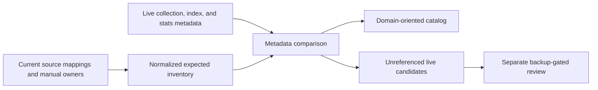

# 2026-08-09 - christopherbell-dev Session Memory

Website development and production-delivery history. Repository paths, guardrails, reviews, and snapshots are dated evidence; verify current configuration before execution.

## Reading and Updating This Record

This file records work and events for this project on this date. Append same-day progress, decisions, reviews, blockers, publication and closure here; use a separate file for each other date. Sources with no date in their filename are grouped by their last recorded Git change date in the original corpus; that is archival provenance, not a claim that every described event occurred that day. Plans and runtime reports remain separate evidence documents. Imported instructions and statuses are historical evidence, not current operating policy; current AGENTS.md and skills take precedence. Use the source navigation or search for an issue, date, or topic rather than loading the entire history.

## Imported Source Navigation

- [docs/session-memory/2026-08-09-christopherbell-dev-mongodb-collection-catalog.md](#source-docs-session-memory-2026-08-09-christopherbell-dev-mongodb-collection-catalog-md)
- [docs/specs/2026-08-09-christopherbell-dev-mongodb-collection-catalog.md](#source-docs-specs-2026-08-09-christopherbell-dev-mongodb-collection-catalog-md)
- [docs/specs/2026-08-09-christopherbell-dev-music-runtime-state-consolidation.md](#source-docs-specs-2026-08-09-christopherbell-dev-music-runtime-state-consolidation-md)
- [docs/spoke-reviews/2026-08-09-christopherbell-dev-mongodb-collection-catalog-branch-review.md](#source-docs-spoke-reviews-2026-08-09-christopherbell-dev-mongodb-collection-catalog-branch-review-md)
- [docs/spoke-tasks/2026-08-09-christopherbell-dev-mongodb-collection-catalog-implementation.md](#source-docs-spoke-tasks-2026-08-09-christopherbell-dev-mongodb-collection-catalog-implementation-md)
- [docs/spoke-updates/2026-08-09-christopherbell-dev-mongodb-collection-catalog-merged-delivery.md](#source-docs-spoke-updates-2026-08-09-christopherbell-dev-mongodb-collection-catalog-merged-delivery-md)
- [docs/work-closures/2026-08-09-christopherbell-dev-mongodb-collection-catalog-closure.md](#source-docs-work-closures-2026-08-09-christopherbell-dev-mongodb-collection-catalog-closure-md)
- [docs/work/2026-08-09-christopherbell-dev-mongodb-collection-catalog.md](#source-docs-work-2026-08-09-christopherbell-dev-mongodb-collection-catalog-md)
- [docs/work/2026-08-09-christopherbell-dev-music-runtime-state-consolidation.md](#source-docs-work-2026-08-09-christopherbell-dev-music-runtime-state-consolidation-md)

<a id="source-docs-session-memory-2026-08-09-christopherbell-dev-mongodb-collection-catalog-md"></a>
## 2026-08-09 | session-memory | 2026-08-09 - christopherbell.dev MongoDB Collection Catalog

Original source: `docs/session-memory/2026-08-09-christopherbell-dev-mongodb-collection-catalog.md` at `78f01833d1c348b4ac87c90e9832bb41481f93db`. SHA-256 (normalized text): `7e39ffcd5c80cbc280d5b57e4aabfe0d776034affcfafb3b1d2567520fec4b8e`.

<!-- migrated-source: docs/session-memory/2026-08-09-christopherbell-dev-mongodb-collection-catalog.md -->
<a id="source-docs-session-memory-2026-08-09-christopherbell-dev-mongodb-collection-catalog-md--2026-08-09---christopherbelldev-mongodb-collection-catalog"></a>
### 2026-08-09 - christopherbell.dev MongoDB Collection Catalog

<a id="source-docs-session-memory-2026-08-09-christopherbell-dev-mongodb-collection-catalog-md--1620---christopherbelldev-mongodb-collection-catalog"></a>
#### 16:20 - christopherbell.dev MongoDB Collection Catalog

<a id="source-docs-session-memory-2026-08-09-christopherbell-dev-mongodb-collection-catalog-md--request"></a>
##### Request

Safely reduce the apparent MongoDB-container sprawl for the website, with explicit approval to proceed, safety enforcement, and targeted final fixes. The completed scope had to preserve live data and the dirty authoritative checkout while continuing through implementation, review, PR/CI, merge, protected production deployment, live metadata inventory, and Builder closure.

<a id="source-docs-session-memory-2026-08-09-christopherbell-dev-mongodb-collection-catalog-md--project-context"></a>
##### Project Context

- Builder hub: `C:\Users\Christopher\Developer\builder`.
- Authoritative spoke: `A:\Projects\christopherbell.dev`, extensively dirty and intentionally untouched.
- Feature worktree: `A:\Projects\christopherbell.dev-worktrees\mongodb-collection-catalog`.
- Branch/base: `codex/mongodb-collection-catalog` from `2f025762e248cab5befe0fb699e0560f57006572`.
- Production was already one native MongoDB 8.3 service at `127.0.0.1:27017`, one `christopherbell` database, and one website service on 8080. The apparent sprawl was collections, not separate runtime containers.
- The feature worktree has an unavoidable unstaged `gradlew.bat` line-ending delta; it was never staged or committed.

<a id="source-docs-session-memory-2026-08-09-christopherbell-dev-mongodb-collection-catalog-md--work-completed"></a>
##### Work Completed

- Added `docs/operations/mongodb-collection-catalog.md`, a 51-row catalog with physical/logical names, owner/mapping provenance, role, retention, index, sensitivity, and status.
- Added `MongoCollectionCatalogTest` enforcing exact source/manual/shared mapping coverage and malformed-row/status rules.
- Added `VehicleProperties` startup validation that rejects equal vehicle import-state collection IDs.
- Added `prod.cmd mongo-inventory`, Make wiring, the fixed JavaScript metadata script, strict PowerShell canonicalizer, regular/view/capped/time-series support, nested redaction, deterministic indexes, BSON Long and safe-integer validation, exact `collStats` command enforcement, and two-host Pester coverage.
- Added repository and Windows operations documentation. No collection/document/schema/index mutation or application document read was introduced.
- Delivered ten feature commits from `5df1aa88` through `e5d90052`, PR [#1352](https://github.com/azurras/christopherbell.dev/pull/1352), and squash merge `0bcc8a9b83738df9c4adcf076e4be4443090448c`.
- Saved Builder test report, spoke update, branch review, closure, and updated spec/plan/work/task state.

<a id="source-docs-session-memory-2026-08-09-christopherbell-dev-mongodb-collection-catalog-md--decisions"></a>
##### Decisions

- Preserve active physical collection boundaries. Consolidating collections would not reduce a MongoDB process/container because production already has one service/database; it would combine unrelated ownership, indexes, retention, and security contracts and add migration/rollback risk.
- Treat live-only or empty names as review inputs, never cleanup authority.
- Final-review fixes required explicit user authority after the planned final wave. The user authorized the residual task; final scoped re-review approved original-value floating-point validation and collation-strength enforcement.
- Protected ProgramData ACLs stayed intact. The public inventory wrapper failed closed for the non-elevated shell; the live check used the exact merged generator and canonical validator against the same fixed URI with the known `mongosh` path.

<a id="source-docs-session-memory-2026-08-09-christopherbell-dev-mongodb-collection-catalog-md--validation"></a>
##### Validation

- Fresh coordinator-owned `:website:check`: `BUILD SUCCESSFUL in 5m 7s`, 1,679 Java tests, zero failures/errors, and 83/83 production tests under both PowerShell hosts.
- Focused final operations: 69/69 in PowerShell 7 and Windows PowerShell 5.1.
- Disposable MongoDB 8.3.2 on 27018 verified regular/view/capped/time-series, BSON Long, sorting, redaction, and absence of document/view sentinels.
- Packaged candidate on 8097 returned liveness/readiness/home 200 and stable ZIP 404; candidate and disposable listeners stopped.
- PR and post-merge main Ubuntu/macOS/Windows, Dependency Review, and CodeQL gates passed.
- Protected deployment rotated PID 13484 to PID 62412. Mission Control and logs proved full SHA `0bcc8a9b83738df9c4adcf076e4be4443090448c`; local/public HTTP and Running/Automatic services passed.
- Live inventory generated at `2026-08-09T21:14:00.599Z`: 47 collections, 163 indexes, `actualOnly=[]`, zero sensitive scalar leaks, and four cataloged-but-uncreated names.

<a id="source-docs-session-memory-2026-08-09-christopherbell-dev-mongodb-collection-catalog-md--current-state"></a>
##### Current State

- Website PR #1352 is merged and deployed; production liveness/readiness and public home are healthy.
- Builder `main` contains the completed test/update/review/closure records and is being validated/pushed as the final checkpoint.
- No source GitHub issue existed to close.
- The exact stopped disposable root `C:\Users\Christopher\AppData\Local\Temp\christopherbell-dev-mongo-catalog-final-runtime-e5d90052` remains at roughly 212 MB because recursive cleanup was policy-blocked.
- The external feature and deployment worktrees remain registered; the authoritative checkout remains untouched.

<a id="source-docs-session-memory-2026-08-09-christopherbell-dev-mongodb-collection-catalog-md--follow-ups"></a>
##### Follow-Ups

- Use the catalog and metadata command for future ownership/drift audits.
- The four non-materialized names (`account_deletion_jobs`, `command_center_pending_actions`, `federation_scan_state`, `zip_coordinate_import_state`) are expected unexercised flows.
- Any future cleanup or consolidation requires separate explicit approval, a compressed SHA-verified and restore-tested backup, exact namespace/impact reporting, rollback retention, one-at-a-time action, and Mongo-backed production verification.

<!-- /migrated-source: docs/session-memory/2026-08-09-christopherbell-dev-mongodb-collection-catalog.md -->

<a id="source-docs-specs-2026-08-09-christopherbell-dev-mongodb-collection-catalog-md"></a>
## 2026-08-09 | specs | christopherbell.dev MongoDB Collection Catalog

Original source: `docs/specs/2026-08-09-christopherbell-dev-mongodb-collection-catalog.md` at `78f01833d1c348b4ac87c90e9832bb41481f93db`. SHA-256 (normalized text): `bb1b5b1e980755d250f8a1e9883aca6dad208ea0e17d3d36278a032488addb7d`.

<!-- migrated-source: docs/specs/2026-08-09-christopherbell-dev-mongodb-collection-catalog.md -->
<a id="source-docs-specs-2026-08-09-christopherbell-dev-mongodb-collection-catalog-md--christopherbelldev-mongodb-collection-catalog"></a>
### christopherbell.dev MongoDB Collection Catalog

<a id="source-docs-specs-2026-08-09-christopherbell-dev-mongodb-collection-catalog-md--document-status"></a>
#### Document Status

complete

<a id="source-docs-specs-2026-08-09-christopherbell-dev-mongodb-collection-catalog-md--purpose"></a>
#### Purpose

Make the website's MongoDB data model easier to understand and maintain without merging collections whose separate ownership, indexes, retention, or access patterns protect correctness.

The work will inventory and catalog every collection referenced by current source, compare that catalog with metadata from the live production database, and identify genuinely unreferenced live collections for a separate backup-gated cleanup decision. It will not rename, merge, drop, compact, or repair a production collection.

<a id="source-docs-specs-2026-08-09-christopherbell-dev-mongodb-collection-catalog-md--background"></a>
#### Background

Production currently runs one native Windows MongoDB 8.3 service bound to `127.0.0.1:27017`, one native `ChristopherBellDev` service on port `8080`, and one `christopherbell` database. The website service depends on the MongoDB service. The production runtime is not using Docker. Remote `origin/main` at `2f025762` contains one optional local-development Compose service with one named MongoDB volume.

The many items visible inside MongoDB are collections within the same database, not separate containers or server processes. They already share the MongoDB process, connection pool, storage engine, backup boundary, and host resources. Reducing collection count therefore offers negligible resource savings by itself.

A source scan of current `origin/main` found 52 Spring Data `@Document` mappings. Two vehicle import-state types intentionally map to the same `vehicle_import_state` collection, leaving approximately 51 explicitly mapped collection names before accounting for collections referenced only through `MongoTemplate` or other manual stores. These mappings span entities, social edges, security state, jobs, caches, audit events, history, preferences, leases, import checkpoints, and singleton runtime state with materially different lifecycle and index requirements.

The authoritative checkout at `A:\Projects\christopherbell.dev` has extensive unrelated user changes and is three commits ahead and 121 commits behind its local `origin/main`. It must not be used as an implementation surface. Any later spoke work must begin in a clean isolated worktree from refreshed `origin/main`.

<a id="source-docs-specs-2026-08-09-christopherbell-dev-mongodb-collection-catalog-md--decision"></a>
#### Decision

Preserve active physical collection boundaries. Improve model clarity through a canonical, domain-oriented catalog, naming rules for future collections, and automated catalog coverage. Treat unreferenced live collections as review candidates, never automatic deletion targets.

Do not rename awkward but active legacy collections during this work. For example, `whatsforlunch_ratings` now stores votes, but a physical rename creates migration and rollback risk without improving runtime behavior. The catalog will provide a clear logical name and mark the physical name as legacy.

<a id="source-docs-specs-2026-08-09-christopherbell-dev-mongodb-collection-catalog-md--alternatives-considered"></a>
#### Alternatives Considered

<a id="source-docs-specs-2026-08-09-christopherbell-dev-mongodb-collection-catalog-md--broad-typed-buckets"></a>
##### Broad typed buckets

Combining state, preferences, edges, jobs, and events into generic polymorphic collections would reduce the visible count most. It was rejected because it obscures bounded-context ownership, mixes index and retention requirements, increases repository and discriminator complexity, and makes unrelated data share collection-level operational behavior.

<a id="source-docs-specs-2026-08-09-christopherbell-dev-mongodb-collection-catalog-md--conservative-same-domain-merging"></a>
##### Conservative same-domain merging

Merging only a few low-index, same-domain collections could remove a handful of names. For example, Music queue and radio singleton records could share one typed collection after resolving their colliding `global` identifiers. It was not selected because the migration and repository complexity would outweigh the limited clarity benefit. This option may be reconsidered only when a measured operational or correctness problem justifies a specific pair.

<a id="source-docs-specs-2026-08-09-christopherbell-dev-mongodb-collection-catalog-md--catalog-and-naming-policy"></a>
##### Catalog and naming policy

Keeping intentional boundaries while documenting purpose, owner, lifecycle, and indexes provides the cleanest model with the least production risk. It also exposes stale or orphaned physical collections, which is the only likely source of count reduction without compromising active data design. This is the selected approach.

<a id="source-docs-specs-2026-08-09-christopherbell-dev-mongodb-collection-catalog-md--goals"></a>
#### Goals

1. Give every source-referenced MongoDB collection one documented owner and purpose.
2. Group physical collections into clear website bounded contexts without changing runtime storage.
3. Record lifecycle, retention, cardinality, sensitivity, and key index expectations for each collection.
4. Detect new undocumented collection mappings in automated verification.
5. Compare source expectations with metadata-only live inventory.
6. Identify live collections absent from current source as orphan candidates for separate review.
7. Establish consistent names for future collections while preserving active legacy names.

<a id="source-docs-specs-2026-08-09-christopherbell-dev-mongodb-collection-catalog-md--non-goals"></a>
#### Non-Goals

- Do not merge, rename, drop, compact, repair, or rewrite MongoDB collections.
- Do not read or export document bodies during inventory.
- Do not expose MongoDB metadata publicly or add an admin user interface.
- Do not move production back to Docker or change the native Windows service topology.
- Do not promise a lower collection count when the live inventory contains no proven orphans.
- Do not combine collection-catalog work with modular-monolith package restructuring or unrelated product changes.
- Do not approve future deletion merely because a collection is empty.

<a id="source-docs-specs-2026-08-09-christopherbell-dev-mongodb-collection-catalog-md--catalog-requirements"></a>
#### Catalog Requirements

The website repository will contain one human-readable MongoDB collection catalog. Each catalog entry must include:

- physical collection name;
- logical display name when the physical name is historical or ambiguous;
- owning bounded context and package;
- mapped document type or manual `MongoTemplate` owner;
- role: entity, edge, event/history, job, cache, audit, preference, lease, or singleton state;
- expected cardinality;
- retention, TTL, and deletion behavior;
- important unique and query indexes;
- sensitivity classification;
- status: `active`, `legacy-named`, `orphan-candidate`, or `system-managed`.

The initial logical groups are account and security, social/content, messaging and notifications, federation, Music, shared folder, vehicle and location, What's For Lunch, Canes tracker, and platform operations. Group names organize the catalog; they do not create shared physical collections.

The catalog must explicitly record intentional shared mappings, including the vehicle import-state types that use `vehicle_import_state`. A shared mapping is valid only when its owning domain and identifier scheme prevent collisions and its repository behavior is proven safe.

<a id="source-docs-specs-2026-08-09-christopherbell-dev-mongodb-collection-catalog-md--naming-policy"></a>
#### Naming Policy

New physical names must:

- use lowercase `snake_case`;
- identify their owning domain when the unprefixed name would be ambiguous;
- use plural nouns for entity, edge, job, event, history, and audit collections;
- use `_state` for singleton or checkpoint documents;
- use lifecycle-signaling suffixes such as `_jobs`, `_history`, `_audit`, `_cache`, `_guards`, and `_leases` when applicable;
- avoid a name based only on a Java implementation class;
- document any intentionally shared mapping and collision-proof identifier scheme.

Existing active collections that violate the convention remain unchanged and are marked `legacy-named`. A rename requires its own approved migration design, backup, compatibility strategy, rollback, and production verification.

<a id="source-docs-specs-2026-08-09-christopherbell-dev-mongodb-collection-catalog-md--source-inventory-and-enforcement"></a>
#### Source Inventory and Enforcement

A focused architecture test will fail when a source-referenced collection lacks a catalog entry. The inventory must cover:

- Spring Data mapping metadata for `@Document` types;
- collection constants used by reusable persistence components;
- literal and computed names used by manual `MongoTemplate` stores and migrations;
- intentional multiple document mappings to one physical collection.

The test must not force feature modules or persistence documents to depend on one global collection-name class. Domain ownership remains local. Manual collection owners may be enumerated explicitly where runtime mapping metadata cannot discover them reliably.

Verification must reject duplicate catalog entries, unknown status or role values, missing owners, and undocumented shared mappings. Missing live collections are not failures when a feature has never persisted data; the source catalog remains authoritative for expected ownership.

<a id="source-docs-specs-2026-08-09-christopherbell-dev-mongodb-collection-catalog-md--live-metadata-inventory"></a>
#### Live Metadata Inventory

The production inventory is read-only and local to the production host. It will collect only:

- collection names;
- collection type and options;
- document counts;
- storage and index sizes;
- index names and definitions.

It must not collect document bodies, sampled field values, credentials, connection strings containing secrets, or unrestricted server diagnostics. The output must redact any unexpected sensitive values before it is preserved.

The comparison flow is:



If the production connection, source scan, metadata query, or normalization is incomplete, the inventory must fail closed and report itself as incomplete. No orphan conclusion may be drawn from partial evidence.

<a id="source-docs-specs-2026-08-09-christopherbell-dev-mongodb-collection-catalog-md--orphan-candidate-rules"></a>
#### Orphan-Candidate Rules

A live collection may be labeled `orphan-candidate` only when it is:

1. absent from current document mappings, manual collection constants, repositories, migrations, and operational scripts;
2. not a MongoDB system collection;
3. understood well enough to name its former owner and purpose;
4. inventoried with count, size, options, and indexes.

An orphan candidate remains untouched by this project. Empty does not mean disposable, and an old migration reference may be a compatibility or recovery requirement.

Any later removal proposal must additionally provide:

- a current compressed database archive;
- a recorded SHA-256 for the archive;
- successful restore parsing or dry-run validation;
- an exact-namespace backup for the candidate;
- an impact report and explicit user approval;
- one-at-a-time removal and a retained rollback archive;
- Mongo-backed application and production health verification after removal.

<a id="source-docs-specs-2026-08-09-christopherbell-dev-mongodb-collection-catalog-md--failure-handling"></a>
#### Failure Handling

- Source discovery failure: fail the catalog test and identify the undiscovered owner or mapping form.
- Production metadata access failure: preserve the source catalog, mark the live comparison incomplete, and make no cleanup recommendation.
- Source-only collection: classify it as expected but not yet materialized unless runtime evidence proves a configuration error.
- Live-only collection: classify it as an unreviewed extra until ownership and history are established.
- Conflicting owners: treat the conflict as a design defect; do not resolve it by placing both types into a generic bucket.
- Unexpected sensitive metadata: stop report generation, redact the value, and narrow the query before retrying.

<a id="source-docs-specs-2026-08-09-christopherbell-dev-mongodb-collection-catalog-md--expected-files-and-ownership"></a>
#### Expected Files and Ownership

Later implementation is expected to involve:

- a website architecture or operations Markdown catalog under `docs/`;
- focused Java architecture tests under `website/src/test/java/dev/christopherbell/architecture/` or the repository's current equivalent;
- a bounded metadata-only inventory command or script under the existing native Windows operations boundary if one does not already exist;
- Builder test-report, review, closure, and session-memory artifacts when implementation and live comparison are complete.

Exact files and literal line ranges belong in the implementation plan and must be derived from a clean isolated worktree based on refreshed `origin/main`.

<a id="source-docs-specs-2026-08-09-christopherbell-dev-mongodb-collection-catalog-md--validation-plan"></a>
#### Validation Plan

<a id="source-docs-specs-2026-08-09-christopherbell-dev-mongodb-collection-catalog-md--static-verification"></a>
##### Static verification

- Enumerate all Spring Data document mappings from the application mapping context.
- Enumerate all known manual collection owners and migration literals.
- Prove every discovered name has exactly one catalog entry.
- Prove intentional shared mappings are declared and collision-safe.
- Add negative fixtures or focused tests showing undocumented mappings and duplicate entries fail.
- Run the focused catalog tests and the repository's full `:website:check` gate.

<a id="source-docs-specs-2026-08-09-christopherbell-dev-mongodb-collection-catalog-md--local-runtime-verification"></a>
##### Local runtime verification

- Use an isolated worktree and private `GRADLE_USER_HOME`.
- Run any inventory command against disposable MongoDB first.
- Prove the command returns collection/index/stats metadata without document bodies.
- Prove connection and partial-query failures produce an incomplete result and no orphan classification.
- Start the packaged candidate on a non-8080 port when executable application or operations code changes.
- Record exact URL/port, request or command input, status/output, and MongoDB target.

<a id="source-docs-specs-2026-08-09-christopherbell-dev-mongodb-collection-catalog-md--production-verification"></a>
##### Production verification

- Confirm `MongoDB`, `ChristopherBellDev`, and `cloudflared` remain Running and Automatic.
- Confirm MongoDB remains bound only to loopback and the website still uses the `christopherbell` database.
- Run the bounded metadata inventory locally and record completeness plus collection/index totals.
- Compare live-only names with source, migrations, and operational scripts before labeling any orphan candidate.
- Verify local and public website health and at least one Mongo-backed read flow if deployed code changed.
- Do not touch the production listener or database when the delivered change is documentation and tests only.

<a id="source-docs-specs-2026-08-09-christopherbell-dev-mongodb-collection-catalog-md--rollback-and-recovery"></a>
#### Rollback and Recovery

The catalog, test, and read-only inventory do not mutate MongoDB. Their rollback is an ordinary application or documentation revert.

No collection cleanup is authorized by this specification. A future cleanup requires the separate safeguards above. Its rollback source is the verified full archive plus exact-namespace archive retained until the production soak and user-approved retention period are complete.

<a id="source-docs-specs-2026-08-09-christopherbell-dev-mongodb-collection-catalog-md--risks"></a>
#### Risks

- **False simplicity:** Fewer collections can hide unrelated schemas behind discriminators. Mitigation: preserve owner, lifecycle, and index boundaries.
- **Incomplete discovery:** Manual `MongoTemplate` names may not appear in mapping metadata. Mitigation: scan constants, literals, migrations, and operational scripts and maintain an explicit manual-owner inventory.
- **Catalog drift:** Documentation alone can become stale. Mitigation: enforce catalog coverage in architecture tests.
- **Unsafe orphan inference:** A live-only or empty collection may still support rollback or an inactive feature. Mitigation: fail closed, establish historical ownership, and require separate approval and backups.
- **Sensitive inventory output:** Broad database commands can expose data. Mitigation: query only collection, stats, options, and index metadata and redact unexpected values.
- **Dirty checkout damage:** The authoritative spoke contains unrelated work. Mitigation: use a refreshed isolated worktree and leave it untouched.
- **No visible count reduction:** Every live collection may still be active. Mitigation: define success as clarity and verified ownership, not an arbitrary count target.

<a id="source-docs-specs-2026-08-09-christopherbell-dev-mongodb-collection-catalog-md--acceptance-criteria"></a>
#### Acceptance Criteria

- Every source-referenced collection has one catalog entry with owner, role, lifecycle, and index expectations.
- All manual collection owners and intentional shared mappings are covered.
- New undocumented collection mappings fail automated verification.
- A metadata-only live comparison completes without reading document bodies or exposing secrets.
- Live-only collections are reported with evidence and are not removed.
- Active collection names, documents, indexes, retention rules, and production topology remain unchanged.
- The catalog explains the visible collection count by bounded context and distinguishes active, legacy-named, orphan-candidate, and system-managed names.
- If no orphan candidates exist, the result explicitly recommends retaining the current collection count.
- Any future cleanup remains backup-gated, exact-namespace scoped, explicitly approved, and production verified.

<a id="source-docs-specs-2026-08-09-christopherbell-dev-mongodb-collection-catalog-md--open-questions"></a>
#### Open Questions

None for the design. The user approved preserving active boundaries, metadata-only inventory, automated catalog enforcement, legacy-name documentation instead of renames, and separate approval for any orphan cleanup on 2026-08-09.

<!-- /migrated-source: docs/specs/2026-08-09-christopherbell-dev-mongodb-collection-catalog.md -->

<a id="source-docs-specs-2026-08-09-christopherbell-dev-music-runtime-state-consolidation-md"></a>
## 2026-08-09 | specs | christopherbell.dev Music Runtime State Consolidation

Original source: `docs/specs/2026-08-09-christopherbell-dev-music-runtime-state-consolidation.md` at `78f01833d1c348b4ac87c90e9832bb41481f93db`. SHA-256 (normalized text): `e691bb9276439986b9998e67132e59eed2394a91cd388d56978af5ff412564dc`.

<!-- migrated-source: docs/specs/2026-08-09-christopherbell-dev-music-runtime-state-consolidation.md -->
<a id="source-docs-specs-2026-08-09-christopherbell-dev-music-runtime-state-consolidation-md--christopherbelldev-music-runtime-state-consolidation"></a>
### christopherbell.dev Music Runtime State Consolidation

<a id="source-docs-specs-2026-08-09-christopherbell-dev-music-runtime-state-consolidation-md--document-status"></a>
#### Document Status

`ready-for-execution`

<a id="source-docs-specs-2026-08-09-christopherbell-dev-music-runtime-state-consolidation-md--purpose"></a>
#### Purpose

Reduce the website's MongoDB collection count by one while improving music-domain
organization and preserving current queue and radio behavior. The change consolidates
two compatible singleton-state namespaces into one physical collection without making
their updates share a concurrency token.

<a id="source-docs-specs-2026-08-09-christopherbell-dev-music-runtime-state-consolidation-md--background"></a>
#### Background

Production already uses one native MongoDB service and one `christopherbell` database;
the cleanup target is collection organization, not container or process consolidation.
A fresh metadata-only inventory on 2026-08-09 reported 47 live collections, 163 indexes,
and no unowned namespace. The inventory therefore found nothing that was safe to delete
as abandoned data.

The first compatible active pair is:

| Collection | Role | Live documents | Indexes | Current identity |
| --- | --- | ---: | ---: | --- |
| `music_queue_state` | singleton queue state | 1 | 1 | `_id: "global"` |
| `music_radio_state` | singleton radio state | 1 | 1 | `_id: "global"` |

The two collections have the same owner and lifecycle category, but they cannot simply
share their current collection name because their identical `_id` values would collide.
They also have separate optimistic-lock versions today; preserving that separation avoids
new contention between queue edits and radio transitions.

<a id="source-docs-specs-2026-08-09-christopherbell-dev-music-runtime-state-consolidation-md--approved-decisions"></a>
#### Approved Decisions

- Optimize first for a simpler music-domain model.
- Consolidate only music runtime state in this first cleanup slice.
- Use one physical collection with two separate, validated envelope documents.
- Preserve independent queue and radio optimistic-lock versions.
- Retain the two old collections for seven days after production cutover.
- Make the old-collection drop a separate, explicitly approved destructive phase.

<a id="source-docs-specs-2026-08-09-christopherbell-dev-music-runtime-state-consolidation-md--goals"></a>
#### Goals

- Introduce one canonical `music_runtime_state` collection.
- Preserve queue contents, radio state, and both current version values exactly.
- Preserve the behavior of queue operations, radio transitions, queue consumption,
  history idempotency, and cross-instance radio leasing.
- Keep queue and radio updates independently concurrent after consolidation.
- Provide a deterministic, fail-closed forward migration and a tested reverse conversion.
- After the approved observation and retirement phases, reduce production from 47 to 46
  live collections with no unowned namespace.
- Establish a small, evidence-backed pattern before considering any further merges.

<a id="source-docs-specs-2026-08-09-christopherbell-dev-music-runtime-state-consolidation-md--non-goals"></a>
#### Non-Goals

- Do not merge music tracks, playlists, metadata edits, history, or access-attempt data.
- Do not consolidate collections from any other website domain in this slice.
- Do not change public music APIs, payloads, authorization, playback behavior, or UI.
- Do not combine queue and radio into one MongoDB document or one version counter.
- Do not drop, rename, truncate, or otherwise mutate either source collection during the
  initial cutover.
- Do not infer that approval of this specification authorizes the later destructive drop.

<a id="source-docs-specs-2026-08-09-christopherbell-dev-music-runtime-state-consolidation-md--target-data-model"></a>
#### Target Data Model

`music_runtime_state` contains exactly two application-owned documents:

```text
{
  _id: "queue",
  kind: "QUEUE",
  queue: { entries: [...] },
  version: <independent queue optimistic-lock version>
}

{
  _id: "radio",
  kind: "RADIO",
  radio: {
    stationSequence,
    trackId,
    observedToken,
    startedAt,
    durationSeconds,
    source,
    queueEntryId
  },
  version: <independent radio optimistic-lock version>
}
```

Each document must contain its expected `kind` and only its matching payload. A narrow
storage adapter performs exact-ID operations and rejects an ID, kind, or payload mismatch.
The broad cross-type repository operations that could accidentally enumerate or deserialize
the other document are not part of the music service interface.

The existing queue and radio domain models remain distinct. Their validation invariants
remain authoritative, including queue size and uniqueness limits and radio state/source
consistency. The shared collection is a storage boundary, not a combined aggregate.

<a id="source-docs-specs-2026-08-09-christopherbell-dev-music-runtime-state-consolidation-md--forward-migration"></a>
#### Forward Migration

The next immutable application migration performs the cutover while no old-version website
writer is active.

1. Read metadata and documents from the two literal source namespaces.
2. Require an expected source state:
   - each source has zero or one document because the existing runtime treats absent state as
     valid and creates it lazily;
   - each present document has `_id: "global"`;
   - each present document maps successfully through the current domain validator;
   - version values are present or absent only as allowed by existing Spring Data semantics.
3. Require `music_runtime_state` to be absent or to contain exactly the target membership
   implied by the present sources, with every document fully equivalent. Reject missing, extra,
   duplicate, malformed, or conflicting destination state.
4. Transform each present queue or radio source into its target envelope, retaining all logical
   fields and version values; do not synthesize state for an absent source.
5. Insert the target documents and then read them back through the production storage
   adapter.
6. Compare canonical logical payloads and versions with the sources.
7. Record the immutable migration as applied only after every check succeeds.
8. Leave both source documents and collections unchanged.

The migration must be safe to reevaluate after an interrupted startup. It may accept only
an absent destination or a fully verified destination with the exact source-implied membership;
it must never guess how to repair partial or divergent state. If both valid sources are absent,
the migration succeeds without creating the target collection.

<a id="source-docs-specs-2026-08-09-christopherbell-dev-music-runtime-state-consolidation-md--runtime-storage-behavior"></a>
#### Runtime Storage Behavior

- Queue reads and saves address only `_id: "queue"` and `kind: "QUEUE"`.
- Radio reads and saves address only `_id: "radio"` and `kind: "RADIO"`.
- Each document retains its own optimistic-lock version and conflict behavior.
- Existing radio transition leasing and local locking remain unchanged.
- Existing radio-history writes remain in `music_radio_history` and are not part of this
  consolidation.
- A missing or malformed destination document fails clearly and does not fall back silently
  to stale source data.
- Runtime writes go only to `music_runtime_state` after cutover; the old collections are
  rollback snapshots, not dual-write targets.

<a id="source-docs-specs-2026-08-09-christopherbell-dev-music-runtime-state-consolidation-md--catalog-and-operational-visibility"></a>
#### Catalog and Operational Visibility

- Add `music_runtime_state` as the active music runtime-state collection.
- Give the two source namespaces an explicit rollback-retained/retiring lifecycle in the
  collection catalog so inventory output distinguishes intentional retention from an orphan.
- Inventory remains metadata-only and must not emit document values.
- During the observation window, the expected physical count is 48: the new destination
  plus both retained sources.
- After retirement, the expected physical count is 46 and neither retired namespace may
  remain live.

<a id="source-docs-specs-2026-08-09-christopherbell-dev-music-runtime-state-consolidation-md--rollback-design"></a>
#### Rollback Design

A release rollback after destination writes requires a reverse conversion; simply starting
the old release would expose stale source state. A protected schema-direction marker and the
installed Windows writer-start guard make the release identity and permitted schema direction a
single fail-closed state machine across deploy, rollback, boot, SCM recovery, sensors, and install.

1. Acquire the deployment lock, suspend SCM recovery, and stop all website writers.
2. Capture and checksum a fresh backup of `music_runtime_state` and both source namespaces.
3. Read and validate the current `queue` and `radio` destination documents.
4. Transform them back to the two source schemas with `_id: "global"`, preserving logical
   payloads and compatible version values.
5. Replace only the two exact source documents.
6. Read back and compare canonical payloads and versions.
7. Switch and start the prior release through the guarded launcher only after verification
   succeeds, then record that legacy-to-target reconciliation is required before a target-schema
   writer may run again.

The guarded launcher bundle and its containing service directory are canonical, non-reparse,
hash-verified, and protected by the expected Windows ACL. A pre-guard installed service is set to
Disabled before publication begins; any publication failure leaves it unable to boot through the
old launcher. Startup type returns to Automatic only after the installed boundary is fully
verified. A previously running service is restored and health-checked after successful routine
installation, while an intentionally stopped service remains stopped.

Automatic deployment never performs schema reconciliation. A later manual target deployment
holds the same lock, keeps the writer stopped, captures a fresh verified backup, copies the exact
current legacy singleton membership forward, verifies it, and only then permits the target writer.

The reverse conversion is implemented and tested before production cutover. A failed reverse
check leaves the writer stopped and reports a redacted operational error.

<a id="source-docs-specs-2026-08-09-christopherbell-dev-music-runtime-state-consolidation-md--seven-day-observation-window"></a>
#### Seven-Day Observation Window

For seven days after cutover:

- keep both old source collections unchanged;
- monitor readiness, liveness, music API behavior, optimistic-lock failures, migration
  status, radio transitions, queue operations, and unexpected MongoDB errors;
- periodically verify the destination still contains exactly the two expected identities;
- treat any evidence of lost queue/radio state or changed public behavior as a rollback
  trigger;
- do not claim the physical cleanup complete while the retained collections still exist.

<a id="source-docs-specs-2026-08-09-christopherbell-dev-music-runtime-state-consolidation-md--retirement-phase-and-destructive-boundary"></a>
#### Retirement Phase and Destructive Boundary

Retirement is a separate operation after the observation window. Before requesting deletion
approval, provide an exact preview containing the production database, the two literal
collection names, current counts, current indexes, backup location, backup checksum, restore
test result, and expected post-drop collection count.

After explicit approval:

1. Stop website writers.
2. Take a fresh compressed backup containing `music_runtime_state`,
   `music_queue_state`, and `music_radio_state`.
3. Verify the backup checksum and restore it into a disposable database.
4. Prove restored logical payload equality and document counts.
5. Recheck that production contains the expected destination and source namespaces.
6. Drop only `music_queue_state`, then verify.
7. Drop only `music_radio_state`, then verify.
8. Start the website and verify runtime behavior, readiness, logs, inventory ownership, and
   the expected 46-collection total.

No wildcard, database-wide cleanup, or inferred namespace is allowed. If any precondition
changes after approval, stop and present a new preview rather than proceeding.

<a id="source-docs-specs-2026-08-09-christopherbell-dev-music-runtime-state-consolidation-md--failure-handling"></a>
#### Failure Handling

- Unexpected counts, IDs, shapes, types, versions, or destination state fail startup closed.
- Migration errors are redacted and recorded through the existing durable migration state.
- Source data is never deleted as error recovery.
- Production cutover does not proceed if clone migration or alternate-port acceptance fails.
- Retirement does not proceed if backup, checksum, restore, or readback evidence is missing.
- A transient readiness failure during listener rotation is rechecked; persistent failure
  triggers rollback.

<a id="source-docs-specs-2026-08-09-christopherbell-dev-music-runtime-state-consolidation-md--expected-code-and-documentation-areas"></a>
#### Expected Code and Documentation Areas

- `website/src/main/java/dev/christopherbell/music/radio/`
  - target runtime-state envelope, narrow storage adapter, and service wiring
- `website/src/main/java/dev/christopherbell/configuration/mongo/migration/`
  - immutable forward migration and reusable validated conversion logic
- `website/src/test/java/dev/christopherbell/music/radio/`
  - storage, behavior, concurrency, and rollback tests
- `website/src/test/java/dev/christopherbell/configuration/mongo/migration/`
  - migration precondition, fidelity, rerun, and partial-state tests
- `website/src/test/java/dev/christopherbell/architecture/`
  - collection catalog ownership and lifecycle coverage
- `docs/operations/mongodb-collection-catalog.md`
  - active and rollback-retained namespace ownership
- `docs/operations/mongodb-migrations.md` and the production runbook/scripts
  - cutover, reverse conversion, observation, retirement preview, backup, restore, and exact
    drop procedure

Literal file and line edit ranges belong in the implementation plan after the approved spec
is mapped against a fresh isolated worktree.

<a id="source-docs-specs-2026-08-09-christopherbell-dev-music-runtime-state-consolidation-md--validation-plan"></a>
#### Validation Plan

<a id="source-docs-specs-2026-08-09-christopherbell-dev-music-runtime-state-consolidation-md--automated"></a>
##### Automated

- Forward conversion preserves every queue/radio logical field and version.
- Reverse conversion restores the old schemas and identities without loss.
- Migration succeeds for all four valid queue/radio source-presence combinations.
- Migration accepts only a fully equivalent already-completed destination on reevaluation.
- Migration rejects wrong IDs, extra source documents, malformed payloads, conflicting
  destinations, and partial destinations.
- Queue and radio storage operations cannot address each other's documents.
- Queue optimistic-lock conflicts remain independent from radio conflicts.
- Existing queue, radio, history-idempotency, lease, API, architecture, catalog, migration,
  and operational-script tests remain green.
- Full website and repository verification pass on supported Windows and CI environments.

<a id="source-docs-specs-2026-08-09-christopherbell-dev-music-runtime-state-consolidation-md--disposable-mongodb-and-candidate-runtime"></a>
##### Disposable MongoDB and Candidate Runtime

- Restore a current production backup into an isolated database.
- Run the candidate migration against the clone and verify exact source/destination counts,
  IDs, logical payload digests, versions, and indexes.
- Start the packaged website on a non-8080 port against that clone.
- Exercise queue reads/writes, radio reads/transitions, queued-track consumption, readiness,
  liveness, and relevant authenticated APIs with exact request/status/response evidence.
- Prove the reverse conversion against a separate clone before production approval.

<a id="source-docs-specs-2026-08-09-christopherbell-dev-music-runtime-state-consolidation-md--production-cutover"></a>
##### Production Cutover

- Record exact deployed commit, service PID rotation, port, migration record, collection
  metadata, destination identities, redacted logical digests, and endpoint results.
- Verify public and local health plus unchanged music behavior.
- Confirm required Windows services remain Running/Automatic and the current-release logs
  contain no migration, mapping, optimistic-lock, or MongoDB failures.

<a id="source-docs-specs-2026-08-09-christopherbell-dev-music-runtime-state-consolidation-md--production-retirement"></a>
##### Production Retirement

- Record the explicit deletion approval, exact backup path and checksum, disposable restore
  evidence, one-at-a-time drop results, final inventory, endpoint results, and service state.

<a id="source-docs-specs-2026-08-09-christopherbell-dev-music-runtime-state-consolidation-md--acceptance-criteria"></a>
#### Acceptance Criteria

- The approved target collection has exactly the two expected, independently versioned
  documents.
- Queue and radio logical state match their pre-cutover sources at migration time.
- Public website and music behavior remain unchanged.
- The source collections remain intact for seven healthy days.
- No destructive operation occurs without the separate exact preview and approval.
- After retirement, production has 46 live collections, no unowned namespace, and a tested
  recoverable backup.

<a id="source-docs-specs-2026-08-09-christopherbell-dev-music-runtime-state-consolidation-md--open-questions"></a>
#### Open Questions

None for design review. Implementation details and literal edit ranges will be resolved in
the implementation plan after this written specification is approved.

<!-- /migrated-source: docs/specs/2026-08-09-christopherbell-dev-music-runtime-state-consolidation.md -->

<a id="source-docs-spoke-reviews-2026-08-09-christopherbell-dev-mongodb-collection-catalog-branch-review-md"></a>
## 2026-08-09 | spoke-reviews | christopherbell.dev MongoDB Collection Catalog Branch Review

Original source: `docs/spoke-reviews/2026-08-09-christopherbell-dev-mongodb-collection-catalog-branch-review.md` at `78f01833d1c348b4ac87c90e9832bb41481f93db`. SHA-256 (normalized text): `254ee26d213d98a18a6b8bdfe88540c702940a2ffec065b4fa137579b56b10a3`.

<!-- migrated-source: docs/spoke-reviews/2026-08-09-christopherbell-dev-mongodb-collection-catalog-branch-review.md -->
<a id="source-docs-spoke-reviews-2026-08-09-christopherbell-dev-mongodb-collection-catalog-branch-review-md--christopherbelldev-mongodb-collection-catalog-branch-review"></a>
### christopherbell.dev MongoDB Collection Catalog Branch Review

- Status: `closed`
- Work record: [christopherbell.dev MongoDB Collection Catalog](#source-docs-work-2026-08-09-christopherbell-dev-mongodb-collection-catalog-md)
- Task brief: [Implementation Task](#source-docs-spoke-tasks-2026-08-09-christopherbell-dev-mongodb-collection-catalog-implementation-md)
- Spoke update: [Merged Delivery](#source-docs-spoke-updates-2026-08-09-christopherbell-dev-mongodb-collection-catalog-merged-delivery-md)
- Test report: [Local And Production Test Report](../test-reports/2026-08-09-christopherbell-dev-mongodb-collection-catalog-test-report.md)
- Reviewed repo: `azurras/christopherbell.dev`
- Branch/range: `codex/mongodb-collection-catalog`, `2f025762e248cab5befe0fb699e0560f57006572..e5d900524ba42000a6c4518fdd1df9bce9f7b2e3`
- Pull request: [#1352](https://github.com/azurras/christopherbell.dev/pull/1352)

<a id="source-docs-spoke-reviews-2026-08-09-christopherbell-dev-mongodb-collection-catalog-branch-review-md--findings"></a>
#### Findings

No open Blocker or Warning remains under the `write-jane-street-style-code` testing/review rubric.

Task-scoped reviews found and closed:

- catalog parsing initially skipped malformed rows instead of failing closed;
- inventory canonicalization collapsed empty and singleton nested arrays;
- operator documentation omitted the copy-ready `make prod-mongo-inventory` command;
- the first final review required compound-index order preservation, exact source/manual/shared provenance, distinct vehicle state IDs, nested sensitive-literal redaction, strict time-series support, full catalog status handling, and a stronger metadata-only denylist;
- the scoped whole-branch re-review left two residuals: integer-only time-series/TTL values could accept fractional or unsafe floating-point forms, and generic `runCommand` was not constrained to the audited `collStats` form;
- the authorized residual task closed the command-policy gap, then its review found lossy floating-point conversion and missing `options.collation.strength` validation;
- final fix `e5d90052` validated original floating-point values before conversion and enforced collation strength 1 through 5. Scoped re-review marked both findings addressed, with no new breakage or scope drift.

<a id="source-docs-spoke-reviews-2026-08-09-christopherbell-dev-mongodb-collection-catalog-branch-review-md--scope-reviewed"></a>
#### Scope Reviewed

- Ten feature commits and 14 tracked files.
- The complete 51-row catalog, Java source/manual drift rules, vehicle startup invariant, PowerShell generator/canonicalizer, CLI and Make wiring, Pester policy tests, and operator documentation.
- Fail-closed parsing, deterministic ordering, safe integer domains, BSON Long handling, time-series and view semantics, redaction, stdout/stderr behavior, and protection from application document reads or mutation commands.
- Disposable MongoDB runtime, packaged alternate-port site, full repository suite, PR/main CI, protected deployment, and live metadata-only inventory.

<a id="source-docs-spoke-reviews-2026-08-09-christopherbell-dev-mongodb-collection-catalog-branch-review-md--validation-checked"></a>
#### Validation Checked

- Task-focused RED/GREEN evidence under Java, PowerShell 7, and Windows PowerShell 5.1.
- Independent review after every implementation task and every authorized fix round.
- Fresh final `:website:check`: `BUILD SUCCESSFUL in 5m 7s`, 1,679 Java tests, zero failures/errors, 83/83 embedded production tests in both PowerShell hosts.
- Final focused operations: 69/69 in both hosts.
- Disposable MongoDB 8.3.2: regular/view/capped/time-series, BSON Long, sorted indexes, nested redaction, and no document/view sentinel leakage.
- Packaged site on 8097: liveness/readiness/home 200 and stable ZIP 404; cleanup verified.
- PR and post-merge main platform/security gates all passed.
- Production exact release SHA, listener rotation, HTTP/service health, 47-collection/163-index inventory, `actualOnly=[]`, and zero sensitive scalar leaks.

<a id="source-docs-spoke-reviews-2026-08-09-christopherbell-dev-mongodb-collection-catalog-branch-review-md--risks"></a>
#### Risks

- Four cataloged collections are not materialized because their flows have not run. This is expected and provides no cleanup authority.
- The non-elevated public wrapper cannot read protected `deploy.json`; production verification used the exact merged generator and validator without weakening ACLs.
- One exact stopped disposable Temp root remains because recursive cleanup was policy-blocked.
- Future collection consolidation would be a separate data migration with backup/restore/rollback risk and negligible process savings because production already has one MongoDB service and database.

<a id="source-docs-spoke-reviews-2026-08-09-christopherbell-dev-mongodb-collection-catalog-branch-review-md--requested-changes"></a>
#### Requested Changes

None.

<a id="source-docs-spoke-reviews-2026-08-09-christopherbell-dev-mongodb-collection-catalog-branch-review-md--merge-readiness"></a>
#### Merge Readiness

Merged and production-accepted. PR #1352 passed every required CI, Dependency Review, and CodeQL gate, squash-merged as `0bcc8a9b83738df9c4adcf076e4be4443090448c`, passed post-merge main CI/CodeQL, deployed through the protected Windows workflow, and passed live metadata-only production acceptance.

<!-- /migrated-source: docs/spoke-reviews/2026-08-09-christopherbell-dev-mongodb-collection-catalog-branch-review.md -->

<a id="source-docs-spoke-tasks-2026-08-09-christopherbell-dev-mongodb-collection-catalog-implementation-md"></a>
## 2026-08-09 | spoke-tasks | Implement christopherbell.dev MongoDB Collection Catalog

Original source: `docs/spoke-tasks/2026-08-09-christopherbell-dev-mongodb-collection-catalog-implementation.md` at `78f01833d1c348b4ac87c90e9832bb41481f93db`. SHA-256 (normalized text): `350fa565cb7ea782e6fa769e9588e862d85c7524b74b9b91a9fea9c90b2edc31`.

<!-- migrated-source: docs/spoke-tasks/2026-08-09-christopherbell-dev-mongodb-collection-catalog-implementation.md -->
<a id="source-docs-spoke-tasks-2026-08-09-christopherbell-dev-mongodb-collection-catalog-implementation-md--implement-christopherbelldev-mongodb-collection-catalog"></a>
### Implement christopherbell.dev MongoDB Collection Catalog

- Status: `closed`
- Work record: [christopherbell.dev MongoDB Collection Catalog](#source-docs-work-2026-08-09-christopherbell-dev-mongodb-collection-catalog-md)
- Project spec: [MongoDB Collection Catalog](#source-docs-specs-2026-08-09-christopherbell-dev-mongodb-collection-catalog-md)
- Implementation plan: [MongoDB Collection Catalog](../implementation-plans/2026-08-09-christopherbell-dev-mongodb-collection-catalog.md)
- Target repo: `azurras/christopherbell.dev`
- Authoritative local path: `A:\Projects\christopherbell.dev` (read-only)
- Isolated worktree: `A:\Projects\christopherbell.dev-worktrees\mongodb-collection-catalog`
- Branch: `codex/mongodb-collection-catalog`
- Base: `2f025762e248cab5befe0fb699e0560f57006572`

<a id="source-docs-spoke-tasks-2026-08-09-christopherbell-dev-mongodb-collection-catalog-implementation-md--objective"></a>
#### Objective

Implement the approved catalog, drift enforcement, metadata-only inventory operation, and operator documentation without merging or mutating live MongoDB collections. Carry the result through automated and alternate-port local validation, task-scoped reviews, whole-branch review, PR and required CI, merge, protected deployment, metadata-only production verification, and Builder closeout.

<a id="source-docs-spoke-tasks-2026-08-09-christopherbell-dev-mongodb-collection-catalog-implementation-md--required-skill-and-before-edit-brief"></a>
#### Required Skill and Before-Edit Brief

Required skill: `write-jane-street-style-code`.

Before changing production code, tests, scripts, code-bearing configuration, or copy-ready implementation examples, read and apply that skill. After read-only investigation and before the first edit, record a Before-Edit Brief covering:

- Behavior: the exact observable behavior being introduced or enforced.
- Invariants: especially one native MongoDB service, no application-document reads, no collection/data mutation, deterministic inventory ordering, and exact catalog-to-mapping agreement.
- Boundary/API: catalog rows, Java drift test, PowerShell functions, JSON payload, CLI command, Make target, and documentation boundaries.
- Effects and failures: Mongo shell invocation, protected configuration reads, stdout/stderr separation, validation failures, and non-zero exits.
- Tests and evidence: RED/GREEN focused tests, full automated suite, disposable Mongo validation, alternate-port packaged-app acceptance, and production metadata-only evidence.

Revise the brief if investigation changes any assumption, and include the final brief in the returned report.

<a id="source-docs-spoke-tasks-2026-08-09-christopherbell-dev-mongodb-collection-catalog-implementation-md--strict-scope"></a>
#### Strict Scope

- Follow the implementation plan exactly, including literal collection names, roles, statuses, PowerShell function signatures, JSON schema, CLI behavior, and validation sequence.
- Preserve the dirty authoritative checkout and make all edits only in the isolated worktree.
- Preserve unrelated checkout-time `gradlew.bat` line-ending changes; do not stage or commit them.
- Do not merge, rename, delete, compact, migrate, or write MongoDB collections or documents.
- Treat live-only collections as orphan candidates requiring separate backup-gated approval, never as automatically stale data.
- Do not weaken protected production ACLs or expose secrets.
- Use a private `GRADLE_USER_HOME`; do not impose short timeouts on Gradle or Pester.
- Validate a candidate on the plan's non-production port before any live listener change.

<a id="source-docs-spoke-tasks-2026-08-09-christopherbell-dev-mongodb-collection-catalog-implementation-md--likely-files"></a>
#### Likely Files

- `docs/operations/mongodb-collection-catalog.md`
- `website/src/test/java/dev/christopherbell/configuration/MongoCollectionCatalogTest.java`
- `ops/production/windows/modules/Production.Operations.psm1`
- `ops/production/windows/prod.ps1`
- `prod.cmd`
- `Makefile`
- `ops/production/windows/tests/Production.Operations.Tests.ps1`
- `ops/production/windows/tests/Production.Command.Tests.ps1`
- `README.md`
- `docs/operations/windows-production.md`

<a id="source-docs-spoke-tasks-2026-08-09-christopherbell-dev-mongodb-collection-catalog-implementation-md--validation-required"></a>
#### Validation Required

- Task-focused Java and Pester tests with recorded TDD RED/GREEN evidence.
- `:website:test`, `:website:jsTest`, `:website:build`, and applicable production Pester suites.
- Metadata inventory against a disposable MongoDB listener/database without application-document reads or writes.
- Packaged application acceptance on port `8097` against disposable data before production activity.
- Required GitHub PR checks and post-merge checks.
- Production command evidence that records database name, generation time, collection metadata, stats, and indexes while proving the site remains healthy and no mutation operation ran.

<a id="source-docs-spoke-tasks-2026-08-09-christopherbell-dev-mongodb-collection-catalog-implementation-md--required-return"></a>
#### Required Return

Return concise status plus durable report files containing commits and subjects, changed files, Before-Edit Brief, TDD RED/GREEN evidence, commands and exact results, review findings and fixes, PR/CI/merge state, deployment state, production verification, blockers or residual risks, and links needed for Builder ingestion and closure.

<a id="source-docs-spoke-tasks-2026-08-09-christopherbell-dev-mongodb-collection-catalog-implementation-md--final-delivery"></a>
#### Final Delivery

- Pull request: [#1352](https://github.com/azurras/christopherbell.dev/pull/1352)
- Merge commit: `0bcc8a9b83738df9c4adcf076e4be4443090448c`
- Test report: [MongoDB Collection Catalog Test Report](../test-reports/2026-08-09-christopherbell-dev-mongodb-collection-catalog-test-report.md)
- Spoke update: [Merged Delivery](#source-docs-spoke-updates-2026-08-09-christopherbell-dev-mongodb-collection-catalog-merged-delivery-md)
- Review: [Branch Review](#source-docs-spoke-reviews-2026-08-09-christopherbell-dev-mongodb-collection-catalog-branch-review-md)
- Outcome: reviewed, merged, deployed, production-verified, and ready for hub closure; no source GitHub issue existed.

<!-- /migrated-source: docs/spoke-tasks/2026-08-09-christopherbell-dev-mongodb-collection-catalog-implementation.md -->

<a id="source-docs-spoke-updates-2026-08-09-christopherbell-dev-mongodb-collection-catalog-merged-delivery-md"></a>
## 2026-08-09 | spoke-updates | christopherbell.dev MongoDB Collection Catalog Merged Delivery

Original source: `docs/spoke-updates/2026-08-09-christopherbell-dev-mongodb-collection-catalog-merged-delivery.md` at `78f01833d1c348b4ac87c90e9832bb41481f93db`. SHA-256 (normalized text): `22c774e940d8d8957039fc3028fc4e46c9d78dfc54c76c6d9df0fa55d3500421`.

<!-- migrated-source: docs/spoke-updates/2026-08-09-christopherbell-dev-mongodb-collection-catalog-merged-delivery.md -->
<a id="source-docs-spoke-updates-2026-08-09-christopherbell-dev-mongodb-collection-catalog-merged-delivery-md--christopherbelldev-mongodb-collection-catalog-merged-delivery"></a>
### christopherbell.dev MongoDB Collection Catalog Merged Delivery

- Status: `closed`
- Work record: [christopherbell.dev MongoDB Collection Catalog](#source-docs-work-2026-08-09-christopherbell-dev-mongodb-collection-catalog-md)
- Task brief: [Implement christopherbell.dev MongoDB Collection Catalog](#source-docs-spoke-tasks-2026-08-09-christopherbell-dev-mongodb-collection-catalog-implementation-md)
- Test report: [MongoDB Collection Catalog Test Report](../test-reports/2026-08-09-christopherbell-dev-mongodb-collection-catalog-test-report.md)
- Source repo: `azurras/christopherbell.dev`
- Feature head: `e5d900524ba42000a6c4518fdd1df9bce9f7b2e3`
- Pull request: [#1352 Catalog MongoDB collections and add safe inventory](https://github.com/azurras/christopherbell.dev/pull/1352)
- Merge commit: `0bcc8a9b83738df9c4adcf076e4be4443090448c`

<a id="source-docs-spoke-updates-2026-08-09-christopherbell-dev-mongodb-collection-catalog-merged-delivery-md--changes-delivered"></a>
#### Changes Delivered

- Added a canonical 51-row physical collection catalog with owner, mapping/manual provenance, role, retention, index, sensitivity, logical name, and status.
- Added Java drift enforcement for every source mapping, exact manual/shared ownership, malformed-row rejection, full status vocabulary, and distinct vehicle import-state IDs.
- Added a Windows metadata-only inventory command for regular, view, capped, and time-series namespaces with strict JSON validation, deterministic ordering, nested redaction, safe integer handling, and exact `collStats` command enforcement.
- Added Pester coverage in both supported PowerShell hosts and operator documentation including `make prod-mongo-inventory`.
- Preserved every live collection and document; no merge, rename, drop, compaction, repair, migration, schema write, index write, or application document read was performed.

<a id="source-docs-spoke-updates-2026-08-09-christopherbell-dev-mongodb-collection-catalog-merged-delivery-md--commits-and-review"></a>
#### Commits And Review

The branch contained ten reviewed commits from `5df1aa88` through `e5d90052`. Task reviews required three focused fix rounds across Tasks 1-3. Final review required one explicitly authorized broad fix wave and one explicitly authorized residual task. Scoped re-review approved the final two fixes—original-value floating-point validation and `options.collation.strength` enforcement—with no new breakage or out-of-scope change.

<a id="source-docs-spoke-updates-2026-08-09-christopherbell-dev-mongodb-collection-catalog-merged-delivery-md--validation-ci-and-merge"></a>
#### Validation, CI, And Merge

- Fresh coordinator-owned `:website:check` passed in 5m7s: 1,679 Java tests, zero failures/errors, and 83/83 production tests under each PowerShell host.
- Focused final operations suites passed 69/69 in both hosts.
- Real disposable MongoDB 8.3.2 and packaged runtime on 8097 passed metadata/redaction and HTTP acceptance; temporary listeners stopped.
- PR Dependency Review, Ubuntu/macOS/Windows builds, and all CodeQL analyses passed.
- Post-merge main CI Build and CodeQL passed for `0bcc8a9b`.
- PR #1352 was promoted from draft only after all gates were green and squash-merged.

<a id="source-docs-spoke-updates-2026-08-09-christopherbell-dev-mongodb-collection-catalog-merged-delivery-md--protected-windows-deployment"></a>
#### Protected Windows Deployment

The protected SYSTEM auto-deployer rotated production from PID `13484` to PID `62412`. Mission Control reported application commit `0bcc8a9b`, and its log recorded the exact release JAR `0bcc8a9b83738df9c4adcf076e4be4443090448c`. Liveness, readiness, local home, and public HTTPS home returned 200. `ChristopherBellDev`, `MongoDB`, and `Cloudflared` were Running/Automatic; 8081 was free. Protected ProgramData remained ACL-denied and no ACL was weakened.

<a id="source-docs-spoke-updates-2026-08-09-christopherbell-dev-mongodb-collection-catalog-merged-delivery-md--production-mongodb-inventory"></a>
#### Production MongoDB Inventory

The non-elevated public wrapper failed closed at protected `deploy.json`, so live verification used the exact merged inventory-script generator and canonical validator with the known `mongosh` executable against the same fixed `127.0.0.1:27017/admin` URI and `christopherbell` database.

The complete live result generated at `2026-08-09T21:14:00.599Z` contained 47 collections and 163 indexes, `actualOnly=[]`, and zero sensitive scalar leaks. Four cataloged names were not yet materialized: `account_deletion_jobs`, `command_center_pending_actions`, `federation_scan_state`, and `zip_coordinate_import_state`. They are unexercised flows, not orphan or cleanup candidates.

<a id="source-docs-spoke-updates-2026-08-09-christopherbell-dev-mongodb-collection-catalog-merged-delivery-md--blockers-and-risks"></a>
#### Blockers And Risks

No delivery blocker remains. The exact stopped disposable MongoDB Temp root remains because recursive cleanup was policy-blocked. Any future physical collection cleanup or consolidation requires a separate approved compressed-backup, restore-validation, impact, rollback, and one-at-a-time plan.

<a id="source-docs-spoke-updates-2026-08-09-christopherbell-dev-mongodb-collection-catalog-merged-delivery-md--next-action"></a>
#### Next Action

Use the catalog and metadata command for future drift and ownership decisions. Do not reduce collection count merely for resource savings: production already uses one MongoDB service and one database, so collection consolidation would add migration risk without materially reducing container/process overhead.

<!-- /migrated-source: docs/spoke-updates/2026-08-09-christopherbell-dev-mongodb-collection-catalog-merged-delivery.md -->

<a id="source-docs-work-closures-2026-08-09-christopherbell-dev-mongodb-collection-catalog-closure-md"></a>
## 2026-08-09 | work-closures | christopherbell.dev MongoDB Collection Catalog Closure

Original source: `docs/work-closures/2026-08-09-christopherbell-dev-mongodb-collection-catalog-closure.md` at `78f01833d1c348b4ac87c90e9832bb41481f93db`. SHA-256 (normalized text): `e3305f3cbd11f58b889347130aa5225b9456260f1bf2d5d5b70d8f66c788e5d0`.

<!-- migrated-source: docs/work-closures/2026-08-09-christopherbell-dev-mongodb-collection-catalog-closure.md -->
<a id="source-docs-work-closures-2026-08-09-christopherbell-dev-mongodb-collection-catalog-closure-md--christopherbelldev-mongodb-collection-catalog-closure"></a>
### christopherbell.dev MongoDB Collection Catalog Closure

- Status: `closed`
- Work record: [christopherbell.dev MongoDB Collection Catalog](#source-docs-work-2026-08-09-christopherbell-dev-mongodb-collection-catalog-md)
- Specification: [MongoDB Collection Catalog](#source-docs-specs-2026-08-09-christopherbell-dev-mongodb-collection-catalog-md)
- Implementation plan: [MongoDB Collection Catalog](../implementation-plans/2026-08-09-christopherbell-dev-mongodb-collection-catalog.md)
- Task brief: [Implementation Task](#source-docs-spoke-tasks-2026-08-09-christopherbell-dev-mongodb-collection-catalog-implementation-md)
- Test report: [Local And Production Test Report](../test-reports/2026-08-09-christopherbell-dev-mongodb-collection-catalog-test-report.md)
- Final update: [Merged Delivery](#source-docs-spoke-updates-2026-08-09-christopherbell-dev-mongodb-collection-catalog-merged-delivery-md)
- Review: [Branch Review](#source-docs-spoke-reviews-2026-08-09-christopherbell-dev-mongodb-collection-catalog-branch-review-md)
- Pull request: [#1352](https://github.com/azurras/christopherbell.dev/pull/1352)
- Merge commit: `0bcc8a9b83738df9c4adcf076e4be4443090448c`

<a id="source-docs-work-closures-2026-08-09-christopherbell-dev-mongodb-collection-catalog-closure-md--final-status"></a>
#### Final Status

Closed. The approved safety-first catalog slice is implemented, reviewed, merged, deployed, production-verified, and durably recorded. No separate GitHub issue existed; the conversational request and Builder work record were the source task.

<a id="source-docs-work-closures-2026-08-09-christopherbell-dev-mongodb-collection-catalog-closure-md--completed-scope"></a>
#### Completed Scope

- Documented all 51 expected physical MongoDB collection names with domain ownership and operational contracts.
- Enforced exact catalog/source/manual/shared mapping agreement and rejected malformed or ambiguous catalog state.
- Added a fixed metadata-only inventory command with strict trust-boundary validation, deterministic ordering, nested redaction, and regular/view/capped/time-series support.
- Added startup protection for distinct vehicle import-state collection IDs.
- Added two-host PowerShell tests, Java architecture/property tests, CLI/Make wiring, and operator documentation.
- Preserved the single native MongoDB service, one `christopherbell` database, one website deployable, every active collection name, and every document.

<a id="source-docs-work-closures-2026-08-09-christopherbell-dev-mongodb-collection-catalog-closure-md--validation"></a>
#### Validation

- Task-scoped TDD and independent review gates completed; all findings were resolved and re-reviewed.
- Fresh local `:website:check` passed in 5m7s with 1,679 Java tests and both 83-test PowerShell suites green.
- Disposable MongoDB 8.3.2 and packaged port-8097 runtime verified namespace types, BSON Long, redaction, index ordering, health, stable API behavior, and cleanup.
- PR #1352 and post-merge main passed platform CI, Dependency Review, and CodeQL.
- Protected production cutover deployed full SHA `0bcc8a9b83738df9c4adcf076e4be4443090448c` as PID `62412`; local/public health and services passed.
- Live metadata inventory returned 47 collections, 163 indexes, `actualOnly=[]`, four cataloged-but-uncreated names, and zero sensitive scalar leaks.

<a id="source-docs-work-closures-2026-08-09-christopherbell-dev-mongodb-collection-catalog-closure-md--decisions"></a>
#### Decisions

- Preserve active physical collection boundaries. The many MongoDB items are collections, not separate containers; they already share one native MongoDB process, database, connection pool, storage engine, and backup boundary.
- Do not consolidate collections for nominal resource savings. Different ownership, retention, indexes, and security boundaries make consolidation a correctness and rollback risk with negligible process/container savings.
- A live-only or empty collection is never deletion authority. Future cleanup requires a separate approved backup/restore/impact/rollback workflow.
- Protected ProgramData ACL denial is expected. Verification used exact runtime SHA, listener rotation, HTTP/service evidence, and the exact merged metadata generator/validator without weakening ACLs.

<a id="source-docs-work-closures-2026-08-09-christopherbell-dev-mongodb-collection-catalog-closure-md--known-gaps-and-follow-ups"></a>
#### Known Gaps And Follow-Ups

- `account_deletion_jobs`, `command_center_pending_actions`, `federation_scan_state`, and `zip_coordinate_import_state` are cataloged but not materialized in the current live database. This is expected until their flows run.
- One stopped disposable MongoDB Temp root remains because recursive deletion was policy-blocked.
- Any future physical cleanup or consolidation is separate scope and must start from a fresh live inventory plus compressed, hash-verified, restore-tested backup evidence.

<a id="source-docs-work-closures-2026-08-09-christopherbell-dev-mongodb-collection-catalog-closure-md--closure-readiness"></a>
#### Closure Readiness

ready

<a id="source-docs-work-closures-2026-08-09-christopherbell-dev-mongodb-collection-catalog-closure-md--closure-text"></a>
#### Closure Text

Completed the MongoDB collection catalog through reviewed implementation, final local and disposable-Mongo runtime testing, PR #1352, all required CI/Dependency Review/CodeQL gates, squash merge `0bcc8a9b83738df9c4adcf076e4be4443090448c`, protected Windows deployment, and live metadata-only production acceptance. Production has one MongoDB service/database already; no collection consolidation or data mutation was performed. No external issue existed, and Builder work is closed.

<!-- /migrated-source: docs/work-closures/2026-08-09-christopherbell-dev-mongodb-collection-catalog-closure.md -->

<a id="source-docs-work-2026-08-09-christopherbell-dev-mongodb-collection-catalog-md"></a>
## 2026-08-09 | work | christopherbell.dev MongoDB Collection Catalog

Original source: `docs/work/2026-08-09-christopherbell-dev-mongodb-collection-catalog.md` at `78f01833d1c348b4ac87c90e9832bb41481f93db`. SHA-256 (normalized text): `6fe7fd5ef7380f978f69e2bab0ad6c740826f4d9489394f92fd4b3262d6e51c3`.

<!-- migrated-source: docs/work/2026-08-09-christopherbell-dev-mongodb-collection-catalog.md -->
<a id="source-docs-work-2026-08-09-christopherbell-dev-mongodb-collection-catalog-md--christopherbelldev-mongodb-collection-catalog"></a>
### christopherbell.dev MongoDB Collection Catalog

- Status: `closed`
- Owner context: Builder hub coordinating subagent-driven implementation, review, publication, production rollout, and closure
- Related spec: [MongoDB Collection Catalog](#source-docs-specs-2026-08-09-christopherbell-dev-mongodb-collection-catalog-md)
- Related implementation plan: [MongoDB Collection Catalog](../implementation-plans/2026-08-09-christopherbell-dev-mongodb-collection-catalog.md)

<a id="source-docs-work-2026-08-09-christopherbell-dev-mongodb-collection-catalog-md--objective"></a>
#### Objective

Reduce MongoDB operational ambiguity without merging active data domains: establish a canonical catalog for the website's Spring Data MongoDB collections, enforce that catalog against mapped document types, and provide a metadata-only inventory command that can identify unmodeled live collections for later backup-gated review.

<a id="source-docs-work-2026-08-09-christopherbell-dev-mongodb-collection-catalog-md--spoke-repository"></a>
#### Spoke Repository

- Repository: `azurras/christopherbell.dev`
- Authoritative path: `A:\Projects\christopherbell.dev` (read-only for this initiative because it contains unrelated user work)
- Isolated worktree: `A:\Projects\christopherbell.dev-worktrees\mongodb-collection-catalog`
- Branch: `codex/mongodb-collection-catalog`
- Starting revision: refreshed `origin/main` commit `2f025762e248cab5befe0fb699e0560f57006572`

<a id="source-docs-work-2026-08-09-christopherbell-dev-mongodb-collection-catalog-md--scope"></a>
#### Scope

- Document every source-mapped physical MongoDB collection and its owning capability.
- Add an automated drift test that fails when mapped collection names and the catalog diverge.
- Add a read-only production inventory operation that returns collection metadata, statistics, and indexes without reading application documents.
- Document comparison and orphan-candidate handling.
- Do not merge, rename, migrate, delete, compact, or otherwise mutate MongoDB collections or data.
- Preserve the single native MongoDB service and the website's single-deployable runtime.

<a id="source-docs-work-2026-08-09-christopherbell-dev-mongodb-collection-catalog-md--current-state"></a>
#### Current State

Closed. The catalog and metadata-only inventory are implemented, independently reviewed, merged through [PR #1352](https://github.com/azurras/christopherbell.dev/pull/1352), deployed as `0bcc8a9b83738df9c4adcf076e4be4443090448c`, and production-verified. The live inventory contained 47 collections and 163 indexes, with no live-only name and four cataloged-but-uncreated names. No collection or document was mutated.

<a id="source-docs-work-2026-08-09-christopherbell-dev-mongodb-collection-catalog-md--blockers"></a>
#### Blockers

None.

<a id="source-docs-work-2026-08-09-christopherbell-dev-mongodb-collection-catalog-md--validation"></a>
#### Validation

- Specification checkpoint: Builder commit `95eb2da`.
- Implementation-plan checkpoint: Builder commit `80ac3441ce981f9c87306ced24b5a1105d6f8d49`.
- Test report checkpoint: Builder commit `723e403`.
- Spoke update checkpoint: Builder commit `77ccab8`.
- Spoke review checkpoint: Builder commit `b89090e`.
- Final local `:website:check`: 1,679 Java tests and both 83-test production suites passed; `BUILD SUCCESSFUL in 5m 7s`.
- PR and main Ubuntu/macOS/Windows, Dependency Review, and CodeQL gates passed.
- Production PID rotated from `13484` to `62412`; exact merge SHA, local/public HTTP 200 responses, Running/Automatic services, and metadata-only MongoDB inventory were verified.

<a id="source-docs-work-2026-08-09-christopherbell-dev-mongodb-collection-catalog-md--follow-ups"></a>
#### Follow-Ups

- Use the catalog and `prod.cmd mongo-inventory` for future ownership/drift review.
- Treat the four cataloged-but-uncreated names as unexercised flows, not cleanup candidates.
- Require separate explicit approval, compressed backup, restore validation, impact reporting, rollback retention, and one-at-a-time verification before any future collection cleanup or consolidation.

<!-- /migrated-source: docs/work/2026-08-09-christopherbell-dev-mongodb-collection-catalog.md -->

<a id="source-docs-work-2026-08-09-christopherbell-dev-music-runtime-state-consolidation-md"></a>
## 2026-08-09 | work | christopherbell.dev Music Runtime State Consolidation

Original source: `docs/work/2026-08-09-christopherbell-dev-music-runtime-state-consolidation.md` at `78f01833d1c348b4ac87c90e9832bb41481f93db`. SHA-256 (normalized text): `20d04827f0ea9aa73f11412c263f48883e56e2f5f894ec1a595e754da409aa7f`.

<!-- migrated-source: docs/work/2026-08-09-christopherbell-dev-music-runtime-state-consolidation.md -->
<a id="source-docs-work-2026-08-09-christopherbell-dev-music-runtime-state-consolidation-md--christopherbelldev-music-runtime-state-consolidation"></a>
### christopherbell.dev Music Runtime State Consolidation

- Status: `active`
- Owner context: Builder hub coordinating design, implementation, production-safe migration,
  observation, and separately approved retirement
- Related spec: [Music Runtime State Consolidation](#source-docs-specs-2026-08-09-christopherbell-dev-music-runtime-state-consolidation-md)

<a id="source-docs-work-2026-08-09-christopherbell-dev-music-runtime-state-consolidation-md--objective"></a>
#### Objective

Safely reduce the website's MongoDB collection count by consolidating the compatible
`music_queue_state` and `music_radio_state` singleton collections into one
`music_runtime_state` collection without coupling their concurrency, changing public
music behavior, or deleting rollback data during the cutover.

<a id="source-docs-work-2026-08-09-christopherbell-dev-music-runtime-state-consolidation-md--owner-and-scope"></a>
#### Owner and Scope

- Builder hub: `C:\Users\Christopher\Developer\builder`
- Spoke: `azurras/christopherbell.dev`
- Authoritative spoke path: `A:\Projects\christopherbell.dev` (preserve unrelated dirty state)
- Current deployed baseline: `0bcc8a9b83738df9c4adcf076e4be4443090448c`
- Scope: music queue and radio runtime state only
- Destructive boundary: no collection drop is authorized by design approval or spec approval

<a id="source-docs-work-2026-08-09-christopherbell-dev-music-runtime-state-consolidation-md--related-artifacts"></a>
#### Related Artifacts

- Project specification: [Music Runtime State Consolidation](#source-docs-specs-2026-08-09-christopherbell-dev-music-runtime-state-consolidation-md)
- Prior collection catalog work: [MongoDB Collection Catalog](#source-docs-work-2026-08-09-christopherbell-dev-mongodb-collection-catalog-md)
- Implementation plan: [Music Runtime State Consolidation](../implementation-plans/2026-08-09-christopherbell-dev-music-runtime-state-consolidation.md)
- Test report, spoke update, review, and closure: pending execution

<a id="source-docs-work-2026-08-09-christopherbell-dev-music-runtime-state-consolidation-md--current-state"></a>
#### Current State

- A fresh metadata-only production inventory reported 47 live collections and 163 indexes.
- No live collection is unowned or absent from the collection catalog.
- The user selected active-collection consolidation for a simpler domain model, beginning
  with music runtime state.
- `music_queue_state` and `music_radio_state` are compatible singleton-state collections:
  each currently contains one `_id: "global"` document and only the `_id` index.
- The approved architecture uses one collection with separate queue and radio documents,
  preserving independent optimistic-lock versions.
- The approved rollback-retention window is seven days.
- Verification contract: full Pester on PowerShell 7 plus focused Music runtime, command, and
  operations tests on Windows PowerShell 5.1. The untouched base has 85 unrelated PS5-only
  incompatibility failures and they are recorded rather than added to this migration scope.

<a id="source-docs-work-2026-08-09-christopherbell-dev-music-runtime-state-consolidation-md--guardrails"></a>
#### Guardrails

- Use an isolated spoke worktree refreshed from `origin/main`; do not modify the
  authoritative dirty checkout.
- Prove the migration and website behavior against a production-data clone on an
  alternate port before production cutover.
- Fail closed on unexpected counts, IDs, shapes, versions, or partial destination state.
- Leave both source collections intact during the seven-day observation window.
- Treat retirement as a separate destructive phase requiring a fresh backup, checksum,
  disposable restore proof, literal-name preview, and explicit user approval.
- Never weaken production ACLs or expose document values in operational evidence.

<a id="source-docs-work-2026-08-09-christopherbell-dev-music-runtime-state-consolidation-md--next-steps"></a>
#### Next Steps

1. Obtain user review and approval of the written project specification.
2. Write, review, validate, commit, and push a literal implementation and rollback plan.
3. Execute the non-destructive consolidation cutover through normal spoke delivery.
4. Observe production for seven days.
5. Return with exact retirement evidence and request approval before dropping the two
   legacy source collections.

<!-- /migrated-source: docs/work/2026-08-09-christopherbell-dev-music-runtime-state-consolidation.md -->

